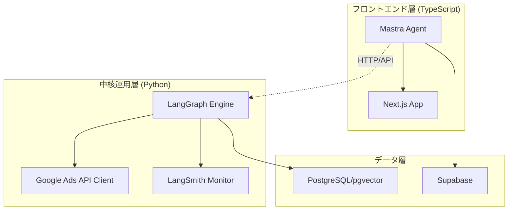

# エージェント技術スタック選定

## 選定結果

UnsonOSのGoogle Ads自動運用システムにおいて、以下の技術スタックを採用します：

### 中核エージェント: LangChain + LangGraph (Python)

**選定理由:**
1. **ステートフルな長時間運用** - 変更クールダウン、再試行、分岐処理が必須のAds運用に最適
2. **Google Ads公式サポート** - Pythonの公式クライアントライブラリとの直接統合
3. **観測性** - LangSmithによる強力なツール呼び出し追跡と失敗点の可視化
4. **構造化出力** - YAML/JSON形式の決定カードを厳密に管理可能
5. **成熟度** - 本番環境での採用実績多数、公式も新規開発はLangGraph推奨

### フロントエンド連携: Mastra (TypeScript)

**選定理由:**
1. **TypeScriptネイティブ** - Zodによる型安全なワークフロー
2. **サーバーレス対応** - Next.js/Vercel/Cloudflareへの直接デプロイ
3. **統合機能** - RAG、メモリ、エージェント、評価機能が標準搭載
4. **MCP対応** - Model Context Protocolによる外部ツール連携

## アーキテクチャ分業



## 実装アプローチ

### Phase 1: 中核エージェント (LangGraph)

```python
# エージェント定義例
from langgraph.graph import StateGraph, END
from langchain_google_ads import GoogleAdsClient

class AdsOptimizationAgent:
    def __init__(self):
        self.workflow = StateGraph(AdsState)
        self.ads_client = GoogleAdsClient()
        
        # ワークフローノード
        self.workflow.add_node("analyze", self.analyze_performance)
        self.workflow.add_node("plan", self.create_optimization_plan)
        self.workflow.add_node("validate", self.validate_risks)
        self.workflow.add_node("execute", self.execute_changes)
        self.workflow.add_node("monitor", self.monitor_results)
        
        # 条件分岐
        self.workflow.add_conditional_edges(
            "validate",
            self.risk_assessment,
            {
                "safe": "execute",
                "risky": "human_review",
                "abort": END
            }
        )
```

### Phase 2: フロントエンド連携 (Mastra)

```typescript
// Mastra エージェント定義
import { createAgent } from '@mastra/core';
import { z } from 'zod';

const copyGenerationAgent = createAgent({
  name: 'copy-generator',
  description: 'Generate ad copy for products',
  
  tools: {
    generateHeadline: {
      schema: z.object({
        product: z.string(),
        intent: z.string(),
        tone: z.enum(['professional', 'casual', 'urgent'])
      }),
      handler: async (input) => {
        // Python APIを呼び出し
        const response = await fetch('/api/langraph/generate', {
          method: 'POST',
          body: JSON.stringify(input)
        });
        return response.json();
      }
    }
  }
});
```

## 技術選定マトリクス

| 要件 | LangChain/LangGraph | Mastra | 選定 |
|------|-------------------|---------|------|
| Google Ads API統合 | ◎ (公式Python) | △ (非公式Node) | LangGraph |
| ステートフル運用 | ◎ (StateGraph) | ○ | LangGraph |
| 観測性・監査 | ◎ (LangSmith) | ○ (Evals) | LangGraph |
| サーバーレス | ○ | ◎ (Vercel直結) | Mastra |
| TypeScript DX | △ | ◎ (ネイティブ) | Mastra |
| 軽量タスク | ○ | ◎ | Mastra |

## 運用分担

### LangGraph担当（Python）
- Google Ads APIの直接操作
- キーワード最適化ロジック
- 予算配分計算
- リスク評価と承認フロー
- 長時間実行タスク
- 決定カードの生成と管理

### Mastra担当（TypeScript）
- 広告コピー生成
- ランディングページ分析
- ユーザー向けRAG応答
- リアルタイムUI更新
- Webhook処理
- 軽量な分類・タグ付け

## 導入スケジュール

### Week 1-2
- LangGraph環境構築
- Google Ads Python Client統合
- 基本的なStateGraph実装
- LangSmith設定

### Week 3-4
- Mastra環境構築
- Next.js連携
- API通信層の実装
- 基本的なエージェント定義

### Week 5-6
- LangGraph ↔ Mastra連携
- エンドツーエンドテスト
- 監視ダッシュボード構築

## コスト考慮

### 実行コスト
- **重い処理（LangGraph）**: AWS Lambda / Cloud Run
- **軽い処理（Mastra）**: Vercel Edge Functions

### LLMコスト
- **分類・タグ付け**: Claude Haiku (Mastra経由)
- **提案生成**: Claude Opus (LangGraph経由)
- **分析**: Claude Sonnet (両方で使用)

## リスク管理

### 技術的リスク
1. **Python/TS間の通信オーバーヘッド**
   - 対策: gRPCまたはGraphQL採用を検討
   
2. **状態管理の複雑化**
   - 対策: LangGraphのチェックポイント機能活用
   
3. **デバッグの困難さ**
   - 対策: LangSmithとMastra Evalsの併用

### 運用リスク
1. **スキルセット要求**
   - Python + TypeScriptの両方が必要
   - 対策: 明確な責任分界点の設定

2. **バージョン管理**
   - 対策: モノレポ構成で統一管理

## まとめ

**「Ads運用の心臓部」はLangChain/LangGraph（Python）**で堅牢に実装し、**「各プロダクトの周辺知能」はMastra（TypeScript）**で素早く構築する分業体制により、安全性と開発速度の両立を実現します。

この選定により：
- Google Ads APIの公式サポートを最大限活用
- LangSmithによる本番運用の完全な可視化
- Vercelへの軽量タスクの高速デプロイ
- 型安全性とDXの向上

が可能となり、UnsonOSの100-200プロダクト同時運用という野心的な目標を現実的に達成できます。