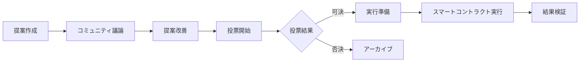

# Unson OS DAO コンセプト設計書

## 1. エグゼクティブサマリー

Unson OS DAOは、100個のマイクロSaaSプロダクト（3年目標）を自動生成・運用するプラットフォームにおいて、コミュニティ主導の開発と公平な利益分配を実現する分散型自律組織です。従来の株式会社モデルではなく、貢献度に基づいた動的な利益分配システムを採用し、「Company-as-a-Product」の概念を具現化します。

## 2. DAO設計の基本理念

### 2.1 コアバリュー

1. **透明性（Transparency）**
   - すべての意思決定プロセスの可視化
   - 収益・コストの完全公開
   - 貢献度計測の明確化

2. **公平性（Fairness）**
   - 貢献度に基づく報酬分配
   - 新規参加者への機会均等
   - 長期貢献者への適切な評価

3. **自律性（Autonomy）**
   - スマートコントラクトによる自動執行
   - 人的介入の最小化
   - 分散型意思決定

4. **持続可能性（Sustainability）**
   - 長期的な価値創造
   - コミュニティの成長促進
   - リスク分散メカニズム

### 2.2 設計原則

- **Simple is Best**: 複雑な仕組みより、シンプルで理解しやすい設計
- **Incentive Alignment**: 個人の利益とDAOの利益が一致する設計
- **Gradual Decentralization**: 段階的な分散化アプローチ
- **Fail-Safe Mechanism**: 失敗時の安全装置の組み込み

## 3. トークンエコノミー設計

### 3.1 トークン構造

#### UNSONトークン（ガバナンストークン）
- **総供給量**: 100,000,000 UNSON
- **初期配分**:
  - 創業チーム（雲孫GK）: 25%（2年ベスティング）
  - コミュニティトレジャリー: 40%
  - エコシステム開発: 20%
  - 流動性提供: 10%
  - 予備（将来の投資家等）: 5%

#### PROFITトークン（収益分配トークン）
- **動的発行**: 各プロダクトの収益に応じて毎月発行
- **用途**: 実際の収益分配に使用
- **交換レート**: 1 PROFIT = 収益プールの比例分配権

### 3.2 貢献度計測システム

#### 貢献カテゴリと重み付け

```
開発貢献（40%）
├── コード貢献: 20%
├── バグ修正: 10%
├── レビュー: 5%
└── ドキュメント: 5%

プロダクト貢献（30%）
├── アイデア提案: 10%
├── 検証実施: 10%
├── UI/UXデザイン: 10%

マーケティング貢献（20%）
├── コンテンツ作成: 10%
├── SNS活動: 5%
└── コミュニティ管理: 5%

ガバナンス貢献（10%）
├── 提案作成: 5%
└── 投票参加: 5%
```

#### 貢献度スコアリング

```javascript
// 貢献度計算式
contributionScore = Σ(activityPoints × categoryWeight × qualityMultiplier)

// 品質乗数
qualityMultiplier = {
  exceptional: 2.0,  // 例外的に優れた貢献
  high: 1.5,         // 高品質な貢献
  standard: 1.0,     // 標準的な貢献
  low: 0.5          // 改善が必要な貢献
}
```

### 3.3 収益分配メカニズム

#### 月次収益分配フロー

1. **収益集計**（毎月1日）
   - 全プロダクトの収益を集計
   - 運営・再投資コスト（45%）を控除
   - 創業メンバーボーナス（15%）を確保
   - コミュニティ分配可能収益（40%）を確定

2. **貢献度計算**（毎月5日）
   - 過去30日間の貢献度を集計
   - 品質評価を反映
   - 最終スコアを確定

3. **PROFIT発行**（毎月10日）
   - 貢献度に応じてPROFITトークンを発行
   - スマートコントラクトで自動配布

4. **収益交換**（毎月15日以降）
   - PROFITトークンをUSDCに交換可能
   - 交換レートは収益プール÷総PROFIT数

#### 収益分配の具体例

```
月間総収益: $100,000
内訳:
- 運営・再投資: $45,000（45%）
- 創業メンバーボーナス: $15,000（15%）
- コミュニティ配当: $40,000（40%）

コミュニティ配当の分配例:
貢献者A: 1,000ポイント（全体の10%）
→ 4,000 PROFIT発行
→ $4,000相当の収益分配

貢献者B: 500ポイント（全体の5%）
→ 2,000 PROFIT発行
→ $2,000相当の収益分配
```

## 4. ガバナンス構造

### 4.1 意思決定プロセス

#### 提案カテゴリと必要票数

| カテゴリ | 内容 | 必要賛成率 | 最低投票率 |
|---------|------|-----------|------------|
| 運営提案 | 日常的な運営判断 | 51% | 10% |
| 技術提案 | 新機能・アーキテクチャ変更 | 66% | 20% |
| 経済提案 | トークノミクス変更 | 75% | 30% |
| 憲章変更 | DAO基本ルール変更 | 80% | 40% |

#### 提案から実行までのフロー



### 4.2 投票メカニズム

#### Quadratic Voting（二次投票）の採用

投票力の計算式：
```
投票力 = √(保有UNSONトークン数)
```

この仕組みにより：
- 大口保有者の影響力を適度に制限
- 小口保有者の声も反映
- より民主的な意思決定を実現

#### 委任投票システム

- 専門知識を持つメンバーへの投票権委任
- カテゴリ別委任（技術、マーケティング等）
- いつでも委任解除可能

### 4.3 セーフガード機能

#### 緊急停止メカニズム
- セキュリティ脅威検知時の自動停止
- マルチシグによる緊急対応
- 72時間以内の対応義務

#### 悪意ある提案の防止
- 提案には最低1,000 UNSON保有が必要
- スパム提案者のトークン没収
- コミュニティによる提案事前審査

## 5. プロダクト管理とDAO

### 5.1 プロダクトライフサイクル管理

#### フェーズ1: アイデア提案（0-7日）
- コミュニティメンバーがアイデア提出
- 初期投票で上位10案を選定
- 選定案に開発リソース割当

#### フェーズ2: MVP開発（7-21日）
- 2週間でMVP完成
- 開発者はGitHub貢献度で自動評価
- テスター募集と初期フィードバック

#### フェーズ3: 市場検証（21-28日）
- LP公開とユーザー獲得
- KPI達成度の測定
- 継続/終了の自動判定

#### フェーズ4: 本格運用 or 終了
- **成功**: 自動スケーリング開始
- **失敗**: リソースを次プロダクトへ

### 5.2 自動終了メカニズム

#### 終了条件（以下のいずれか）
1. 30日間の収益が運営コストを下回る
2. MAUが100人を下回る
3. 技術的メンテナンスコストが収益の50%を超える
4. コミュニティ投票で70%以上が終了に賛成

#### 終了プロセス
1. 終了30日前にユーザー通知
2. データエクスポート機能提供
3. 段階的なサービス縮小
4. 最終的なシャットダウン

## 6. 技術アーキテクチャ

### 6.1 具体的なツールスタック

#### ガバナンス・投票システム
- **Snapshot**: オフチェーン投票プラットフォーム
  - 投票期間: 5日間
  - 可決条件: 66%以上の賛成 + 20%以上の参加率
  - QuadraticVotingまたは1トークン=1票

- **Safe (Gnosis)**: マルチシグウォレット
  - 3/5署名による重要操作
  - タイムロック機能
  - 自動的な資金分流 (45/15/40%)

#### 収益分配システム
- **Superfluid**: リアルタイム収益ストリーミング
  - 四半期配当の自動化
  - USDC → UNFホルダーへの直接分配
  - RageQuit機能との連携

- **SafeTxBuilder**: 自動取引実行
  - 月次収益分配の自動化
  - 貢献度に基づく配当計算
  - 透明性のための取引ハッシュ公開

### 6.2 スマートコントラクト構成

```solidity
// メインDAO契約
contract UnsonDAO {
    // ガバナンス機能
    mapping(address => uint256) public votingPower;
    mapping(uint256 => Proposal) public proposals;
    
    // 収益分配機能
    mapping(address => uint256) public contributionScores;
    mapping(address => uint256) public profitTokens;
    
    // プロダクト管理
    mapping(uint256 => Product) public products;
    mapping(uint256 => ProductMetrics) public metrics;
    
    // SubDAO管理
    mapping(uint256 => SubDAO) public subDAOs;
}

// トークン契約
contract UNSONToken is ERC20, ERC20Permit {
    // ガバナンストークン実装
    // 総供給量: 1億枚（追加発行なし）
}

contract PROFITToken is ERC20 {
    // 収益分配トークン実装
    // 月次でmint、収益と交換後burn
}
```

### 6.3 SubDAOアーキテクチャ

#### SubDAOパターン
```
UnsonOS DAO (親)
├── Ads-SubDAO (広告運用特化)
│   ├── 独自予算管理
│   ├── ROAS≥150%のKPI
│   └── 2Q連続未達で親DAOに吸収
├── Data-SubDAO (データ統合特化)
│   ├── 新API実装数がKPI
│   ├── 利用率10%未満で解散
│   └── 独自ガバナンス
└── 将来的な機能別SubDAO
```

### 6.4 監査・監視システム

#### 自動監視Bot
- **投票集中監視**: 単一アドレスの20%超保有を検知
- **Treasury流出監視**: SafeTx >10/分で緊急停止
- **SubDAO活動監視**: 提案ゼロ30日で自動通知

#### 透明性確保
- 全取引ハッシュを Discord#audit チャンネルに自動投稿
- 月次財務報告の自動生成
- GitHub Issueとの自動連携

### 6.5 オフチェーン連携

#### データ収集と処理
- GitHub API: コード貢献度の取得
- Analytics API: プロダクトメトリクス収集
- Oracle: 収益データのオンチェーン化
- Stripe Webhook: 自動収益分流

#### 自動化システム
- 月次収益集計バッチ
- 貢献度計算エンジン
- KPIモニタリングシステム

### 6.6 セキュリティ対策

#### 多層防御アプローチ
1. **スマートコントラクト監査**
   - 著名監査会社による定期監査
   - バグバウンティプログラム
   - 形式検証の実施

2. **アクセス制御**
   - マルチシグウォレット採用
   - タイムロック機能
   - Role-Based Access Control

3. **リスク管理**
   - 段階的な資金解放
   - 緊急時の資産凍結機能
   - 保険プロトコルとの連携

## 7. 法的コンプライアンス

### 7.1 規制対応フレームワーク

#### 管轄地域の選定と詳細
- **Wyoming DAO LLC**: 最短2週間で設立、有限責任
  - 収益型DAO向けに最適化
  - 米国内での法的保護
  - 設立費用: 約$2,000〜$5,000

- **Wyoming DUNA**: 100人以上の公共DAOに最適
  - 将来のパブリックグッズ化時に採用
  - より分散型のガバナンス構造
  - 設立費用: 約$5,000〜$10,000

- **日本**: 合同会社雲孫（既存）
  - 国内税務の一本化
  - 日本人中心プロジェクト向け
  - 親会社としての機能

#### 法人構造
```
合同会社雲孫（日本）
    ↓
Wyoming DAO LLC（米国）
    ↓
各国の規制に応じた子会社
```

#### トークン分類
- UNSONトークン: ユーティリティトークン
- PROFITトークン: 収益分配権（セキュリティトークンの可能性）

### 7.2 外部投資の法的構造

#### Token Warrant / SAFE+Token
- VCがUNFに転換権を持つ形式
- 10%割引・24か月ロック・議決権50%減の条件例
- 法的文書: [legalnodes.com](https://legalnodes.com)等を参照

#### 投資条件例
- 転換割引: 10%
- ロック期間: 24ヶ月
- 議決権制限: 50%減
- 流動性制限: 段階的解放

### 7.3 KYC/AML対応

#### 段階的KYC
1. **基本参加**: KYC不要（投票権のみ）
2. **収益受取**: 簡易KYC必要
3. **大口取引**: 完全KYC必要

#### AMLモニタリング
- 異常取引パターンの検知
- ブラックリストアドレスの排除
- 定期的なリスク評価

## 8. 成長戦略とロードマップ

### 8.1 120日間の導入ロードマップ

#### Phase 1: Foundation（0-30日）
**マイルストーン**:
- [ ] Safe（マルチシグウォレット）& UNF発行
- [ ] Wyoming DAO LLC登記
- [ ] 基本的なStripe Webhook設定（45/15/40分流）
- [ ] 初期コミュニティ形成（100人）

**具体的なタスク**:
- Safe作成とマルチシグ設定
- UNSONトークンのスマートコントラクト開発
- 合同会社雲孫からWyoming DAO LLCへの法人設立
- Discord/Slackコミュニティ構築

#### Phase 2: Infrastructure（30-60日）
**マイルストーン**:
- [ ] Snapshot・SubDAOテンプレート実装
- [ ] 自動監視Bot開発
- [ ] 基本的なガバナンス機能実装
- [ ] 初期メンバーKYC対応

**具体的なタスク**:
- Snapshot統合とガバナンス投票システム
- GitHub APIとの連携（貢献度計算）
- SubDAOアーキテクチャの実装
- 基本的なセキュリティ監査

#### Phase 3: Operations（60-90日）
**マイルストーン**:
- [ ] Founder Bonus初回配当
- [ ] 投票実績公開
- [ ] 最初のSubDAO立ち上げ
- [ ] 外部監査実施

**具体的なタスク**:
- Superfluidを用いた自動配当システム
- 透明性レポートの自動生成
- Ads-SubDAOまたはData-SubDAOの実装
- セキュリティ監査とバグ修正

#### Phase 4: Growth（90-120日）
**マイルストーン**:
- [ ] Quadratic Funding Round #1開催
- [ ] 外部投資家への提案
- [ ] 国際展開の準備
- [ ] エコシステムパートナーシップ

**具体的なタスク**:
- GitcoinスタイルのQuadratic Funding実装
- Token Warrant/SAFE+Tokenの法的整備
- 多言語対応（英語、中国語等）
- 他DAOとの連携協定

### 8.2 フェーズ別成長計画

#### Phase 1: Foundation（0-6ヶ月）
- [ ] スマートコントラクト開発
- [ ] 初期コミュニティ形成（1,000人）
- [ ] 最初の10プロダクトローンチ
- [ ] 月間収益$10,000達成

#### Phase 2: Growth（6-12ヶ月）
- [ ] 50プロダクト運用
- [ ] コミュニティ10,000人
- [ ] 月間収益$100,000達成
- [ ] 分散型ガバナンス本格始動

#### Phase 3: Scale（12-24ヶ月）
- [ ] 100プロダクト運用（3年目標）
- [ ] グローバル展開
- [ ] 月間収益$1,000,000達成
- [ ] 他DAOとの連携

#### Phase 4: Ecosystem（24ヶ月以降）
- [ ] プロダクト間シナジー創出
- [ ] AIによる段階的自動化
- [ ] 新規事業領域への展開
- [ ] IPO or M&Aの検討

### 8.2 KPI設定

#### DAOレベルKPI
- **財務KPI**
  - 月間総収益（MRR）
  - 利益率
  - トークン時価総額

- **コミュニティKPI**
  - アクティブメンバー数
  - 月間貢献者数
  - 提案採択率

- **プロダクトKPI**
  - 稼働プロダクト数
  - 平均プロダクト寿命
  - 成功率（収益性達成率）

## 9. リスク分析と対策

### 9.1 技術的リスク

| リスク | 影響度 | 発生確率 | 対策 |
|--------|--------|----------|------|
| スマートコントラクトバグ | 高 | 中 | 監査・保険・バグバウンティ |
| スケーラビリティ問題 | 中 | 高 | L2ソリューション採用 |
| オラクル障害 | 中 | 低 | 複数オラクル使用 |

### 9.2 事業リスク

| リスク | 影響度 | 発生確率 | 対策 |
|--------|--------|----------|------|
| 規制強化 | 高 | 中 | 複数管轄地での運営 |
| 競合出現 | 中 | 高 | 先行者利益の最大化 |
| コミュニティ離反 | 高 | 低 | 透明性とインセンティブ強化 |

### 9.3 金融リスク

| リスク | 影響度 | 発生確率 | 対策 |
|--------|--------|----------|------|
| トークン価格暴落 | 高 | 中 | 買い戻しプログラム |
| 流動性不足 | 中 | 中 | LP報酬プログラム |
| 為替リスク | 低 | 高 | ステーブルコイン活用 |

## 10. DAO参加条件

### 10.1 段階的参加システム

#### STEP 0: 基本登録
**条件**:
- Eメール & GitHub / Slack連携
- 利用規約・コードオブコンダクトに署名

**目的**:
- Sybil（なりすまし）防止
- 最低限の行動規範共有

#### STEP 1: 本人確認
**条件**:
- GitHubアカウント年齢 ≥ 30日
- 法的に必要な国のみKYC（パスポートまたはマイナンバー）

**目的**:
- Bot大量登録抑止
- AML/OFACリスク回避

#### STEP 2: 初期貢献（Earn-to-Join）
**以下のいずれか一つ達成で「Contributorロール」付与**:
- コードPR 1本マージ
- LP/広告クリエイティブ 1件採用
- 翻訳500文字またはDocs修正2ページ

**目的**:
- "タダ乗り"防止
- 最初の貢献による価値提供
- 開発者以外の入口確保

#### STEP 3: 最小UNF保有（Stake-to-Vote）
**条件**:
- 100 UNF以上を保有・ロック（約10〜20 USDC想定）

**取得方法**:
- STEP2達成でエアドロップ
- DEXで購入

**目的**:
- 投票の重み付け
- Sybilコスト上昇

### 10.2 権限レベル

#### オブザーバー（STEP 0完了）
- 透明性確保のため情報閲覧可能
- 投票権なし
- 配当権なし

#### コントリビューター（STEP 0+1+2完了）
- 貢献度に応じた配当権
- 制限付き投票権
- コミュニティ活動参加権

#### フルメンバー（STEP 0+1+2+3完了）
- 完全な投票権
- 提案作成権
- 最大配当権

## 11. 実装チェックリスト

### 11.1 技術実装

- [ ] スマートコントラクト基本設計
- [ ] トークンコントラクト実装
- [ ] ガバナンスモジュール実装
- [ ] 収益分配モジュール実装
- [ ] オラクル連携実装
- [ ] フロントエンド開発
- [ ] 監査実施
- [ ] メインネットデプロイ

### 11.2 運営準備

- [ ] 法人設立（各管轄地）
- [ ] 法的文書作成
- [ ] KYCプロバイダー選定
- [ ] 初期資金調達
- [ ] 初期チーム組成
- [ ] コミュニティプラットフォーム構築

### 11.3 マーケティング準備

- [ ] ブランディング確定
- [ ] Webサイト制作
- [ ] ホワイトペーパー作成
- [ ] SNSアカウント開設
- [ ] インフルエンサー連携
- [ ] PR戦略策定

## 11. 結論

Unson OS DAOは、従来の会社組織の限界を超えて、真に分散化された価値創造システムを実現します。透明性、公平性、自律性、持続可能性の4つの柱に基づいて設計されたこのシステムは、参加者全員が利益を享受できる新しい経済圏を創出します。

段階的な実装アプローチにより、リスクを最小化しながら着実に成長を実現し、最終的には完全自律型の組織として、人類の新しい協働モデルを提示することを目指します。

## 付録

### A. 用語集

- **UNSON**: Unson OS DAOのガバナンストークン
- **PROFIT**: 月次収益分配用トークン
- **Quadratic Voting**: 保有トークン数の平方根で投票力を計算する方式
- **Treasury**: DAOが管理する共同資金プール
- **Vesting**: トークンの段階的解放スケジュール

### B. 参考リンク

- [Ethereum Governance](https://ethereum.org/governance/)
- [MakerDAO Documentation](https://docs.makerdao.com/)
- [Compound Governance](https://compound.finance/governance)
- [Snapshot Voting](https://snapshot.org/)

### C. 更新履歴

- v1.0 (2024-01-XX): 初版作成
- v1.1 (予定): コミュニティフィードバック反映
- v2.0 (予定): 実装後の改善反映