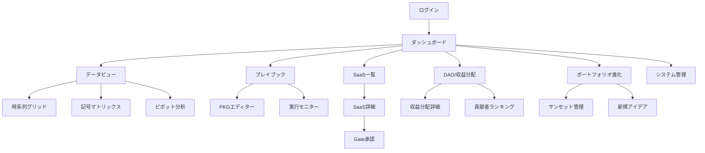
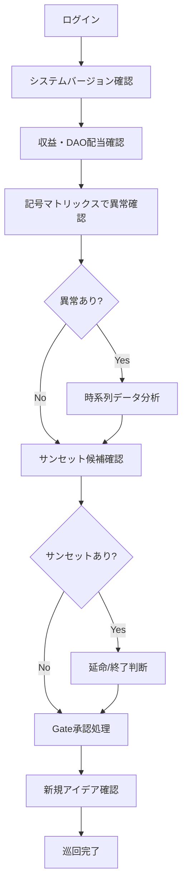

# UnsonOS UI設計書（完全版）

> 最終更新: 2025-01-15
> バージョン: 2.4.1

## 📌 概要

UnsonOSの管理ダッシュボードは、100-200個のマイクロSaaSプロダクトを最小限のリソースで効率的に管理するためのUIシステムです。

### 設計原則
- **STAY SMALL哲学**: 30分の朝の巡回で全体管理
- **記号化による情報圧縮**: 時系列データを5段階の記号で表現
- **PKGベースの自動化**: インジケーター駆動の条件分岐
- **DAOコミュニティ統合**: 収益の40%自動分配の可視化

---

## 🗺️ UI遷移図



---

## 🏠 1. メインダッシュボード

### 完全統合版レイアウト

```
┌─────────────────────────────────────────────────────────────┐
│ UnsonOS v2.4.1        🔔 3  💰 DAO  👤 佐藤太郎 ▼           │
├─────┬───────────────────────────────────────────────────────┤
│ 📊  │                                                         │
│ ﾎｰﾑ │ ┌──────────────────────────────────────────────────┐ │
│     │ │ 📊 今日の概要                2025年1月15日(水)  │ │
│ 📈  │ │                                                  │ │
│ ﾃﾞｰﾀ │ │ 総収益: ¥142,000 ↗️(+18%)                      │ │
│     │ │ ├─ 運営(60%): ¥85,200                          │ │
│ 📋  │ │ └─ DAO(40%): ¥56,800                           │ │
│ SaaS│ │                                                  │ │
│     │ │ SaaS状況: 87個 (🟢64 🟡18 🔴5)                 │ │
│ 📝  │ │ サンセット予定: 3個                             │ │
│ ﾌﾟﾚｲ │ │ Gate承認待ち: 3個                               │ │
│ ﾌﾞｯｸ │ └──────────────────────────────────────────────────┘ │
│     │                                                         │
│ 💰  │ ┌─────────────────┬────────────────────────────────┐ │
│ DAO │ │ KPI記号(1h足)    │ フェーズ分布                   │ │
│     │ │                  │                                │ │
│ 🔄  │ │ 14:00 ↘️ ↗️ → →  │ 研究    ████ 12               │ │
│ 進化│ │ 15:00 ⬇️ → ↘️ →  │ LP      ████████ 23           │ │
│     │ │ 16:00 ⬇️ ↘️ ⬇️ ↘️  │ MVP     ███████████ 31        │ │
│ 🤖  │ │ 17:00 → → ↘️ →  │ 収益化  ██████ 18              │ │
│ AI  │ │ NOW   ↗️ ↗️ → →  │ スケール █ 3                   │ │
│     │ │                  │                                │ │
│ ⚙️  │ │ [詳細データ表示] │ [フェーズ詳細]                │ │
│ ｼｽﾃﾑ│ └─────────────────┴────────────────────────────────┘ │
└─────┴─────────────────────────────────────────────────────┘
```

---

## 📊 2. データビュー

### 2.1 時系列グリッド（Excel風表計算）

```
┌─────────────────────────────────────────────────────────────┐
│ 時系列グリッド - 猫カフェ予約システム                       │
├─────────────────────────────────────────────────────────────┤
│ SaaS: [猫カフェ予約 ▼] 時間足: [5分 ▼] 期間: [今日 ▼]      │
│ [フィルター] [カスタム列] [条件付き書式] [エクスポート]     │
├─────────────────────────────────────────────────────────────┤
│ Time   │ MRR    │ Δ     │ 記号│ DAU │ Δ   │記号│ CVR   │
│────────┼────────┼───────┼─────┼─────┼─────┼────┼────────│
│ 14:00  │ 45,000 │ 0     │ →  │ 125 │ +5  │ ↗️ │ 8.5%   │
│ 14:05  │ 45,000 │ 0     │ →  │ 128 │ +3  │ → │ 8.5%   │
│ 14:10  │ 45,000 │ 0     │ →  │ 132 │ +4  │ → │ 8.3%   │
│ 14:15  │ 44,500 │ -500  │ →  │ 130 │ -2  │ → │ 8.1%   │
│ 14:20  │ 43,000 │ -1500 │ ↘️  │ 125 │ -5  │ ↘️ │ 7.8%   │
│ 14:25  │ 41,000 │ -2000 │ ↘️  │ 120 │ -5  │ ↘️ │ 7.2%   │
│ 14:30  │◾38,000◾│ -3000 │◾⬇️◾│ 115 │ -5  │ ↘️ │ 6.5%   │
│ 14:35  │◾35,000◾│ -3000 │◾⬇️◾│ 110 │ -5  │ ↘️ │ 5.8%   │
└─────────────────────────────────────────────────────────────┘
```

### 2.2 記号マトリックス（全SaaS俯瞰）

```
┌─────────────────────────────────────────────────────────────┐
│ 記号マトリックス                                            │
├─────────────────────────────────────────────────────────────┤
│ メトリクス: [MRR ▼]  時間足: [1h ▼]                        │
├─────────────────────────────────────────────────────────────┤
│         00 01 02 03 04 05 06 07 08 09 10 11 12 13 14 15 16 │
│ ────────────────────────────────────────────────────────── │
│ 🔴猫カフェ  → → → → → → ↗️ ↗️ ↗️ → → ↘️ ↘️ ↘️◾⬇️◾◾⬇️◾│
│ 🔴英会話    → → ↘️ ↘️ ↘️ → → → ↗️ ↗️ → ↘️ ↘️◾⬇️◾◾⬇️◾↘️│
│ 🟡ペット    ↗️ ↗️ → → → → → ↗️ ↗️ ↗️ → → → ↘️ ↘️ → → │
│ 🟢家計簿    ↗️ ↗️ ↗️ → → → ↗️ ↗️ ⬆️ ⬆️ ↗️ → → → → ↗️ ↗️│
└─────────────────────────────────────────────────────────────┘
```

### 2.3 記号化ルール

| 記号 | 意味 | 変化率 | 色 |
|------|------|--------|-----|
| ⬆️ | 急上昇 | +30%以上 | 緑 |
| ↗️ | 上昇 | +10%〜+30% | 緑 |
| → | 横ばい | -10%〜+10% | 灰 |
| ↘️ | 下降 | -10%〜-30% | 橙 |
| ⬇️ | 急降下 | -30%以下 | 赤 |

---

## 🎯 3. プレイブック（PKG）管理

### 3.1 PKG実行状況

```
┌─────────────────────────────────────────────────────────────┐
│ プレイブック実行状況                                        │
├─────────────────────────────────────────────────────────────┤
│                                                               │
│ SaaS名          │ 現在のPKG           │ 進捗 │ 次のPKG     │
│─────────────────┼────────────────────┼──────┼─────────────│
│ 猫カフェ予約    │ pkg_crisis_recovery │ 35%  │ pkg_pivot   │
│   └ トリガー: MRR⬇️ (14:30検出)                            │
│                                                               │
│ 家計簿アプリ    │ pkg_fast_mvp       │ 78%  │ pkg_monetize│
│   └ トリガー: CVR↗️ > 15%                                  │
│                                                               │
│ PKGフロー可視化:                                            │
│ ┌──────────────────────────────────────────────────────┐    │
│ │ [pkg_mvp_standard] → [条件判定] → [pkg_crisis_recovery]│   │
│ │         ✓完了         MRR⬇️          実行中(35%)      │    │
│ └──────────────────────────────────────────────────────┘    │
└─────────────────────────────────────────────────────────────┘
```

### 3.2 PKGエディター

```
┌─────────────────────────────────────────────────────────────┐
│ PKGエディター: pkg_smart_crisis_recovery                    │
├─────────────────────────────────────────────────────────────┤
│                                                               │
│ 実行条件:                                                    │
│ IF [MRR記号] == "⬇️" OR [DAU記号] == "⬇️"                 │
│                                                               │
│ 実行ステップ:                                                │
│ 1. 解約要因の自動分析                                       │
│ 2. 緊急施策の生成                                           │
│ 3. A/Bテスト実行                                            │
│                                                               │
│ 分岐条件:                                                    │
│ → churn_rate < 5%: pkg_recovery_success                    │
│ → churn_rate >= 10%: pkg_pivot_consideration               │
└─────────────────────────────────────────────────────────────┘
```

---

## 💰 4. DAO/収益分配

### 4.1 収益分配ダッシュボード

```
┌─────────────────────────────────────────────────────────────┐
│ 💰 収益分配ダッシュボード                                   │
├─────────────────────────────────────────────────────────────┤
│                                                               │
│ 今月の収益分配:                                             │
│ 総売上: ¥12,345,678                                         │
│ ├─ 運営費(60%): ¥7,407,407                                │
│ └─ DAOプール(40%): ¥4,938,271                             │
│                                                               │
│ DAOトレジャリー: ¥25,432,100 ↗️+18.5%                      │
│                                                               │
│ 🏆 貢献度TOP5:                                              │
│ 1. @yamada_dev    (2,847 pts) → ¥487,234                   │
│ 2. @suzuki_design (2,234 pts) → ¥382,156                   │
│ 3. @tanaka_pm     (1,892 pts) → ¥323,654                   │
│ 4. @sato_marketing(1,543 pts) → ¥263,982                   │
│ 5. @ito_qa        (1,234 pts) → ¥211,123                   │
└─────────────────────────────────────────────────────────────┘
```

---

## 🔄 5. ポートフォリオ進化

### 5.1 Self-Evolving管理

```
┌─────────────────────────────────────────────────────────────┐
│ 🔄 ポートフォリオ進化                                       │
├─────────────────────────────────────────────────────────────┤
│                                                               │
│ ライフサイクル:                                             │
│ 新規(12) → 成長(34) → 成熟(28) → 衰退(15) → サンセット(3) │
│                                                               │
│ ⚠️ サンセット予定:                                          │
│ • 在庫管理Pro (7日後) - MRR < ¥10,000                      │
│ • 日報アプリ (10日後) - DAU < 10                           │
│ • 勤怠システム (15日後) - CVR < 1%                         │
│                                                               │
│ 🚀 新規パイプライン:                                        │
│ • AI議事録作成 (CVR: 18% 🔥)                               │
│ • 契約書チェッカー (市場: ¥50B)                            │
│                                                               │
│ リソース再配分:                                             │
│ サンセット3個 → 新規2個へ (¥45,000/月削減)                │
└─────────────────────────────────────────────────────────────┘
```

---

## ⚙️ 6. システム管理

### 6.1 Company-as-a-Product

```
┌─────────────────────────────────────────────────────────────┐
│ ⚙️ UnsonOS システム情報                      v2.4.1-stable │
├─────────────────────────────────────────────────────────────┤
│                                                               │
│ 現在: v2.4.1 (Build: 2025.01.15.0847)                      │
│ Uptime: 23d 14h 32m                                         │
│                                                               │
│ 📋 最新リリース:                                            │
│ v2.4.1 - 時系列データビュー追加                            │
│ v2.4.0 - PKGシステム導入                                   │
│                                                               │
│ KPI (会社をプロダクトとして):                              │
│ • NPS: 72                                                   │
│ • 月次成長率: +15.3%                                        │
│ • アップタイム: 99.97%                                      │
│                                                               │
│ 🔄 利用可能な更新:                                          │
│ v2.5.0-beta (AIエージェント強化)                           │
└─────────────────────────────────────────────────────────────┘
```

---

## 🚶 7. ユーザーフロー

### 7.1 朝の巡回フロー（30分）



### 7.2 Gate承認フロー（3ステップ）

1. **要件確認** → チェックリスト確認
2. **承認理由** → 判断根拠入力
3. **最終確認** → 実行（取り消し不可）

---

## 📱 8. レスポンシブ対応

### デバイス別表示

| デバイス | 画面サイズ | 表示内容 |
|---------|-----------|----------|
| デスクトップ | 1024px〜 | フル機能 |
| タブレット | 768-1024px | 簡略表示 |
| モバイル | 〜768px | 記号のみ |

### モバイル版例

```
┌─────────────────┐
│ UnsonOS ☰ 🔔 👤│
├─────────────────┤
│ 収益 ¥142K ↗️   │
│ SaaS 87個       │
│ Gate待ち 3      │
├─────────────────┤
│ MRR時系列       │
│ 14:00 ¥45K →  │
│ 15:00 ¥43K ↘️  │
│ 16:00 ¥38K ⬇️  │
│ NOW   ¥36K ↗️  │
└─────────────────┘
```

---

## 🎨 9. デザインシステム

### カラーパレット

```css
/* フェーズカラー */
--research: #3B82F6;     /* 青 */
--lp: #10B981;          /* 緑 */
--mvp: #F59E0B;         /* 黄 */
--monetization: #8B5CF6; /* 紫 */
--scale: #6366F1;       /* 藍 */

/* ステータスカラー */
--healthy: #10B981;     /* 緑 */
--warning: #F59E0B;     /* 黄 */
--critical: #EF4444;    /* 赤 */
```

### コンポーネント階層

```
DashboardLayout
├── Header (システム情報、通知、ユーザー)
├── Sidebar (ナビゲーション)
└── MainContent
    ├── KPICards (記号表示)
    ├── DataGrid (時系列データ)
    ├── SymbolMatrix (全SaaS俯瞰)
    ├── PlaybookMonitor (PKG実行)
    ├── DAODashboard (収益分配)
    └── PortfolioEvolution (サンセット管理)
```

---

## 🚀 10. 実装技術

```javascript
const techStack = {
  frontend: {
    framework: "Next.js 14",
    ui: "Tailwind CSS",
    charts: "Recharts",
    state: "Zustand"
  },
  realtime: {
    protocol: "WebSocket",
    library: "Socket.io"
  },
  data: {
    symbolEngine: "Custom",
    timeframes: ["5m", "1h", "1d", "1w"]
  }
};
```

---

## 📋 付録: API仕様

主要エンドポイント：
- `GET /api/saas` - SaaS一覧
- `GET /api/saas/:id/timeseries` - 時系列データ
- `GET /api/symbols/matrix` - 記号マトリックス
- `POST /api/gates/approve` - Gate承認
- `GET /api/dao/revenue` - 収益分配情報
- `GET /api/portfolio/sunset` - サンセット候補

---

## 📝 変更履歴

- v2.4.1 (2025-01-15): UI設計書統合版作成
- v2.4.0: 時系列データビュー、PKGシステム追加
- v2.3.0: DAO機能、ポートフォリオ進化追加
- v2.2.0: 基本ダッシュボード、Gate承認実装