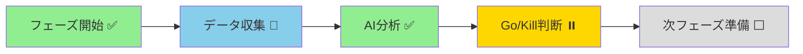
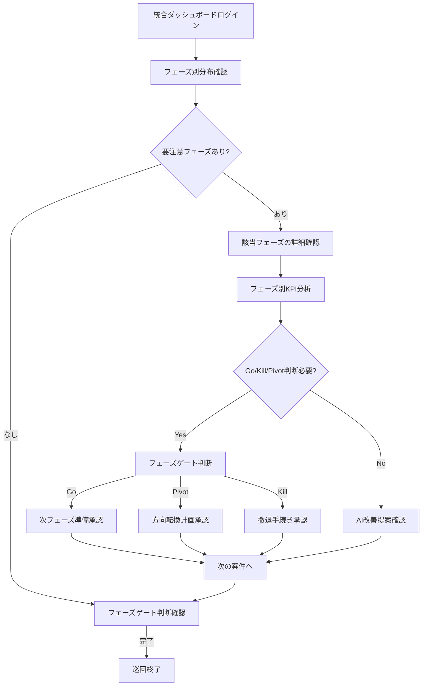

# UnsonOS 中核UI ストーリーボード設計

## 概要

UnsonOSの中核UIは、100-200個のマイクロSaaSプロダクトを効率的に管理・監督するためのダッシュボードシステムです。人間とAIエージェントが協調して意思決定を行うためのインターフェースを提供します。

## 画面一覧（主要機能別）

### 1. 統合ダッシュボード画面

全100のSaaSプロダクトの全体状況を俯瞰するトップページです。

#### 主要コンポーネント
- **フェーズ別分布サマリー**
  - 市場調査（15個）、LP検証（25個）、MVP開発（30個）、収益化（20個）、スケール（8個）、撤退（2個）
  - 各フェーズのアラート件数と要対応案件
  - フェーズ遷移のペース（週次/月次のPhase Gate通過数）

- **全体KPIサマリー**
  - 総収益、平均利益率、稼働率などの主要指標
  - 前日比・前週比での変動を記号（↑/↓/→）で表示
  - フェーズ別パフォーマンス指標（市場調査成功率、LP検証CVR平均、MVP継続率平均等）

- **プロダクトハイライト**
  - 各フェーズの上位/下位パフォーマンスのプロダクト表示
  - フェーズゲート判断待ちの件数（Go/Kill判断ペンディング）
  - 承認待ちGate数の通知バッジ

- **アクションエリア**
  - フェーズ別の重要アラート表示（CVR低下、継続率悪化、競合脅威等）
  - フェーズゲート承認への直接リンク
  - AIからのフェーズ別重要メッセージフィード

### 2. SaaSプロダクト一覧画面

個々のプロダクトの状態を一覧比較できる画面です。フェーズ別にタブ分けして管理。

#### 主要コンポーネント
- **フェーズ別ポートフォリオテーブル**
  ```
  [市場調査] [LP検証] [MVP開発] [収益化] [スケール] [撤退準備]
  
  | プロダクト名 | フェーズ | 主要KPI | 次回判断 | 状態 |
  |------------|---------|---------|----------|------|
  | SaaS-A     | LP検証  | CVR:11% ↑ | 3日後   | 順調 🟢 |
  | SaaS-B     | MVP開発 | RET7:22% ↓ | Gate待ち | 要注意 🟡 |
  | SaaS-C     | 収益化  | LTV/CAC:2.1 | 7日後   | 危険 🔴 |
  ```

- **フェーズ別フィルタリング・ソート機能**
  - フェーズ内でのKPI順ソート（CVR、継続率、LTV/CAC等）
  - 判断期限順、リスクレベル順での表示
  - フェーズ別の成功/失敗パターンでの絞り込み

- **一括操作**
  - 複数プロダクトの選択
  - バッチでの設定変更
  - CSVエクスポート機能

### 3. SaaS詳細画面

選択した各プロダクトの詳細状況を深掘りする画面です。フェーズに応じて表示内容が動的に変化します。

#### フェーズ別コンテンツ表示

##### 市場調査フェーズの詳細画面
```javascript
{
  phase: "market-research",
  daysRemaining: 9,
  kpis: {
    tam: "¥50B",
    competitors: 12,
    searchVolume: "50K/month",
    trendScore: 85
  },
  aiInsight: "中小企業向け在庫管理で、音声入力特化のニッチを発見",
  opportunityScore: 72,
  decision: {
    recommendation: "Go",
    deadline: "2025-01-22"
  }
}
```

##### LP検証フェーズの詳細画面
```javascript
{
  phase: "landing-validation",
  weekProgress: "1/2",
  kpis: {
    visitors: 1234,
    signups: 89,
    cvr: "7.2%", // 目標10%
    cac: "¥506",
    abTestWinner: "B案: 価格訴求"
  },
  heatmap: "ヒートマップ表示",
  userFeedback: ["価格が明確で良い", "機能がよくわからない"]
}
```

##### Playbook進行状況ビュー（フェーズ共通）


##### フェーズゲート承認パネル
```yaml
# LP検証→MVP開発への移行判断例
フェーズゲート承認:
  current: "LP検証 (Week 2/2)"
  next: "MVP開発"
  criteria:
    CVR: "11.2% ✅ (目標10%)"
    CAC: "¥650 ⚠️ (目標¥500)" 
    フィードバック: "ポジティブ ✅"
  risk: "競合参入リスク: 低"
  investment: "¥200万"
  ai_recommendation: "CACは高いが改善可能。需要確実でGo推奨"
  
アクション:
  - Go - MVP開発へ（緑ボタン）
  - Pivot - 方向転換（黄ボタン）
  - Kill - 撤退（赤ボタン）
  - コメント入力欄
```

### 4. Gate承認画面（承認キュー）

全プロダクト横断で保留中のGate承認リクエストとフェーズゲート判断を一覧する専用画面です。

#### 承認カードレイアウト（フェーズゲート含む）

##### フェーズゲート判断カード
```
┌─────────────────────────────────────┐
│ 🚀 SaaS-A: LP検証→MVP開発移行      │
│                                     │
│ 達成状況: CVR 11.2%✅ CAC ¥650⚠️  │
│ 投資額: ¥200万 / 期間: 8週間       │
│ AIの推奨: Go推奨 🟢               │
│ 締切: あと3日                       │
│                                     │
│ [詳細] [Go🚀] [Pivot🔄] [Kill❌]   │
└─────────────────────────────────────┘
```

##### 通常のGate承認カード
```
┌─────────────────────────────────────┐
│ 🔔 SaaS-B - 価格改定（収益化中）   │
│                                     │
│ 提案: ¥3,980→¥3,480に変更         │
│ 予想効果: CVR ↑2% / LTV ↑15%      │
│ AIの推奨: 承認推奨 🟢              │
│                                     │
│ [詳細] [承認✅] [保留⏸️] [却下❌]   │
└─────────────────────────────────────┘
```

## ユーザー行動ストーリー（巡回フロー）

### フェーズ重視の定期巡回フロー



### 承認フロー詳細

1. **通知確認**
   - ヘッダーの通知バッジで未承認数を確認
   - クリックでGate承認画面へ遷移

2. **内容精査**
   - 提案内容と影響指標の確認
   - AIの推奨理由の詳細確認
   - 必要に応じてシミュレーション結果参照

3. **意思決定**
   - 承認/保留/却下の選択
   - 確認ダイアログでの最終確認
   - コメント入力（保留・却下時は必須）

4. **実行とフィードバック**
   - 決定の即時反映
   - AIへのフィードバック送信
   - Playbook進行状況の更新

## インジケーター（記号化KPI）の視認性

### KPI記号の定義と表示ルール

| 記号 | 意味 | 色 | 条件 |
|------|------|-----|------|
| ↑ | 上昇 | 緑 | 前期比+5%以上 |
| → | 横ばい | 灰 | 前期比±5%未満 |
| ↓ | 下降 | 赤 | 前期比-5%以下 |

### ステータスインジケーター

```javascript
const statusIndicators = {
  completed: { icon: "✅", color: "green", label: "完了" },
  inProgress: { icon: "🔄", color: "blue", label: "進行中" },
  pending: { icon: "⏸️", color: "yellow", label: "保留" },
  error: { icon: "⚠️", color: "red", label: "エラー" },
  waiting: { icon: "⏰", color: "orange", label: "待機中" }
};
```

### スコアリング表示

```javascript
const scoreDisplay = {
  excellent: { range: [80, 100], color: "🟢", badge: "優良" },
  good: { range: [60, 79], color: "🟡", badge: "良好" },
  warning: { range: [40, 59], color: "🟠", badge: "要注意" },
  critical: { range: [0, 39], color: "🔴", badge: "危険" }
};
```

## Gate承認操作のセーフガード

### 多段階確認プロセス

```typescript
interface GateApprovalFlow {
  // Step 1: 初期選択
  initialAction: 'approve' | 'hold' | 'reject';
  
  // Step 2: 確認ダイアログ
  confirmationDialog: {
    title: string;
    impacts: Array<{metric: string, change: string}>;
    requireComment: boolean;
  };
  
  // Step 3: 最終確認（重要Gate時）
  finalConfirmation?: {
    requireSecondApprover: boolean;
    cooldownPeriod: number; // seconds
  };
  
  // Step 4: Undo機能
  undoWindow: {
    duration: 300; // 5分間
    enabled: boolean;
  };
}
```

### セキュリティ機能

1. **誤操作防止**
   - ボタンの色分けと配置の工夫
   - ダブルクリック防止
   - 確認ダイアログの必須化

2. **権限管理**
   - ロールベースのアクセス制御
   - 重要Gateの複数承認要求
   - 承認履歴の完全記録

3. **監査証跡**
   ```javascript
   {
     timestamp: "2025-01-13T10:30:00Z",
     user: "代表者A",
     action: "approved",
     gate: "PLB^pricing_change",
     comment: "市場状況を考慮し承認",
     ipAddress: "192.168.1.1"
   }
   ```

## UIトーン設計

### デザイン原則

#### 1. 安心感（Trust）
- **カラーパレット**: ブルー・グレー基調の落ち着いた配色
- **透明性**: AIの判断根拠を常に表示
- **言語**: 専門用語を避けた平易な表現

#### 2. 決定感（Decisiveness）
- **フィードバック**: 即座の視覚的確認
- **演出**: 承認時のアニメーション効果
- **確認**: 意図的な間合い（Mindful Friction）

#### 3. 信頼感（Partnership）
- **AI表現**: 控えめだが認識可能なAIプレゼンス
- **対話性**: 双方向のフィードバックループ
- **学習表示**: AI改善の可視化

### メッセージトーン例

```javascript
const messageTemplates = {
  aiProposal: "分析の結果、{action}を提案します。ご判断をお願いします。",
  approvalThanks: "承認ありがとうございます。引き続き対応いたします。",
  rejectionAck: "却下を承知しました。代替案を検討します。",
  learningFeedback: "フィードバックを学習し、提案精度を改善しました。"
};
```

## レスポンシブデザイン考慮事項

### デバイス別最適化

| デバイス | 画面サイズ | 主な用途 | UI調整 |
|---------|-----------|---------|--------|
| デスクトップ | 1920x1080+ | 詳細分析・承認作業 | フル機能 |
| タブレット | 768-1024px | 外出先での確認・承認 | 簡略表示 |
| モバイル | 〜767px | 緊急承認・通知確認 | 最小限機能 |

### アクセシビリティ

- **キーボード操作**: Tab順序の最適化
- **スクリーンリーダー**: ARIA属性の適切な設定
- **色覚異常対応**: 色だけに依存しない情報伝達
- **文字サイズ**: 可変対応（最小14px）

## パフォーマンス目標

| 指標 | 目標値 | 測定方法 |
|------|--------|----------|
| 初期表示 | < 2秒 | First Contentful Paint |
| インタラクティブ | < 3秒 | Time to Interactive |
| API応答 | < 500ms | 95パーセンタイル |
| リアルタイム更新 | < 100ms | WebSocket遅延 |

## 実装技術スタック

```javascript
const techStack = {
  frontend: {
    framework: "Next.js 14",
    ui: "Tailwind CSS + shadcn/ui",
    charts: "Recharts / D3.js",
    state: "Zustand / TanStack Query"
  },
  realtime: {
    protocol: "WebSocket",
    library: "Socket.io",
    fallback: "Server-Sent Events"
  },
  monitoring: {
    analytics: "PostHog",
    errors: "Sentry",
    performance: "Web Vitals"
  }
};
```

## 今後の拡張計画

1. **AI対話機能の強化**
   - 自然言語での指示入力
   - 音声コマンド対応
   - ChatGPT統合

2. **予測ダッシュボード**
   - What-ifシナリオ分析
   - 将来予測の可視化
   - リスクアラート

3. **協調機能**
   - チームメンバー間の共有
   - コメント・議論機能
   - 承認ワークフロー拡張

## 関連ドキュメント

- [データ駆動コアシステム](./data-driven-core.md)
- [Playbook DSL仕様](./playbook-dsl-spec.md)
- [Gate承認設計](./playbook-dsl-spec.md#gate-node)
- [Product SDK実装ガイド](./product-sdk-guide.md)