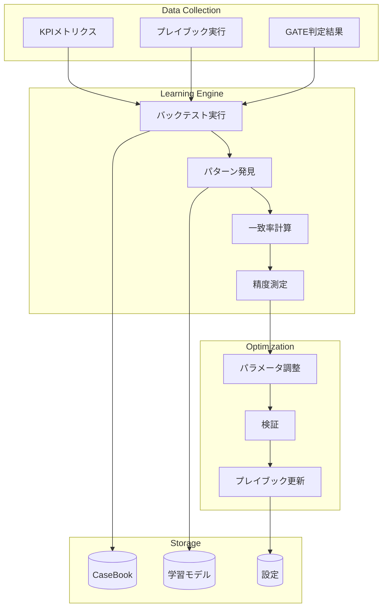

# インジケーター学習システム設計書

## 概要

UnsonOSにおけるバックテストベースのプレイブック精度向上システム。FXの手法を参考に、複数インジケーターの重ね合わせ率と予測精度を分析し、プレイブックを自動チューニングします。

## コアコンセプト

### FX手法との対応関係

| FX要素 | UnsonOS実装 | 説明 |
|--------|------------|------|
| 15分平均足 | フェーズ別北極星指標 | フェーズごとに異なる「真実」を定義 |
| ローソク足の陽線/陰線 | KPI改善/悪化の判定 | 複合スコアによる健全性評価 |
| 指標の重ね合わせ率 | インジケーター一致率 | 複数KPIの方向性一致度 |
| バックテスト | CaseBook履歴分析 | 過去の実行結果から学習 |
| 予測精度 | GATE承認率 | システム推奨と人間判定の一致率 |

## システムアーキテクチャ



## フェーズ別「絶対的指標」定義

### 1. 北極星指標（North Star Metrics）

```typescript
type PhaseMetrics = {
  'LP検証': {
    primary: 'CVR',           // 主要指標：コンバージョン率
    threshold: 0.10,          // 成功閾値：10%
    window: 'short',          // 評価期間：7日
    truth: 'binary'           // 判定：閾値超えで成功
  },
  'MVP開発': {
    primary: '7day_retention', // 主要指標：7日継続率
    threshold: 0.50,          // 成功閾値：50%
    window: 'mid',            // 評価期間：14日
    truth: 'binary'
  },
  '収益化': {
    primary: 'LTV_CAC_ratio', // 主要指標：LTV/CAC比
    threshold: 3.0,           // 成功閾値：3.0倍
    window: 'long',           // 評価期間：28日
    truth: 'continuous'       // 判定：連続値評価
  },
  'スケール': {
    primary: 'MRR_growth',    // 主要指標：MRR成長率
    threshold: 0.20,          // 成功閾値：20%/月
    window: 'long',
    truth: 'continuous'
  },
  'サンセット': {
    primary: 'churn_rate',    // 主要指標：解約率
    threshold: 0.20,          // 危険閾値：20%超
    window: 'mid',
    truth: 'binary'
  }
}
```

### 2. 複合健全性スコア

```typescript
class HealthScoreCalculator {
  calculate(saas: SaaS, window: TimeWindow): HealthScore {
    const weights = this.getPhaseWeights(saas.phase);
    
    return {
      score: this.weightedAverage({
        mrr: { value: saas.mrr, weight: weights.mrr },
        ltv_cac: { value: saas.ltv / saas.cac, weight: weights.ltv_cac },
        retention: { value: saas.retention, weight: weights.retention },
        growth: { value: saas.growthRate, weight: weights.growth },
        cvr: { value: saas.cvr, weight: weights.cvr }
      }),
      
      // FXの陽線/陰線に相当
      direction: this.score > this.previousScore ? '↗️' : '↘️',
      
      // 予測との比較
      predicted: this.predictions[window],
      accuracy: this.calculateAccuracy()
    };
  }
  
  private getPhaseWeights(phase: Phase): Weights {
    // フェーズごとに重み付けを変更
    switch(phase) {
      case 'LP検証':
        return { cvr: 0.7, retention: 0.2, growth: 0.1 };
      case '収益化':
        return { mrr: 0.4, ltv_cac: 0.3, retention: 0.3 };
      default:
        return { mrr: 0.3, ltv_cac: 0.25, retention: 0.25, growth: 0.2 };
    }
  }
}
```

## インジケーター学習システム

### 1. パターン発見エンジン

```typescript
class PatternDiscoveryEngine {
  // インジケーターの重ね合わせパターンを発見
  async discoverPatterns(
    window: TimeWindow,
    minSamples: number = 100
  ): Promise<IndicatorPattern[]> {
    const cases = await CaseBook.query({
      window,
      minSamples,
      includeOutcomes: true
    });
    
    return cases
      .map(c => this.extractPattern(c))
      .groupBy('patternId')
      .map(group => ({
        pattern: group.key,
        indicators: group.indicators,
        consensusRate: this.calculateConsensus(group.indicators),
        successRate: group.successCount / group.total,
        confidence: this.calculateConfidence(group.samples),
        recommendations: this.generateRecommendations(group)
      }))
      .filter(p => p.confidence > 0.75)
      .sort((a, b) => b.successRate - a.successRate);
  }
  
  private calculateConsensus(indicators: Indicator[]): number {
    // 指標の方向性一致率を計算（FXの重ね合わせ率に相当）
    const directions = indicators.map(i => i.direction);
    const majorityDirection = this.getMajorityDirection(directions);
    const consensusCount = directions.filter(d => d === majorityDirection).length;
    
    return consensusCount / directions.length;
  }
  
  private extractPattern(caseEntry: CaseEntry): Pattern {
    return {
      patternId: this.generatePatternId(caseEntry.indicators),
      indicators: {
        mrr: caseEntry.metrics.mrr.direction,
        dau: caseEntry.metrics.dau.direction,
        cvr: caseEntry.metrics.cvr.direction,
        churn: caseEntry.metrics.churn.direction,
        cac: caseEntry.metrics.cac.direction
      },
      outcome: caseEntry.outcome,
      gateDecision: caseEntry.gateDecision
    };
  }
}
```

### 2. バックテストエンジン

```typescript
class BacktestEngine {
  async runBacktest(
    playbook: Playbook,
    historicalData: HistoricalData,
    config: BacktestConfig
  ): Promise<BacktestResult> {
    const results: PredictionResult[] = [];
    
    // 過去データに対してプレイブックを仮想実行
    for (const dataPoint of historicalData) {
      const prediction = await this.predictOutcome(playbook, dataPoint);
      const actual = await this.getActualOutcome(dataPoint, config.window);
      
      results.push({
        timestamp: dataPoint.timestamp,
        saasId: dataPoint.saasId,
        phase: dataPoint.phase,
        
        // 予測時のインジケーター状態
        indicators: dataPoint.indicators,
        consensusRate: this.calculateConsensusRate(dataPoint.indicators),
        
        // 予測と実績
        predicted: prediction,
        actual: actual,
        correct: prediction === actual,
        
        // 詳細分析用データ
        confidence: this.calculateConfidence(dataPoint),
        gateAlignment: await this.checkGateAlignment(prediction, dataPoint)
      });
    }
    
    return {
      totalSamples: results.length,
      accuracy: results.filter(r => r.correct).length / results.length,
      
      // 一致率別の精度分析
      accuracyByConsensus: this.analyzeByConsensusRate(results),
      
      // フェーズ別の精度分析
      accuracyByPhase: this.analyzeByPhase(results),
      
      // 失敗パターンの特定
      failurePatterns: this.identifyFailurePatterns(results),
      
      // 改善提案
      improvements: this.generateImprovements(results)
    };
  }
  
  private analyzeByConsensusRate(results: PredictionResult[]): ConsensusAnalysis {
    // 一致率ごとにグループ化して精度を分析
    const groups = {
      high: results.filter(r => r.consensusRate >= 0.8),
      medium: results.filter(r => r.consensusRate >= 0.5 && r.consensusRate < 0.8),
      low: results.filter(r => r.consensusRate < 0.5)
    };
    
    return {
      high: {
        samples: groups.high.length,
        accuracy: groups.high.filter(r => r.correct).length / groups.high.length,
        recommendation: 'High consensus - Strong signal for entry'
      },
      medium: {
        samples: groups.medium.length,
        accuracy: groups.medium.filter(r => r.correct).length / groups.medium.length,
        recommendation: 'Medium consensus - Consider additional validation'
      },
      low: {
        samples: groups.low.length,
        accuracy: groups.low.filter(r => r.correct).length / groups.low.length,
        recommendation: 'Low consensus - Skip or reduce position'
      }
    };
  }
}
```

### 3. プレイブック自動チューニング

```typescript
class PlaybookTuner {
  async tunePlaybook(
    playbook: Playbook,
    backtestResults: BacktestResult
  ): Promise<TunedPlaybook> {
    const currentAccuracy = backtestResults.accuracy;
    
    // 1. 閾値の最適化
    const optimizedThresholds = await this.optimizeThresholds(
      playbook,
      backtestResults
    );
    
    // 2. 重み付けの調整
    const optimizedWeights = await this.optimizeWeights(
      playbook,
      backtestResults
    );
    
    // 3. 失敗パターンへの対策追加
    const failureHandlers = await this.createFailureHandlers(
      backtestResults.failurePatterns
    );
    
    // 4. 新しいプレイブックの生成
    const tunedPlaybook = {
      ...playbook,
      version: this.incrementVersion(playbook.version),
      thresholds: optimizedThresholds,
      weights: optimizedWeights,
      guards: [
        ...playbook.guards,
        ...failureHandlers
      ],
      metadata: {
        previousAccuracy: currentAccuracy,
        targetAccuracy: currentAccuracy * 1.1, // 10%改善目標
        tuningDate: new Date(),
        backtestSamples: backtestResults.totalSamples
      }
    };
    
    // 5. 検証
    const validation = await this.validateTunedPlaybook(tunedPlaybook);
    
    if (validation.accuracy > currentAccuracy) {
      return tunedPlaybook;
    } else {
      throw new Error('Tuning did not improve accuracy');
    }
  }
  
  private async optimizeThresholds(
    playbook: Playbook,
    results: BacktestResult
  ): Promise<Thresholds> {
    // グリッドサーチで最適な閾値を探索
    const searchSpace = this.generateSearchSpace(playbook.thresholds);
    let bestThresholds = playbook.thresholds;
    let bestAccuracy = results.accuracy;
    
    for (const candidate of searchSpace) {
      const testResults = await this.testThresholds(candidate);
      if (testResults.accuracy > bestAccuracy) {
        bestAccuracy = testResults.accuracy;
        bestThresholds = candidate;
      }
    }
    
    return bestThresholds;
  }
}
```

## 実装例：CVRインジケーター学習

```typescript
class CVRIndicatorLearning {
  async learn(saasId: string): Promise<LearningResult> {
    // 1. 過去のCVRパターンを収集
    const patterns = await this.collectCVRPatterns(saasId);
    
    // 2. パターンごとの成功率を計算
    const patternAnalysis = patterns.map(p => ({
      pattern: p,
      consensusRate: this.calculateConsensus(p.indicators),
      nextPeriodSuccess: p.outcome === 'improved',
      gateApproval: p.gateDecision === 'approved'
    }));
    
    // 3. 高精度パターンを特定
    const highAccuracyPatterns = patternAnalysis
      .filter(p => p.consensusRate > 0.75)
      .filter(p => p.nextPeriodSuccess)
      .filter(p => p.gateApproval);
    
    // 4. 学習モデルを更新
    return {
      patternCount: patterns.length,
      highAccuracyPatterns: highAccuracyPatterns.length,
      averageAccuracy: this.calculateAverageAccuracy(patternAnalysis),
      recommendations: this.generateRecommendations(highAccuracyPatterns)
    };
  }
  
  private calculateConsensus(indicators: Indicators): number {
    // CVRに関連する指標の一致率を計算
    const relevantIndicators = [
      indicators.cvr,           // CVR自体
      indicators.traffic,       // トラフィック
      indicators.bounce_rate,   // 直帰率（逆相関）
      indicators.page_views,    // ページビュー
      indicators.session_time   // 滞在時間
    ];
    
    const positiveCount = relevantIndicators
      .filter(i => i.direction === '↗️' || i.direction === '⬆️')
      .length;
    
    return positiveCount / relevantIndicators.length;
  }
}
```

## GATE判定を活用した精度測定

```typescript
class GateAccuracyMeasurement {
  async measureAccuracy(
    period: DateRange
  ): Promise<AccuracyReport> {
    const gates = await this.getGateDecisions(period);
    
    const results = gates.map(gate => ({
      gateId: gate.id,
      
      // システムの推奨
      systemRecommendation: gate.systemRecommendation,
      systemConfidence: gate.systemConfidence,
      indicatorConsensus: gate.indicatorConsensus,
      
      // 人間の判定（これが「真実」）
      humanDecision: gate.actualDecision,
      humanReasoning: gate.reasoning,
      
      // 一致したか
      aligned: gate.systemRecommendation === gate.actualDecision,
      
      // 結果の追跡
      outcomeAfter7Days: gate.outcomes.day7,
      outcomeAfter30Days: gate.outcomes.day30
    }));
    
    return {
      totalGates: results.length,
      systemAccuracy: results.filter(r => r.aligned).length / results.length,
      
      // 信頼度別の精度
      accuracyByConfidence: this.analyzeByConfidence(results),
      
      // インジケーター一致率別の精度
      accuracyByConsensus: this.analyzeByConsensus(results),
      
      // 最終的な成果との相関
      outcomeCorrelation: this.calculateOutcomeCorrelation(results)
    };
  }
}
```

## 継続的改善サイクル

```yaml
improvement_cycle:
  daily:
    - collect_metrics
    - update_indicators
    - check_drift
    
  weekly:
    - run_backtest
    - analyze_patterns
    - measure_accuracy
    
  monthly:
    - tune_playbooks
    - validate_improvements
    - deploy_updates
    
  quarterly:
    - comprehensive_review
    - model_retraining
    - strategy_adjustment
```

## まとめ

このシステムにより、FXの手法をUnsonOSに適用し、以下を実現します：

1. **インジケーター一致率**による信頼度評価
2. **バックテスト**による予測精度の定量化
3. **パターン発見**による高精度シグナルの特定
4. **自動チューニング**によるプレイブック改善
5. **GATE判定**を真実として活用した学習

これにより、プレイブックの精度を継続的に向上させ、100-200個のSaaSの自動運営精度を高めることができます。