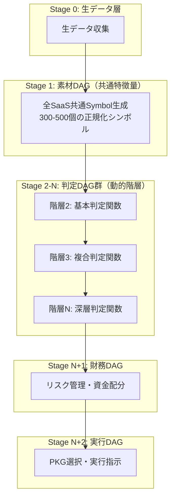

# PKG システム 高度なDAGアーキテクチャ仕様書

## 1. 統合DAGアーキテクチャ概要

### 1.1 基本原則

PKGシステムは以下の原則に基づいた厳密なDAG（有向非巡環グラフ）構造を採用：

1. **階層参照の絶対ルール**: 階層Nのノードは階層N-1以下のノードのみを参照可能
2. **無限階層対応**: 階層数に上限なし（関数合成の深さに応じて動的に拡張）
3. **横参照禁止**: 同階層間の参照は禁止（DAGの本質）
4. **素材と判断の分離**: データ処理と判定ロジックを明確に分離

### 1.2 統合アーキテクチャ構造



## 2. PKG ID体系の拡張

### 2.1 ID構造定義（改善版）

```
[DAG種別]^[階層]-[連番]
```

#### UnsonOS用ID体系
```
M^N-XXX  # Material DAG（素材DAG）
D^N-XXX  # Decision DAG（判定DAG）
F^N-XXX  # Financial DAG（財務DAG）
X^N-XXX  # eXecution DAG（実行DAG）
```

#### 詳細構造と例
```
M^1-005   Material DAG, Layer1, Node5（Symbol生成）
D^10-002  Decision DAG, Layer10, Node2（深層判定）
F^100-001 Financial DAG, Layer100, Node1（リスク評価）
X^1-001   eXecution DAG, Layer1, Node1（最終実行）
```

#### DAG種別プレフィックス定義
| プレフィックス | DAG種別 | 役割 | 階層範囲 |
|---------------|---------|------|----------|
| **M** | Material | 生データ収集・Symbol生成 | 0-99 |
| **D** | Decision | 判定ロジック・条件評価 | 100-899 |
| **F** | Financial | リスク管理・資源配分 | 900-949 |
| **X** | eXecution | PKG選択・最終実行 | 950-999 |

### 2.2 階層別ID割り当て

| DAG種別 | ID範囲例 | 役割 | ノード数目安 |
|---------|----------|------|-------------|
| Material | M^0-001〜999 | 生データ収集 | 50-100 |
| Material | M^1-001〜999 | Symbol生成 | 300-500 |
| Decision | D^100-001〜999 | 基本判定関数 | 100-200 |
| Decision | D^200-001〜999 | 複合判定関数 | 100-200 |
| Decision | D^N-001〜999 | 深層判定関数 | 可変 |
| Financial | F^900-001〜999 | リスク評価 | 50-100 |
| Financial | F^910-001〜999 | 資源配分 | 30-50 |
| eXecution | X^950-001〜999 | PKG選択 | 20-50 |
| eXecution | X^960-001〜999 | 実行指示 | 10-30 |

## 3. 素材DAGと判定DAGの分離

### 3.1 素材DAG（データ処理層）

**責務**: 生データの収集・正規化・特徴量生成

```typescript
// 素材DAG定義
class MaterialDAG {
  // 階層1: Symbol生成のみを担当
  static readonly LAYER = 1;
  
  // 全SaaS共通の特徴量を生成
  generateSymbols(rawData: RawMetrics): SymbolSet {
    const symbols: SymbolSet = {};
    
    // ビジネス指標（B_xxx）
    symbols['B_MRR'] = this.normalizeMRR(rawData.mrr);
    symbols['B_CHURN'] = this.normalizeChurn(rawData.churn);
    symbols['B_LTV_CAC'] = this.normalizeLtvCac(rawData.ltv, rawData.cac);
    
    // ユーザー指標（U_xxx）
    symbols['U_DAU_MAU'] = this.normalizeEngagement(rawData.dau, rawData.mau);
    symbols['U_RETENTION_D7'] = this.normalizeRetention(rawData.retention7d);
    
    // 市場指標（M_xxx）
    symbols['M_TREND'] = this.normalizeTrend(rawData.searchVolume);
    symbols['M_COMPETITION'] = this.normalizeCompetition(rawData.competitors);
    
    // 技術指標（T_xxx）
    symbols['T_UPTIME'] = this.normalizeUptime(rawData.uptime);
    symbols['T_ERROR_RATE'] = this.normalizeErrorRate(rawData.errors);
    
    return symbols;
  }
  
  // 正規化関数（0-1範囲への変換）
  private normalizeMRR(mrr: number): number {
    const target = 100000; // 10万円を基準
    return Math.min(mrr / target, 1);
  }
  
  // 他の正規化関数...
}
```

### 3.2 判定DAG（ロジック層）

**責務**: シンボルを基にビジネス判定を実行

```typescript
// 判定DAG定義（階層2以降）
class JudgmentDAG {
  // 動的階層対応
  private layer: number;
  private dependencies: string[]; // 下位階層のノードID
  
  constructor(layerNumber: number, deps: string[]) {
    this.layer = layerNumber;
    this.validateDependencies(deps);
    this.dependencies = deps;
  }
  
  // 依存関係の検証（下位階層のみ参照可能）
  private validateDependencies(deps: string[]): void {
    deps.forEach(dep => {
      const depLayer = this.extractLayer(dep);
      if (depLayer >= this.layer) {
        throw new Error(`階層${this.layer}は階層${depLayer}を参照できません`);
      }
    });
  }
  
  // D^100-001: 基本判定
  static D_100_001_PMF_CHECK(symbols: SymbolSet): boolean {
    return symbols['U_RETENTION_D7'] > 0.5 && 
           symbols['B_GROWTH'] > 0.2 &&
           symbols['U_DAU_MAU'] > 0.4;
  }
  
  // D^200-001: 複合判定（下位層の結果を利用）
  static D_200_001_CRISIS_DETECT(d100Results: DecisionLayer100Results): boolean {
    return !d100Results.pmfCheck && 
           d100Results.churnAlert &&
           d100Results.mrrDecline;
  }
  
  // D^N-001: 深層判定（すべての下位層を参照可能）
  static D_N_001_FINAL_DECISION(allLowerLayers: LayerResults[]): PKGAction {
    // 複雑な判定ロジック
    const aggregatedScore = this.aggregateScores(allLowerLayers);
    return this.selectPKG(aggregatedScore);
  }
}
```

## 4. 財務DAGの実装（UnsonOS特化版）

### 4.1 UnsonOS版財務DAGの役割定義

UnsonOS版の財務DAGは、以下の4つの主要機能を担当します：

1. **リソース制約管理**: CPU、メモリ、DB接続数の制限
2. **PKG実行コスト評価**: 各PKGの実行コストと予算管理
3. **同時実行数制御**: 並列PKG実行の最適化
4. **リスク評価**: SaaS全体のポートフォリオリスク管理

### 4.2 財務DAG構造

```typescript
// UnsonOS財務DAG（F^900-XXX系列）
class UnsonOSFinancialDAG {
  // UnsonOS特化のリソース制約
  private readonly constraints = {
    maxConcurrentPKGs: 20,           // 同時実行PKG数上限
    maxMemoryUsageMB: 1000,          // メモリ使用量上限
    maxDBConnections: 50,            // DB同時接続数上限
    maxCPUUsagePercent: 80,          // CPU使用率上限
    emergencyReservePercent: 20      // 緊急時リソース予約
  };
  
  // PKGカテゴリ別コスト定義
  private readonly pkgCosts = {
    'CRISIS': { cpu: 0.8, memory: 100, dbConnections: 5, priority: 100 },
    'KILL': { cpu: 0.5, memory: 50, dbConnections: 2, priority: 100 },
    'PIVOT': { cpu: 1.0, memory: 150, dbConnections: 8, priority: 80 },
    'SCALE': { cpu: 0.6, memory: 80, dbConnections: 4, priority: 70 },
    'OPTIMIZE': { cpu: 0.3, memory: 40, dbConnections: 2, priority: 60 }
  };
  
  // F^900-001: メインの財務評価関数
  evaluate(judgmentResults: JudgmentResults, currentLoad: SystemLoad): FinancialDecision {
    const resourceCheck = this.checkResourceAvailability(currentLoad);
    const costEstimate = this.calculatePKGCosts(judgmentResults.selectedPKGs);
    const riskAssessment = this.assessPortfolioRisk(judgmentResults);
    
    return {
      canExecute: resourceCheck.available && costEstimate.withinBudget,
      maxConcurrent: this.calculateOptimalConcurrency(resourceCheck, costEstimate),
      resourceAllocation: this.optimizeResourceAllocation(judgmentResults),
      riskLevel: riskAssessment.overallRisk,
      recommendations: this.generateRecommendations(resourceCheck, costEstimate, riskAssessment)
    };
  }
  
  // F^910-001: リソース可用性チェック
  private checkResourceAvailability(currentLoad: SystemLoad): ResourceAvailability {
    const available = {
      cpu: (this.constraints.maxCPUUsagePercent - currentLoad.cpuUsage) / 100,
      memory: this.constraints.maxMemoryUsageMB - currentLoad.memoryUsageMB,
      dbConnections: this.constraints.maxDBConnections - currentLoad.dbConnections,
      concurrentSlots: this.constraints.maxConcurrentPKGs - currentLoad.runningPKGs
    };
    
    return {
      available: Object.values(available).every(v => v > 0),
      resourceLimits: available,
      emergencyReserve: this.calculateEmergencyReserve(available)
    };
  }
  
  // F^920-001: PKG実行コスト計算
  private calculatePKGCosts(selectedPKGs: PKGCandidate[]): CostEstimate {
    let totalCost = { cpu: 0, memory: 0, dbConnections: 0 };
    let totalBudget = 0;
    
    selectedPKGs.forEach(pkg => {
      const cost = this.pkgCosts[pkg.category];
      totalCost.cpu += cost.cpu;
      totalCost.memory += cost.memory;
      totalCost.dbConnections += cost.dbConnections;
      totalBudget += this.calculateMonetaryCost(pkg);
    });
    
    return {
      resourceCost: totalCost,
      monetaryCost: totalBudget,
      withinBudget: this.isWithinBudget(totalCost, totalBudget),
      recommendations: this.getCostOptimizationSuggestions(selectedPKGs)
    };
  }
  
  // F^930-001: ポートフォリオリスク評価
  private assessPortfolioRisk(judgmentResults: JudgmentResults): RiskAssessment {
    const concentrationRisk = this.calculateConcentrationRisk(judgmentResults);
    const executionRisk = this.calculateExecutionRisk(judgmentResults);
    const cascadeRisk = this.calculateCascadeRisk(judgmentResults);
    
    return {
      overallRisk: Math.max(concentrationRisk, executionRisk, cascadeRisk),
      concentrationRisk,
      executionRisk,
      cascadeRisk,
      mitigation: this.suggestRiskMitigation(concentrationRisk, executionRisk, cascadeRisk)
    };
  }
}
```

## 5. 実行DAGの統合

### 5.1 最終実行層

```typescript
// 実行DAG（最上位層）
class ExecutionDAG {
  execute(
    materialSymbols: SymbolSet,
    judgmentResults: JudgmentResults,
    financialDecision: FinancialDecision
  ): ExecutionPlan {
    // PKG競合解決
    const resolvedPKGs = this.resolveConflicts(judgmentResults.selectedPKGs);
    
    // 実行順序決定
    const executionOrder = this.determineOrder(resolvedPKGs, financialDecision.priority);
    
    // バッチ処理計画
    const batches = this.createBatches(executionOrder, {
      maxParallel: 20,
      cycleTime: financialDecision.cycleTime
    });
    
    return {
      immediate: batches.filter(b => b.priority === 'CRITICAL'),
      scheduled: batches.filter(b => b.priority !== 'CRITICAL'),
      monitoring: this.setupMonitoring(batches)
    };
  }
  
  // PKG競合解決アルゴリズム
  private resolveConflicts(pkgs: PKGCandidate[]): PKGCandidate[] {
    const conflictGroups = this.detectConflicts(pkgs);
    
    return conflictGroups.map(group => {
      if (group.length === 1) return group[0];
      
      // 優先度マトリックスによる解決
      return this.selectByPriority(group, {
        'KILL': 100,
        'CRISIS': 90,
        'PIVOT': 80,
        'SCALE': 70,
        'OPTIMIZE': 60
      });
    });
  }
}
```

## 6. 実装上の重要な注意点

### 6.1 階層参照チェック

```typescript
// 階層参照バリデーター
class LayerValidator {
  static validate(dag: DAGNode): void {
    const nodeLayer = this.extractLayer(dag.id);
    
    dag.dependencies.forEach(depId => {
      const depLayer = this.extractLayer(depId);
      
      // 厳密なチェック: 自分より下の階層のみ参照可能
      if (depLayer >= nodeLayer) {
        throw new Error(
          `違反: ${dag.id}（階層${nodeLayer}）が` +
          `${depId}（階層${depLayer}）を参照しています`
        );
      }
    });
  }
  
  private static extractLayer(nodeId: string): number {
    // "M^N-XXX" または "D^N-XXX" から N を抽出
    const match = nodeId.match(/[MDFX]\^(\d+)-/);
    return match ? parseInt(match[1]) : 0;
  }
}
```

### 6.2 動的階層管理

```typescript
// 動的階層システム
class DynamicLayerSystem {
  private layers: Map<number, DAGNode[]> = new Map();
  
  // 階層は必要に応じて自動追加
  addNode(node: DAGNode): void {
    const layer = this.extractLayer(node.id);
    
    if (!this.layers.has(layer)) {
      this.layers.set(layer, []);
    }
    
    // 参照整合性チェック
    LayerValidator.validate(node);
    
    this.layers.get(layer)!.push(node);
  }
  
  // 階層数に制限なし
  getMaxLayer(): number {
    return Math.max(...this.layers.keys());
  }
  
  // トポロジカルソートで実行順序決定
  getExecutionOrder(): DAGNode[] {
    return this.topologicalSort();
  }
}
```

## 7. パフォーマンス最適化

### 7.1 並列実行戦略

```typescript
// 並列実行エンジン
class ParallelExecutor {
  async executeDAG(dag: DynamicLayerSystem): Promise<Results> {
    const layers = dag.getLayersSorted();
    const results = new Map();
    
    // 各階層内は並列実行可能
    for (const layerNum of layers) {
      const nodes = dag.getNodesInLayer(layerNum);
      
      // 同一階層内のノードを並列実行
      const layerResults = await Promise.all(
        nodes.map(node => this.executeNode(node, results))
      );
      
      // 結果を保存
      layerResults.forEach((result, idx) => {
        results.set(nodes[idx].id, result);
      });
    }
    
    return results;
  }
}
```

### 7.2 実行時間目標

| DAG種別 | 目標時間 | 最大許容 | 並列度 |
|---------|---------|---------|--------|
| 素材DAG | < 10ms | 20ms | N/A |
| 判定DAG（各階層） | < 5ms | 10ms | 最大100並列 |
| 財務DAG | < 5ms | 10ms | N/A |
| 実行DAG | < 10ms | 20ms | N/A |
| **合計** | **< 50ms** | **100ms** | - |

## 8. 段階的移行計画

### 8.1 Phase別移行戦略

レビューフィードバックに基づき、以下の4段階で段階的に移行します：

#### Phase 1: DAG実行エンジンの基盤構築（期間: 2-3週間）

**目標**: 現在の3層アーキテクチャをDAGエンジン上で動作させる

**実装内容**:
- DAG実行エンジンの基盤開発
- ノード定義と依存関係管理
- 階層参照バリデーションの実装
- トポロジカルソートによる実行順序決定

**成功指標**:
- [ ] 現在のSymbol→Guard→PKGフローがDAGエンジン上で動作
- [ ] 階層参照チェックが正常に機能
- [ ] 実行時間が従来システムと同等（±10%以内）

#### Phase 2: 3層システムの新エンジン移行（期間: 2-3週間）

**目標**: 既存システムを新DAGエンジンに完全移行

**実装内容**:
- 既存PKGロジックのDAGノード化
- Symbol生成をM^1-XXX形式に変換
- Guard判定をD^100-XXX形式に変換
- PKG実行をX^950-XXX形式に変換

**成功指標**:
- [ ] 全PKGが新ID体系で動作
- [ ] 出力結果が旧システムと100%一致
- [ ] パフォーマンスが50ms以内を達成

#### Phase 3: 4段階DAGへの拡張（期間: 3-4週間）

**目標**: 素材DAG分離と財務DAG導入

**実装内容**:
- 素材DAGと判定DAGの完全分離
- 財務DAG（F^900-XXX系列）の実装
- リソース制約管理の導入
- 並列実行最適化

**成功指標**:
- [ ] 素材DAGが独立して動作
- [ ] 財務DAGがリソース制約を正しく管理
- [ ] 20並列実行が安定動作

#### Phase 4: 高度機能の統合（期間: 2-3週間）

**目標**: 無限階層対応と最適化機能

**実装内容**:
- 動的階層管理システム
- 深層判定DAG（D^200以上）の実装
- エラー処理とフォールバック機能
- 監視・ログ機能の充実

**成功指標**:
- [ ] 階層数に制限なく動作
- [ ] エラー時の適切なフォールバック
- [ ] 全体パフォーマンス目標達成

### 8.2 移行時の注意点

#### データ互換性の保証
```typescript
// 移行期間中の互換性レイヤー
class MigrationCompatibilityLayer {
  // 旧PKG名と新DAGノードIDのマッピング
  private readonly pkgMapping = {
    'CRISIS_MRR_RECOVERY': 'D^150-001',
    'GROWTH_VIRAL_SCALE': 'D^200-005',
    'STABLE_PERF_OPTIMIZE': 'D^180-003'
  };
  
  // 段階的切り替え制御
  switchToNewDAG(pkgName: string, phase: number): boolean {
    const migrationSchedule = this.getMigrationSchedule();
    return migrationSchedule[pkgName]?.phase <= phase;
  }
}
```

#### リスク軽減策
1. **A/Bテスト実施**: 新旧システムを並行稼働し結果比較
2. **段階的ロールアウト**: 重要度の低いSaaSから移行開始
3. **即座復旧機能**: 問題発生時に旧システムへ即座切り戻し
4. **詳細ログ**: 移行期間中の全操作を詳細記録

### 8.3 各Phaseの詳細仕様

#### Phase 1詳細: DAGエンジン基盤

```typescript
// 基盤DAGエンジンの最小実装
interface DAGNode {
  id: string;                    // M^1-001 形式
  dependencies: string[];        // 依存するノードID
  execute: (inputs: any) => any; // 実行関数
  layer: number;                 // 階層番号（自動抽出）
}

class BasicDAGEngine {
  private nodes: Map<string, DAGNode> = new Map();
  
  addNode(node: DAGNode): void {
    // 階層参照チェック
    this.validateDependencies(node);
    this.nodes.set(node.id, node);
  }
  
  async execute(): Promise<Map<string, any>> {
    const sortedNodes = this.topologicalSort();
    const results = new Map();
    
    for (const nodeId of sortedNodes) {
      const node = this.nodes.get(nodeId)!;
      const inputs = this.gatherInputs(node, results);
      results.set(nodeId, await node.execute(inputs));
    }
    
    return results;
  }
}
```

## 9. まとめ

### 9.1 統合アーキテクチャの特徴

1. **素材と判断の分離**: データ処理と判定ロジックを明確に分離
2. **無限階層対応**: 関数合成の深さに制限なし
3. **厳密な階層ルール**: 下位階層のみ参照可能
4. **財務管理統合**: リスク管理を独立したDAGで実装
5. **並列実行最適化**: 同一階層内は並列処理

### 9.2 実装チェックリスト

- [ ] 階層数に上限を設けていない
- [ ] 同階層間の参照を防いでいる
- [ ] 各階層に多数のノード（数百）を配置可能
- [ ] 依存関係が下位階層のみを向いている
- [ ] 素材DAGと判定DAGが分離されている
- [ ] 財務DAGが独立して実装されている
- [ ] 並列実行が最適化されている
- [ ] 段階的移行計画が策定されている

---

作成日: 2025年1月
バージョン: 2.0.0