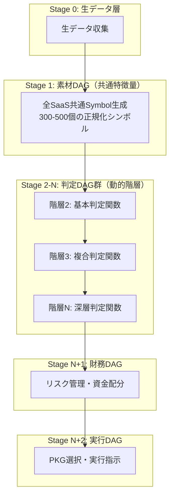

# PKG システム 高度なDAGアーキテクチャ仕様書

## 1. 統合DAGアーキテクチャ概要

### 1.1 基本原則

PKGシステムは以下の原則に基づいた厳密なDAG（有向非巡環グラフ）構造を採用：

1. **階層参照の絶対ルール**: 階層Nのノードは階層N-1以下のノードのみを参照可能
2. **無限階層対応**: 階層数に上限なし（関数合成の深さに応じて動的に拡張）
3. **横参照禁止**: 同階層間の参照は禁止（DAGの本質）
4. **素材と判断の分離**: データ処理と判定ロジックを明確に分離

### 1.2 統合アーキテクチャ構造



## 2. PKG ID体系の拡張

### 2.1 ID構造定義

```
[カテゴリ][タイプ][対象]^[階層]-[連番]
```

#### UnsonOS用ID体系
```
991^N-XXX  # SaaS運用PKG（階層N、連番XXX）
```

#### 詳細構造
```
991^2-126
 │││ │  └─ 連番: その階層内での通し番号（1〜999）
 │││ └──── 階層: 0=生データ, 1=素材DAG, 2以降=判定DAG（上限なし）
 ││└────── 対象: 1=特定SaaS, 9=全SaaS共通
 │└─────── タイプ: 9=統合型
 └──────── カテゴリ: 9=UnsonOS
```

### 2.2 階層別ID割り当て

| 階層 | ID範囲 | 役割 | ノード数目安 |
|------|--------|------|-------------|
| 0 | 991^0-001〜999 | 生データ収集 | 50-100 |
| 1 | 991^1-001〜999 | Symbol生成（素材DAG） | 300-500 |
| 2 | 991^2-001〜999 | 基本判定関数 | 100-200 |
| 3 | 991^3-001〜999 | 複合判定関数 | 100-200 |
| ... | ... | ... | ... |
| N | 991^N-001〜999 | 深層判定関数 | 可変 |
| N+1 | 991^{N+1}-001〜999 | 財務判定 | 50-100 |
| N+2 | 991^{N+2}-001〜999 | 実行指示 | 20-50 |

## 3. 素材DAGと判定DAGの分離

### 3.1 素材DAG（データ処理層）

**責務**: 生データの収集・正規化・特徴量生成

```typescript
// 素材DAG定義
class MaterialDAG {
  // 階層1: Symbol生成のみを担当
  static readonly LAYER = 1;
  
  // 全SaaS共通の特徴量を生成
  generateSymbols(rawData: RawMetrics): SymbolSet {
    const symbols: SymbolSet = {};
    
    // ビジネス指標（B_xxx）
    symbols['B_MRR'] = this.normalizeMRR(rawData.mrr);
    symbols['B_CHURN'] = this.normalizeChurn(rawData.churn);
    symbols['B_LTV_CAC'] = this.normalizeLtvCac(rawData.ltv, rawData.cac);
    
    // ユーザー指標（U_xxx）
    symbols['U_DAU_MAU'] = this.normalizeEngagement(rawData.dau, rawData.mau);
    symbols['U_RETENTION_D7'] = this.normalizeRetention(rawData.retention7d);
    
    // 市場指標（M_xxx）
    symbols['M_TREND'] = this.normalizeTrend(rawData.searchVolume);
    symbols['M_COMPETITION'] = this.normalizeCompetition(rawData.competitors);
    
    // 技術指標（T_xxx）
    symbols['T_UPTIME'] = this.normalizeUptime(rawData.uptime);
    symbols['T_ERROR_RATE'] = this.normalizeErrorRate(rawData.errors);
    
    return symbols;
  }
  
  // 正規化関数（0-1範囲への変換）
  private normalizeMRR(mrr: number): number {
    const target = 100000; // 10万円を基準
    return Math.min(mrr / target, 1);
  }
  
  // 他の正規化関数...
}
```

### 3.2 判定DAG（ロジック層）

**責務**: シンボルを基にビジネス判定を実行

```typescript
// 判定DAG定義（階層2以降）
class JudgmentDAG {
  // 動的階層対応
  private layer: number;
  private dependencies: string[]; // 下位階層のノードID
  
  constructor(layerNumber: number, deps: string[]) {
    this.layer = layerNumber;
    this.validateDependencies(deps);
    this.dependencies = deps;
  }
  
  // 依存関係の検証（下位階層のみ参照可能）
  private validateDependencies(deps: string[]): void {
    deps.forEach(dep => {
      const depLayer = this.extractLayer(dep);
      if (depLayer >= this.layer) {
        throw new Error(`階層${this.layer}は階層${depLayer}を参照できません`);
      }
    });
  }
  
  // 階層2: 基本判定
  static L2_PMF_CHECK(symbols: SymbolSet): boolean {
    return symbols['U_RETENTION_D7'] > 0.5 && 
           symbols['B_GROWTH'] > 0.2 &&
           symbols['U_DAU_MAU'] > 0.4;
  }
  
  // 階層3: 複合判定（階層2の結果を利用）
  static L3_CRISIS_DETECT(l2Results: Layer2Results): boolean {
    return !l2Results.pmfCheck && 
           l2Results.churnAlert &&
           l2Results.mrrDecline;
  }
  
  // 階層N: 深層判定（すべての下位層を参照可能）
  static LN_FINAL_DECISION(allLowerLayers: LayerResults[]): PKGAction {
    // 複雑な判定ロジック
    const aggregatedScore = this.aggregateScores(allLowerLayers);
    return this.selectPKG(aggregatedScore);
  }
}
```

## 4. 財務DAGの実装

### 4.1 財務DAG構造

```typescript
// 財務DAG（階層N+1）
class FinancialDAG {
  // リスク管理パラメータ
  private readonly MAX_RISK_PER_SAAS = 0.02; // 2%ルール
  private readonly MAX_CONCURRENT_CRISIS = 5; // 同時危機対応上限
  
  evaluate(judgmentResults: JudgmentResults, portfolio: Portfolio): FinancialDecision {
    const riskAssessment = this.assessRisk(portfolio);
    const resourceAllocation = this.allocateResources(judgmentResults, riskAssessment);
    
    return {
      canExecute: this.checkFinancialConstraints(resourceAllocation),
      priority: this.calculatePriority(judgmentResults, riskAssessment),
      budget: resourceAllocation.budget,
      resourceLimit: resourceAllocation.limit
    };
  }
  
  // リスク評価
  private assessRisk(portfolio: Portfolio): RiskProfile {
    return {
      totalExposure: portfolio.activeSaaS * this.MAX_RISK_PER_SAAS,
      concentrationRisk: this.calculateConcentration(portfolio),
      liquidityRisk: this.calculateLiquidity(portfolio),
      operationalRisk: this.calculateOperational(portfolio)
    };
  }
  
  // リソース配分
  private allocateResources(
    judgment: JudgmentResults, 
    risk: RiskProfile
  ): ResourceAllocation {
    const availableBudget = this.calculateAvailableBudget(risk);
    const priorities = this.rankByPriority(judgment);
    
    return this.distributeResources(availableBudget, priorities);
  }
}
```

## 5. 実行DAGの統合

### 5.1 最終実行層

```typescript
// 実行DAG（最上位層）
class ExecutionDAG {
  execute(
    materialSymbols: SymbolSet,
    judgmentResults: JudgmentResults,
    financialDecision: FinancialDecision
  ): ExecutionPlan {
    // PKG競合解決
    const resolvedPKGs = this.resolveConflicts(judgmentResults.selectedPKGs);
    
    // 実行順序決定
    const executionOrder = this.determineOrder(resolvedPKGs, financialDecision.priority);
    
    // バッチ処理計画
    const batches = this.createBatches(executionOrder, {
      maxParallel: 20,
      cycleTime: financialDecision.cycleTime
    });
    
    return {
      immediate: batches.filter(b => b.priority === 'CRITICAL'),
      scheduled: batches.filter(b => b.priority !== 'CRITICAL'),
      monitoring: this.setupMonitoring(batches)
    };
  }
  
  // PKG競合解決アルゴリズム
  private resolveConflicts(pkgs: PKGCandidate[]): PKGCandidate[] {
    const conflictGroups = this.detectConflicts(pkgs);
    
    return conflictGroups.map(group => {
      if (group.length === 1) return group[0];
      
      // 優先度マトリックスによる解決
      return this.selectByPriority(group, {
        'KILL': 100,
        'CRISIS': 90,
        'PIVOT': 80,
        'SCALE': 70,
        'OPTIMIZE': 60
      });
    });
  }
}
```

## 6. 実装上の重要な注意点

### 6.1 階層参照チェック

```typescript
// 階層参照バリデーター
class LayerValidator {
  static validate(dag: DAGNode): void {
    const nodeLayer = this.extractLayer(dag.id);
    
    dag.dependencies.forEach(depId => {
      const depLayer = this.extractLayer(depId);
      
      // 厳密なチェック: 自分より下の階層のみ参照可能
      if (depLayer >= nodeLayer) {
        throw new Error(
          `違反: ${dag.id}（階層${nodeLayer}）が` +
          `${depId}（階層${depLayer}）を参照しています`
        );
      }
    });
  }
  
  private static extractLayer(nodeId: string): number {
    // "991^N-XXX" から N を抽出
    const match = nodeId.match(/\^(\d+)-/);
    return match ? parseInt(match[1]) : 0;
  }
}
```

### 6.2 動的階層管理

```typescript
// 動的階層システム
class DynamicLayerSystem {
  private layers: Map<number, DAGNode[]> = new Map();
  
  // 階層は必要に応じて自動追加
  addNode(node: DAGNode): void {
    const layer = this.extractLayer(node.id);
    
    if (!this.layers.has(layer)) {
      this.layers.set(layer, []);
    }
    
    // 参照整合性チェック
    LayerValidator.validate(node);
    
    this.layers.get(layer)!.push(node);
  }
  
  // 階層数に制限なし
  getMaxLayer(): number {
    return Math.max(...this.layers.keys());
  }
  
  // トポロジカルソートで実行順序決定
  getExecutionOrder(): DAGNode[] {
    return this.topologicalSort();
  }
}
```

## 7. パフォーマンス最適化

### 7.1 並列実行戦略

```typescript
// 並列実行エンジン
class ParallelExecutor {
  async executeDAG(dag: DynamicLayerSystem): Promise<Results> {
    const layers = dag.getLayersSorted();
    const results = new Map();
    
    // 各階層内は並列実行可能
    for (const layerNum of layers) {
      const nodes = dag.getNodesInLayer(layerNum);
      
      // 同一階層内のノードを並列実行
      const layerResults = await Promise.all(
        nodes.map(node => this.executeNode(node, results))
      );
      
      // 結果を保存
      layerResults.forEach((result, idx) => {
        results.set(nodes[idx].id, result);
      });
    }
    
    return results;
  }
}
```

### 7.2 実行時間目標

| DAG種別 | 目標時間 | 最大許容 | 並列度 |
|---------|---------|---------|--------|
| 素材DAG | < 10ms | 20ms | N/A |
| 判定DAG（各階層） | < 5ms | 10ms | 最大100並列 |
| 財務DAG | < 5ms | 10ms | N/A |
| 実行DAG | < 10ms | 20ms | N/A |
| **合計** | **< 50ms** | **100ms** | - |

## 8. まとめ

### 8.1 統合アーキテクチャの特徴

1. **素材と判断の分離**: データ処理と判定ロジックを明確に分離
2. **無限階層対応**: 関数合成の深さに制限なし
3. **厳密な階層ルール**: 下位階層のみ参照可能
4. **財務管理統合**: リスク管理を独立したDAGで実装
5. **並列実行最適化**: 同一階層内は並列処理

### 8.2 実装チェックリスト

- [ ] 階層数に上限を設けていない
- [ ] 同階層間の参照を防いでいる
- [ ] 各階層に多数のノード（数百）を配置可能
- [ ] 依存関係が下位階層のみを向いている
- [ ] 素材DAGと判定DAGが分離されている
- [ ] 財務DAGが独立して実装されている
- [ ] 並列実行が最適化されている

---

作成日: 2025年1月
バージョン: 2.0.0