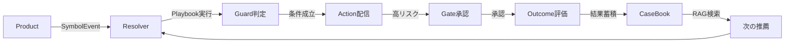

# UnsonOS コアシステムドキュメント

> 100-200個のマイクロSaaSプロダクトを最小限のリソースで効率的に管理するシステム設計ドキュメント

## 📁 ドキュメント構成

### 01-architecture/ - システム設計
- **[システム概要](./01-architecture/overview.md)**  
  UnsonOSの全体構成と核心概念
- **[技術スタック](./01-architecture/technology-stack.md)**  
  使用技術の選定理由と詳細

### プレイブック・SDK・学習システム
- **[プレイブックDSL仕様](./playbook-dsl-spec.md)**  
  意思決定フローを記述するYAMLベースのDSL詳細仕様

- **[Product SDK実装ガイド](./product-sdk-guide.md)**  
  各SaaSアプリケーションがコアシステムと通信するためのSDK

- **[CaseBook設計書](./casebook-design.md)**  
  実験結果の蓄積とRAGによる学習システムの設計

### UI設計・遷移・モニタリング
- **[UIストーリーボード](./ui-storyboard.md)**  
  100個のSaaSを管理する統合ダッシュボードとGate承認UI設計

- **[UI遷移図](./ui-flow-diagram.md)**  
  ユーザーの思考回路に沿った画面遷移フローの定義

- **[フェーズ別モニタリング](./ui-phase-monitoring.md)**  
  SaaS成長フェーズごとの監視要件とUI設計

### 🏗️ アーキテクチャ
- **[UnsonOSアーキテクチャ](./architecture/unson-os-architecture.md)**  
  システム全体のアーキテクチャと技術スタック

- **[マルチテナント戦略](./architecture/multi-tenant-strategy.md)**  
  100-200個のSaaSを効率的に管理するための設計

- **[運用ガイド](./operation-guide.md)**  
  日常運用、トラブルシューティング、メンテナンス手順

### 02-ui-design/ - UI/UX設計
- **[📌 UI設計書（完全版）](./02-ui-design/complete-design.md)** ← **最優先参照**  
  ダッシュボード、時系列データビュー、PKG、DAO機能の統合UI仕様

### 03-backend-design/ - バックエンド設計
- **[データ駆動コアシステム](./03-backend-design/data-driven-core.md)**  
  KPIの記号化（⬆️↗️→↘️⬇️）と宣言的グラフによる自動意思決定

### 04-automation/ - 自動化システム
- **[PKGシステム設計](./04-automation/pkg-system.md)**  
  インジケーターベースの条件分岐とプレイブック実行エンジン

### 05-operation/ - 運用・保守
- **[運用ガイド](./05-operation/operation-guide.md)**  
  日常運用、トラブルシューティング、メンテナンス手順

## 🚀 クイックスタート

### 1. システム理解
1. [データ駆動コアシステム概要](./data-driven-core.md)を読む
2. [アーキテクチャ](./architecture/unson-os-architecture.md)で全体像を把握

### 2. プレイブック作成
1. [プレイブックDSL仕様](./playbook-dsl-spec.md)を学ぶ
2. テンプレートから作成開始
3. ローカルでバリデーション

### 3. SDK実装
1. [Product SDK実装ガイド](./product-sdk-guide.md)に従って統合
2. イベント送信とフラグ取得を実装
3. テスト環境で動作確認

### 4. 運用開始
1. [運用ガイド](./operation-guide.md)でベストプラクティスを確認
2. ステージング環境でテスト
3. 段階的に本番展開

## 🔑 核心概念

### KPI記号化（Symbolization）
- 時系列データを**5段階の記号**に変換
  - ⬆️ 急上昇（+30%以上）
  - ↗️ 上昇（+10%〜+30%）
  - → 横ばい（-10%〜+10%）
  - ↘️ 下降（-10%〜-30%）
  - ⬇️ 急降下（-30%以下）
- 時間足別の記号化（5分/1時間/1日/1週間）
- リアルタイムでの異常検知

### 宣言的グラフ（Declarative Graph）
- **Start → Guard → Action → Gate → Outcome**のフロー
- YAMLで条件分岐と実行を定義
- GitOpsによる版管理

### 安全な展開（Safe Rollout）
- **Canary**: 段階的展開（5%→15%→30%→50%→100%）
- **Bandit**: Thompson Samplingによる探索と活用
- **Gate**: 人による承認チェックポイント

### 学習する組織（Learning Organization）
- **CaseBook**: 実験結果の体系的蓄積
- **RAG**: 類似ケースからの推薦生成
- **継続的改善**: 失敗からも学びを抽出

## 📊 システムフロー

## 🛠️ 主要コンポーネント

| コンポーネント | 役割 | 技術 |
|--------------|------|------|
| **Resolver Engine** | プレイブック解釈と実行 | Node.js/TypeScript |
| **Product SDK** | イベント送信とフラグ取得 | TypeScript/React |
| **CaseBook DB** | 実験結果の永続化 | PostgreSQL/Neon |
| **Vector DB** | 類似検索用埋め込み | Qdrant |
| **Registry** | プレイブック管理 | Convex |
| **RAG System** | 推薦生成 | OpenAI GPT-4 |

## 📈 期待される効果

### 定量的効果
- **意思決定速度**: 従来の10倍高速化
- **実験サイクル**: 2週間→2日に短縮
- **成功率向上**: 過去の学習により20%改善
- **運用コスト**: 自動化により70%削減

### 定性的効果
- **スケーラビリティ**: 100-200サービスの並行運用
- **再現性**: すべての判断が記録・再現可能
- **透明性**: 意思決定プロセスの可視化
- **学習効果**: 失敗も含めた知識の蓄積

## 🔗 関連リソース

### 内部ドキュメント
- [MVP検証フレームワーク](../../business-strategy/mvp-validation-framework.md)
- [DAO概念設計](../../business-strategy/dao-concept-design.md)
- [テスティングガイドライン](../../testing/testing-guidelines.md)

### 外部リソース
- [Convex Documentation](https://docs.convex.dev/)
- [Neon Documentation](https://neon.tech/docs)
- [Qdrant Documentation](https://qdrant.tech/documentation/)
- [OpenAI API Reference](https://platform.openai.com/docs)

## 📝 更新履歴

| 日付 | バージョン | 変更内容 |
|------|-----------|---------|
| 2025-01-15 | v2.4.1 | UI設計書を統合、重複ファイル削除 |
| 2025-01-15 | v2.4.0 | 時系列データビュー、PKG、DAO機能追加 |
| 2025-01-13 | v1.1.0 | データ駆動コアシステム追加 |
| 2025-01-13 | v1.0.0 | 初版作成 |

## 🤝 コントリビューション

- 質問・提案は[GitHub Issues](https://github.com/unsonos/unson_os/issues)へ
- ドキュメント改善のPRを歓迎します
- [Contribution Guide](../../for-community/contribution-guide/)を参照

## 📧 お問い合わせ

- 技術的な質問: tech@unson.jp
- ビジネス関連: business@unson.jp
- Discord: [UnsonOS Community](https://discord.gg/unsonos)