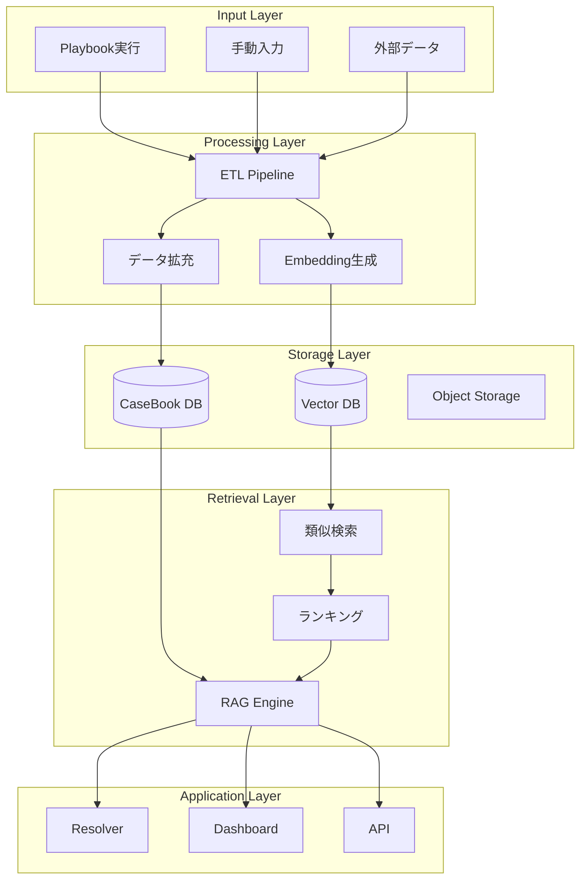

# CaseBook設計書

## 概要

CaseBookは、UnsonOSにおける実験結果と学習を体系的に蓄積し、RAG（Retrieval-Augmented Generation）を通じて次の意思決定を支援するナレッジベースシステムです。

## アーキテクチャ



## データモデル

### CaseEntry（ケースエントリー）

```typescript
type CaseEntry = {
  // 識別情報
  caseId: string                    // CASE^{timestamp}_{hash}
  playbookId: string                // 実行元プレイブック
  productId: string                 // 対象プロダクト
  experimentId: string              // 実験ID
  
  // 時系列情報
  startedAt: Date                   // 開始日時
  completedAt: Date                 // 完了日時
  horizonDays: number               // 評価期間
  
  // 状況（Situation）
  situation: {
    stage: Stage                   // Idea|LP|MVP|Scale
    segment: string                 // JP-Web-SMB等
    window: Window                  // tiny|short|mid|long
    triggerMetrics: {               // トリガーとなった指標
      metric: string
      direction: Direction
      magnitude: number
    }[]
    context: string                 // 自由記述の背景
  }
  
  // アクション（Action）
  action: {
    type: string                    // copy_change|pricing|onboarding等
    flags: Record<string, any>      // 適用したフラグ
    rollout: RolloutStrategy        // 展開戦略
    exposure: number                // 露出割合
    description: string             // アクションの説明
  }
  
  // 結果（Outcome）
  outcome: {
    kpis: {
      metric: string
      baseline: number
      treatment: number
      lift: number                  // (treatment - baseline) / baseline
      confidence: number            // 統計的信頼度
    }[]
    sideEffects: string[]           // 副作用
    verdict: 'success'|'failure'|'neutral'
  }
  
  // 学習（Lessons）
  lessons: {
    insights: string[]              // 得られた洞察
    recommendations: string[]       // 推奨事項
    warnings: string[]              // 注意事項
    tags: string[]                  // 分類タグ
  }
  
  // ベクトル埋め込み
  embeddings: {
    situation: number[]             // 状況の埋め込み
    action: number[]                // アクションの埋め込み
    combined: number[]              // 結合埋め込み
  }
  
  // メタデータ
  metadata: {
    version: string                 // スキーマバージョン
    createdBy: string              // 作成者
    reviewedBy?: string            // レビュー者
    quality: number                // 品質スコア（0-1）
    citations: string[]            // 参照元
  }
}
```

### 状況コード体系

```typescript
// 標準化された状況コード
type SituationCode = `${Stage}|${Window}|${Segment}|${Metric}|${Direction}`

// 例: "LP|short|JP-Web-SMB|CVR|Down"
// 意味: LPステージ、7日間窓、日本Web中小企業セグメント、CVR低下
```

## ETLパイプライン

### 1. データ収集

```typescript
class CaseBookETL {
  async collectData(experimentId: string): Promise<RawCase> {
    // Playbook実行結果を収集
    const execution = await getPlaybookExecution(experimentId)
    
    // メトリクスデータを収集
    const metrics = await getMetrics({
      productId: execution.productId,
      startDate: execution.startedAt,
      endDate: execution.completedAt,
      segments: execution.segments
    })
    
    // 外部データソースから補完
    const external = await fetchExternalData({
      googleAnalytics: true,
      mixpanel: true,
      customerFeedback: true
    })
    
    return mergeData(execution, metrics, external)
  }
}
```

### 2. データ変換と拡充

```typescript
class DataEnrichment {
  async enrich(rawCase: RawCase): Promise<EnrichedCase> {
    // 統計分析
    const statistics = await calculateStatistics(rawCase.metrics)
    
    // 異常検知
    const anomalies = await detectAnomalies(rawCase.metrics)
    
    // 相関分析
    const correlations = await findCorrelations(rawCase.metrics)
    
    // セグメント分析
    const segmentAnalysis = await analyzeSegments(rawCase.segments)
    
    return {
      ...rawCase,
      statistics,
      anomalies,
      correlations,
      segmentAnalysis
    }
  }
}
```

### 3. 埋め込み生成

```typescript
class EmbeddingGenerator {
  async generate(caseEntry: CaseEntry): Promise<Embeddings> {
    // テキスト準備
    const situationText = this.formatSituation(caseEntry.situation)
    const actionText = this.formatAction(caseEntry.action)
    const combinedText = `${situationText} ${actionText}`
    
    // OpenAI Embeddings API
    const situationEmb = await openai.createEmbedding({
      model: "text-embedding-3-small",
      input: situationText
    })
    
    const actionEmb = await openai.createEmbedding({
      model: "text-embedding-3-small",
      input: actionText
    })
    
    const combinedEmb = await openai.createEmbedding({
      model: "text-embedding-3-small",
      input: combinedText
    })
    
    return {
      situation: situationEmb.data[0].embedding,
      action: actionEmb.data[0].embedding,
      combined: combinedEmb.data[0].embedding
    }
  }
}
```

### 4. 品質評価

```typescript
class QualityScorer {
  score(caseEntry: CaseEntry): number {
    let score = 0
    const weights = {
      sampleSize: 0.3,
      statisticalSignificance: 0.3,
      completeness: 0.2,
      consistency: 0.1,
      recency: 0.1
    }
    
    // サンプルサイズ
    if (caseEntry.outcome.sampleSize > 1000) score += weights.sampleSize
    else score += weights.sampleSize * (caseEntry.outcome.sampleSize / 1000)
    
    // 統計的有意性
    if (caseEntry.outcome.pValue < 0.05) score += weights.statisticalSignificance
    
    // データ完全性
    const completeness = this.checkCompleteness(caseEntry)
    score += weights.completeness * completeness
    
    // 一貫性
    const consistency = this.checkConsistency(caseEntry)
    score += weights.consistency * consistency
    
    // 新しさ
    const age = Date.now() - caseEntry.completedAt.getTime()
    const recency = Math.max(0, 1 - age / (365 * 24 * 60 * 60 * 1000))
    score += weights.recency * recency
    
    return score
  }
}
```

## RAGシステム

### 検索パイプライン

```typescript
class RAGPipeline {
  async search(query: SearchQuery): Promise<CaseEntry[]> {
    // 1. クエリ拡張
    const expandedQuery = await this.expandQuery(query)
    
    // 2. ベクトル検索
    const vectorResults = await this.vectorSearch(expandedQuery)
    
    // 3. キーワード検索
    const keywordResults = await this.keywordSearch(expandedQuery)
    
    // 4. ハイブリッドランキング
    const combined = this.hybridRanking(vectorResults, keywordResults)
    
    // 5. リランキング
    const reranked = await this.rerank(combined, query)
    
    // 6. フィルタリング
    const filtered = this.applyFilters(reranked, query.filters)
    
    return filtered.slice(0, query.limit || 10)
  }
}
```

### クエリ拡張

```typescript
class QueryExpander {
  async expand(query: SearchQuery): Promise<ExpandedQuery> {
    // 同義語展開
    const synonyms = await this.getSynonyms(query.text)
    
    // 関連メトリクス
    const relatedMetrics = this.getRelatedMetrics(query.metrics)
    
    // 時間窓の変換
    const windowVariations = this.getWindowVariations(query.window)
    
    // セグメント拡張
    const segmentVariations = this.getSegmentVariations(query.segment)
    
    return {
      original: query,
      synonyms,
      relatedMetrics,
      windowVariations,
      segmentVariations
    }
  }
}
```

### ベクトル検索

```typescript
class VectorSearch {
  async search(query: ExpandedQuery): Promise<ScoredCase[]> {
    // クエリのベクトル化
    const queryEmbedding = await this.embed(query.text)
    
    // Qdrant検索
    const results = await qdrant.search({
      collection: 'casebook',
      vector: queryEmbedding,
      limit: 100,
      filter: {
        must: [
          { key: 'quality', range: { gte: 0.7 } },
          { key: 'stage', match: { any: query.stages } }
        ]
      }
    })
    
    return results.map(r => ({
      caseId: r.id,
      score: r.score,
      case: r.payload
    }))
  }
}
```

### 推薦生成

```typescript
class RecommendationGenerator {
  async generate(
    context: Context,
    retrievedCases: CaseEntry[]
  ): Promise<Recommendation> {
    // プロンプト構築
    const prompt = this.buildPrompt(context, retrievedCases)
    
    // LLM呼び出し
    const response = await openai.createChatCompletion({
      model: "gpt-4",
      messages: [
        { role: "system", content: SYSTEM_PROMPT },
        { role: "user", content: prompt }
      ],
      temperature: 0.3,
      response_format: { type: "json_object" }
    })
    
    // 構造化された推薦を解析
    const recommendation = JSON.parse(response.choices[0].message.content)
    
    // 検証と調整
    return this.validateAndAdjust(recommendation, context)
  }
}
```

## インデックス戦略

### ベクトルインデックス

```sql
-- Qdrant Collection設定
{
  "collection_name": "casebook",
  "vectors": {
    "size": 1536,
    "distance": "Cosine"
  },
  "payload_schema": {
    "caseId": "keyword",
    "stage": "keyword",
    "segment": "keyword",
    "metrics": "keyword[]",
    "quality": "float",
    "completedAt": "datetime"
  },
  "optimizers_config": {
    "indexing_threshold": 20000,
    "memmap_threshold": 50000
  }
}
```

### RDBインデックス

```sql
-- PostgreSQL インデックス
CREATE INDEX idx_case_stage_segment ON casebook(stage, segment);
CREATE INDEX idx_case_completed_at ON casebook(completed_at DESC);
CREATE INDEX idx_case_quality ON casebook(quality DESC);
CREATE INDEX idx_case_metrics ON casebook USING GIN(metrics);
CREATE INDEX idx_case_verdict ON casebook(verdict);

-- 全文検索インデックス
CREATE INDEX idx_case_fulltext ON casebook 
USING GIN(to_tsvector('english', situation || ' ' || lessons));
```

## 学習パターン

### 成功パターンの抽出

```typescript
class PatternExtractor {
  async extractSuccessPatterns(): Promise<Pattern[]> {
    // 成功ケースを取得
    const successCases = await CaseBook.find({
      verdict: 'success',
      quality: { $gte: 0.8 },
      'outcome.lift': { $gte: 0.1 }
    })
    
    // クラスタリング
    const clusters = await this.clusterCases(successCases)
    
    // パターン抽出
    const patterns = clusters.map(cluster => ({
      id: generatePatternId(),
      name: this.generatePatternName(cluster),
      conditions: this.extractCommonConditions(cluster),
      actions: this.extractCommonActions(cluster),
      expectedLift: this.calculateAverageLift(cluster),
      confidence: this.calculateConfidence(cluster),
      examples: cluster.slice(0, 3)
    }))
    
    return patterns
  }
}
```

### 失敗からの学習

```typescript
class FailureAnalyzer {
  async analyzeFailures(): Promise<FailureInsights> {
    // 失敗ケースを取得
    const failureCases = await CaseBook.find({
      verdict: 'failure',
      quality: { $gte: 0.7 }
    })
    
    // 根本原因分析
    const rootCauses = await this.performRCA(failureCases)
    
    // 共通要因の特定
    const commonFactors = this.identifyCommonFactors(failureCases)
    
    // アンチパターンの生成
    const antiPatterns = this.generateAntiPatterns(failureCases)
    
    return {
      rootCauses,
      commonFactors,
      antiPatterns,
      recommendations: this.generateAvoidanceStrategies(antiPatterns)
    }
  }
}
```

## 運用とメンテナンス

### データ品質管理

```typescript
class DataQualityMonitor {
  async monitor(): Promise<QualityReport> {
    const metrics = {
      completeness: await this.checkCompleteness(),
      consistency: await this.checkConsistency(),
      accuracy: await this.checkAccuracy(),
      timeliness: await this.checkTimeliness()
    }
    
    const issues = []
    
    if (metrics.completeness < 0.9) {
      issues.push({
        type: 'incomplete_data',
        severity: 'warning',
        affected: await this.findIncompleteEntries()
      })
    }
    
    return { metrics, issues }
  }
}
```

### 定期的な再評価

```typescript
class CaseRevaluator {
  async reevaluate(): Promise<void> {
    // 古いケースの再評価
    const oldCases = await CaseBook.find({
      completedAt: { $lt: sixMonthsAgo },
      lastRevaluated: { $lt: oneMonthAgo }
    })
    
    for (const case of oldCases) {
      // 新しいデータで再計算
      const newMetrics = await this.recalculateMetrics(case)
      
      // 品質スコアの更新
      case.metadata.quality = this.scorer.score(case)
      
      // 埋め込みの再生成
      case.embeddings = await this.embedder.generate(case)
      
      await case.save()
    }
  }
}
```

## API仕様

### ケース検索API

```typescript
// POST /api/casebook/search
interface SearchRequest {
  query: string                    // 自然言語クエリ
  filters?: {
    stage?: Stage[]
    segment?: string[]
    dateRange?: { from: Date; to: Date }
    minQuality?: number
    verdict?: 'success'|'failure'|'neutral'
  }
  limit?: number
  includeRecommendations?: boolean
}

interface SearchResponse {
  cases: CaseEntry[]
  recommendations?: {
    action: string
    confidence: number
    reasoning: string
    similarCases: string[]
  }
  metadata: {
    totalMatches: number
    searchTime: number
  }
}
```

### ケース登録API

```typescript
// POST /api/casebook/cases
interface CreateCaseRequest {
  experimentId: string
  situation: object
  action: object
  outcome: object
  lessons: object
}

interface CreateCaseResponse {
  caseId: string
  quality: number
  embeddings: {
    generated: boolean
    dimensions: number
  }
}
```

## ダッシュボード

### メトリクス表示

- ケース総数と成長率
- 成功率の推移
- 最も効果的なアクション
- セグメント別パフォーマンス
- 品質スコア分布

### ケース探索UI

- 自然言語検索
- フィルタリング（段階、セグメント、期間）
- 類似ケース表示
- 時系列ビュー
- ネットワークグラフ（関連性）

## ベストプラクティス

### ケース記録

1. **完全性**: 全ての必須フィールドを埋める
2. **客観性**: 事実ベースで記録
3. **定量化**: 可能な限り数値化
4. **文脈**: 背景情報を十分に記載
5. **学習**: 具体的な学びを3つ以上

### 検索活用

1. **具体的なクエリ**: 状況を詳細に記述
2. **フィルタ活用**: 関連性の高い結果に絞る
3. **類似度閾値**: 0.8以上を推奨
4. **複数ケース参照**: 単一ケースに依存しない
5. **定期レビュー**: 古いケースの妥当性確認

## 関連ドキュメント

- [データ駆動コアシステム](./data-driven-core.md)
- [プレイブックDSL仕様](./playbook-dsl-spec.md)
- [ベクトルDB運用ガイド](./vector-db-guide.md)
- [機械学習パイプライン](./ml-pipeline.md)