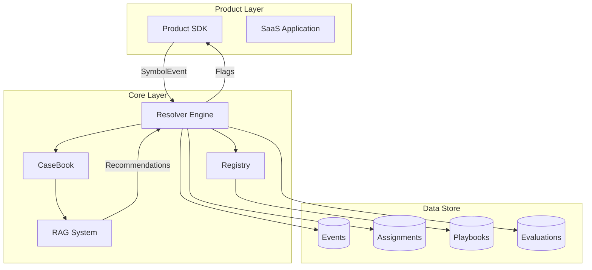

# UnsonOS データ駆動コアシステム

## 概要

UnsonOSのデータ駆動コアシステムは、100-200個のマイクロSaaSを統一的に管理・最適化するための中核基盤です。KPIを記号化（↑/↓/→）して軽量判断し、宣言的グラフ（プレイブック）で「次の一手」を自動配信します。

## 設計原則

### 1. Policy as Code
- プレイブックはYAML/JSONで記述
- Git管理による版管理
- コードレビューによる品質保証

### 2. 軽量判断（Symbolization）
- 数値を↑/↓/→の記号へ正規化
- 複雑な指標を単純な判断基準に変換
- リアルタイムでの高速判断を実現

### 3. 宣言的グラフ
- Start/Guard/Action/Gate/Outcome をノードとして接続
- 条件分岐と実行フローを視覚的に管理
- 再現可能で監査可能な意思決定

### 4. 安全第一
- canary deployment（段階的展開）
- bandit algorithm（探索と活用のバランス）
- Gate（人による承認）
- 自動ロールバック機能

### 5. 観測窓（Time Windows）
- **Tiny**: 24時間
- **Short**: 7日
- **Mid**: 14日
- **Long**: 28日

### 6. 学習する組織
- CaseBookに結果を蓄積
- RAGで次の打ち手を推薦
- 継続的な改善サイクル

### 7. 分離アーキテクチャ
- **Core**: 意思決定と記録
- **Product**: 価値提供
- 厳密な責任分離

## システム構成

### コンポーネント間の関係



## ドメインモデル

### 主要エンティティ

| エンティティ | 説明 | 責務 |
|------------|------|-----|
| **Playbook** | 宣言的グラフ定義 | 意思決定フローの定義 |
| **SymbolEvent** | 記号化されたイベント | Stage-Window-Segment×metric×direction |
| **Resolver** | 解決エンジン | プレイブック解釈とAction決定 |
| **Assignment** | ユーザー割当 | Stickyなバリアント割当管理 |
| **RolloutPolicy** | 展開ポリシー | canary/bandit/blue-green戦略 |
| **Gate** | 承認ゲート | 高影響アクションの人的承認 |
| **Outcome** | 結果評価 | KPI測定と効果判定 |
| **CaseBook** | 事例集 | 状況→打ち手→結果→学びの蓄積 |
| **Registry** | 適用管理 | ProductとPlaybookのマッピング |

### KPIと記号化（Symbolization）

#### 代表的なKPI
- **CVR**: コンバージョン率（申込率）
- **A1**: 初回行動率
- **RET7**: 7日継続率
- **ARPU**: ユーザーあたり収益

#### 記号化ルール
- **↑ (Up)**: 前窓比 +5%以上
- **↓ (Down)**: 前窓比 -5%以下
- **→ (Flat)**: -5%〜+5%の範囲

#### 前処理
- 移動平均による平滑化
- Winsorizeによる外れ値処理
- Bot/内部アクセスの除外

## Resolver（解決エンジン）

### 処理フロー

```typescript
// 擬似コード
node = start
while (node) {
  switch (node.type) {
    case 'Guard':
      observed = fetchLatestSymbols(productId, window, segment)
      node = eval(node.conditions, observed) ? node.then : node.else
      break
      
    case 'Action':
      plan = planRollout(node.rollout.strategy, node.rollout.exposure)
      commitAssignment(productId, plan)
      node = node.next
      break
      
    case 'Gate':
      request = enqueueApproval(node.approverRole)
      decision = await waitDecisionOrTimeout(request, node.timeoutMinutes)
      node = decision.approved ? node.onApprove : node.onReject
      break
      
    case 'Outcome':
      scheduleEvaluation(node.horizonDays, node.kpi)
      writeCasebook()
      node = null // 終了
      break
  }
}
```

### ロールアウト戦略

#### 1. Canary Deployment
```yaml
rollout:
  strategy: "canary"
  steps: [0.05, 0.15, 0.30, 0.50, 1.00]
  intervalMinutes: 120
  rollbackCondition:
    metric: "CVR"
    threshold: -10  # 10%以上低下で自動ロールバック
```

#### 2. Bandit Algorithm (Thompson Sampling)
```yaml
rollout:
  strategy: "bandit"
  algorithm: "thompson"
  maxExposure: 0.4
  explorationRate: 0.1
```

#### 3. Blue-Green Deployment
```yaml
rollout:
  strategy: "blue-green"
  healthCheckMinutes: 30
```

### Sticky Assignment（一貫性のある割当）

```typescript
function assignVariant(userKey: string, seed: string, exposure: number): string {
  // ユーザーを1000個のバケツに分割
  const bucket = murmur3(userKey + seed) % 1000
  
  // バケツ番号に基づいてバリアントを決定
  if (bucket < exposure * 1000) {
    return 'treatment'
  } else {
    return 'control'
  }
}
```

## セグメント設計

セグメントは「市場×チャネル×ペルソナ」の組み合わせで定義されます。

### セグメント例
- `JP-Web-SMB`: 日本市場・Webチャネル・中小企業
- `EN-LINE-Enterprise`: 英語圏・LINEチャネル・大企業
- `JP-Ads-Freelance`: 日本市場・広告チャネル・フリーランス

### セグメント指定
```yaml
scope:
  tags: 
    - "market:JP"
    - "channel:Web"
    - "persona:SMB"
```

## 評価と分析

### 評価指標
- **リフト率**: (treatment - control) / control
- **統計的有意性**: p値 < 0.05
- **実用的有意性**: リフト率 > 最小検出可能効果

### 評価手法

#### A/Bテスト（Canary）
- 二標本比率検定（Wilson/Bayesian）
- 安全境界の設定
- 早期停止ルール

#### 多腕バンディット
- 逐次ベイズ更新
- 事後確率 P(lift > 0) の計算
- 探索と活用のバランス

#### オフライン評価
- イベントリプレイによる事前検証
- Off-Policy Evaluationによる期待値推定
- 異常検知（3σルール、CUSUM）

## 学習機能（CaseBook × RAG）

### CaseBook構造
```typescript
type CaseEntry = {
  caseId: string
  situation: string      // 状況の説明
  action: object        // 実施したアクション
  outcome: object       // 結果のメトリクス
  lessons: string[]     // 得られた学び
  embedding: number[]   // ベクトル埋め込み
}
```

### RAGパイプライン
1. 毎夜のETLでCaseBookを更新
2. OpenAI Embeddingsでベクトル化
3. Qdrantにインデックス
4. 類似ケース検索と推薦
5. 人による承認後、新プレイブックへ反映

## 運用（GitOps）

### ディレクトリ構成
```
/playbooks
  /schemas/          # JSON Schema定義
  /templates/        # 標準テンプレート
    /onboarding/
    /pricing/
    /copy-testing/
  /staging/         # ステージング環境
  /prod/            # 本番環境
```

### リリースフロー
1. PRの作成とSchema検証
2. リプレイによる影響分析
3. Stagingへのデプロイ
4. Canary展開（5%→15%→30%）
5. 本番への昇格

## セキュリティとガバナンス

### アクセス制御（RBAC）
- `growth-lead`: Gate承認権限
- `pm`: プレイブック編集権限
- `ops`: 緊急ロールバック権限
- `legal`: コンプライアンスレビュー

### データ保護
- PII最小化（記号化・集計済みデータ）
- 匿名キーによる個人識別
- KMSによる暗号鍵管理

### 監査
- 全決定のappend-onlyログ
- 入力記号・判定・割当・成果の記録
- コンプライアンスレポート生成

### 変更管理
- 週末/夜間の高影響変更禁止
- 自動スケジューラによる制御
- 緊急時のロールバック手順

## SLO（Service Level Objectives）

| 指標 | 目標値 | 測定方法 |
|-----|--------|---------|
| Decision Latency | p95 < 2秒 | イベント到着→フラグ配信 |
| Rollback MTTR | < 5分 | 異常検出→ロールバック完了 |
| Guard誤判定率 | < 5% | 月次レビュー |
| 学習速度 | 中央値 < 14日 | 新施策の本番昇格まで |

## 監視とアラート

### ダッシュボード
- リアルタイム決定レイテンシ
- 現在の露出量（Exposure）
- ロールバック発生数
- KPIリフトの推移

### アラート条件
- CVR急落（-20%以上）
- 露出量超過（設定値の110%）
- Gate承認タイムアウト
- SLO逸脱

## 実装ロードマップ

### Day 0-30: 基盤構築
- [ ] 共通SDK v0（イベント送信・フラグ取得）
- [ ] プレイブックDSL v0とSchema定義
- [ ] Resolver v0（canary + sticky assignment）
- [ ] Registry v0と監査ログ

### Day 31-60: 高度な機能
- [ ] Gate（承認フロー）実装
- [ ] Banditアルゴリズム導入
- [ ] オフライン評価とリプレイ機能
- [ ] CaseBook構築とRAG ETL

### Day 61-90: 自動化と学習
- [ ] フローマイニングによる新施策提案
- [ ] Shadow評価とcanary自動起動
- [ ] アラート強化と自動ロールバック
- [ ] 管理UI（Monaco Editor + Schema validation）

## 関連ドキュメント

- [プレイブックDSL仕様](./playbook-dsl-spec.md)
- [Product SDK実装ガイド](./product-sdk-guide.md)
- [運用手順書](./operation-guide.md)
- [トラブルシューティング](./troubleshooting.md)