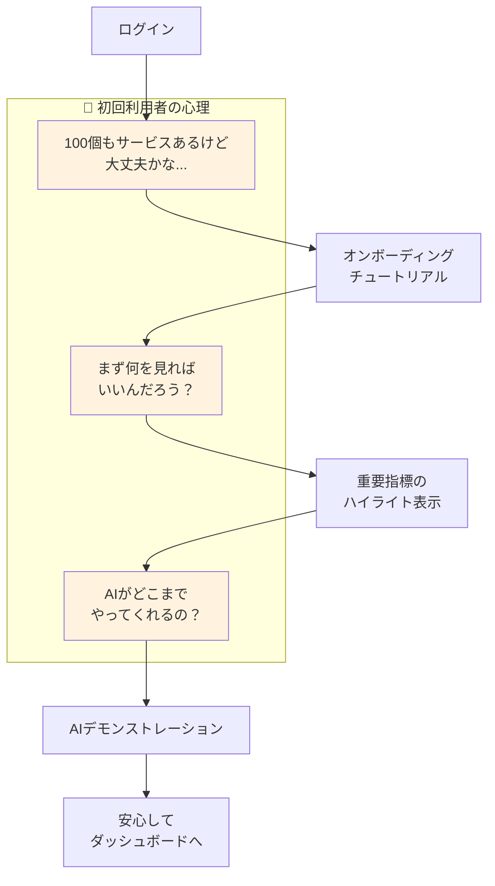
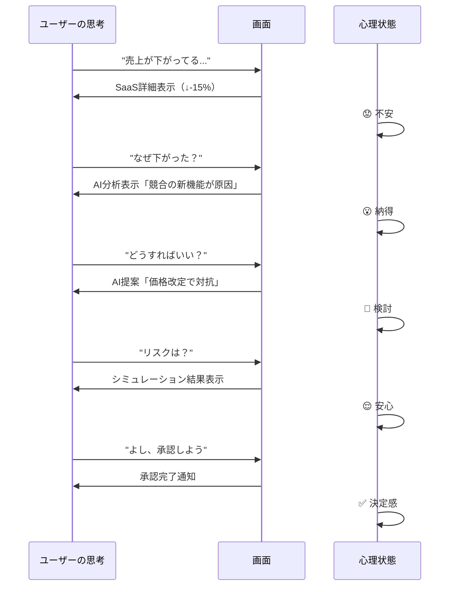
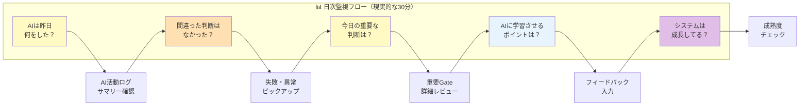
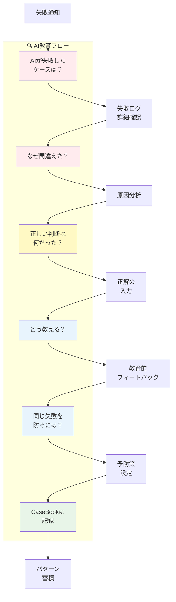
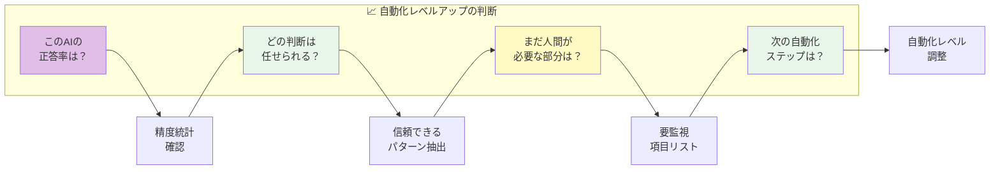
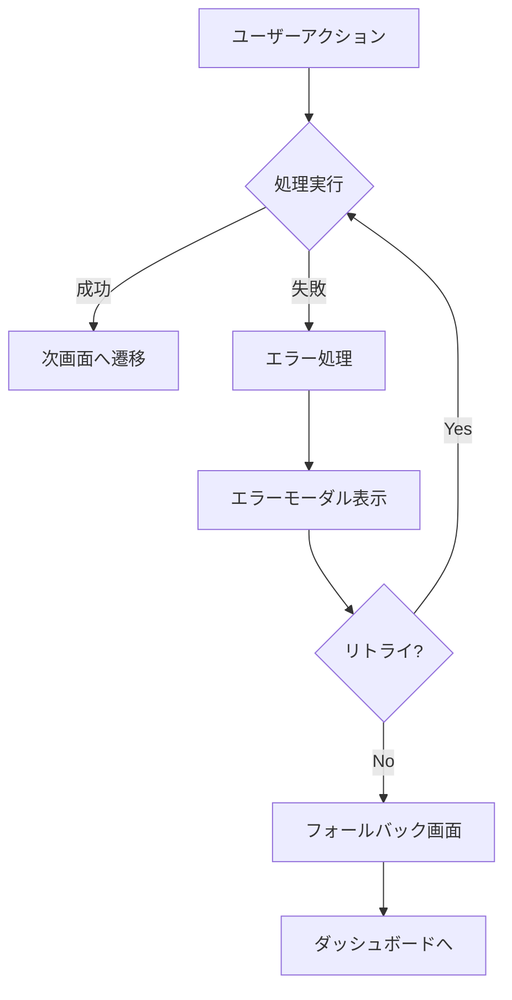
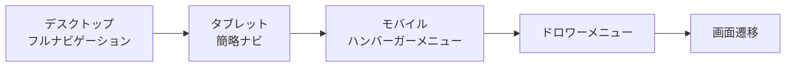

# UnsonOS UI遷移図

## 概要

UnsonOSの管理ダッシュボードにおける画面遷移を、**ユーザーの思考回路**と**SaaSの成長フェーズ**に沿って定義します。100個のSaaSはそれぞれ異なるフェーズにあり、フェーズごとに監視内容が変わることを考慮しています。

## 現実的な運用フェーズのUI遷移マップ

```mermaid
graph TB
    subgraph "🎓 フェーズ別にAIを育成しながら事業を監督する思考"
        Think1["100個のSaaS<br/>フェーズ分布確認"]
        Dashboard[統合ダッシュボード<br/>フェーズ別表示]
        
        Think2{"フェーズ別に<br/>問題はないか？"}
        PhaseCheck[フェーズ別<br/>KPI確認]
        
        Think3["このフェーズの<br/>AIは信頼できる？"]
        PhaseAI[フェーズ別<br/>AI精度確認]
        
        Think4["Go/Kill判断は<br/>適切か？"]
        PhaseGate[フェーズゲート<br/>判断検証]
        
        Think5{"フェーズ遷移<br/>承認すべき？"}
        GateDecision[Go/Pivot/Kill<br/>決定]
        
        Think6["次フェーズの<br/>準備は十分？"]
        NextPhase[次フェーズ<br/>準備状況確認]
        
        Think7["このフェーズの<br/>成功パターンは？"]
        PhasePattern[フェーズ別<br/>パターン蓄積]
    end
    
    %% フェーズ別監視と教育のフロー
    Think1 --> Dashboard
    Dashboard --> Think2
    Think2 --> PhaseCheck
    
    PhaseCheck --> Think3
    Think3 --> PhaseAI
    
    PhaseAI --> Think4
    Think4 --> PhaseGate
    
    PhaseGate --> Think5
    Think5 --> GateDecision
    
    GateDecision --> Think6
    Think6 --> NextPhase
    
    NextPhase --> Think7
    Think7 --> PhasePattern
    
    style Think1 fill:#E8F4FD
    style Think2 fill:#FFF9C4
    style Think3 fill:#FFE0B2
    style Think4 fill:#E8F4FD
    style Think5 fill:#FFF3E0
    style Think6 fill:#E8F5E8
    style Think7 fill:#E1BEE7
```



## ユーザー心理状態を考慮した画面遷移

### 1. 初回ログイン時の思考フロー



### 2. 意思決定時の心理的遷移



## ユーザー思考パターン別の画面遷移

### パターン1: 毎日の監視と教育ルーティン



### パターン2: AIの失敗から学習させる思考



### パターン3: システム成熟度の評価と段階的自動化



## 思考に対応した情報アーキテクチャ

### 現実的な監視・教育フェーズで必要な情報

| ユーザーの思考 | 必要な画面 | 提示すべき情報 | UI要素 |
|--------------|-----------|---------------|--------|
| 「AIは信頼できてる？」 | AI監視ダッシュボード | 正答率、失敗率、学習曲線 | 信頼度メーター |
| 「何を間違えた？」 | 失敗ログ | 誤判断リスト、影響額 | 赤いアラートリスト |
| 「なぜ間違えた？」 | 原因分析 | 判断根拠、使用データ | デシジョンツリー |
| 「どう教える？」 | フィードバック画面 | 正解入力、理由説明 | 教育フォーム |
| 「成長してる？」 | 成熟度ダッシュボード | 週次改善率、自動化可能領域 | 進捗グラフ |
| 「どこまで任せる？」 | 自動化設定 | リスクレベル別の権限設定 | スライダー、チェックボックス |
| 「パターン化できる？」 | CaseBook | 成功/失敗パターン一覧 | パターンカード |

### 思考の深さに応じた情報階層

```
レベル1: 一目で分かる（2秒）
├─ 色（緑=良好、黄=注意、赤=危険）
├─ 記号（↑↓→）
└─ 数字の大きさ

レベル2: ざっと把握（10秒）
├─ サマリーテキスト
├─ 簡易グラフ
└─ TOP5リスト

レベル3: 詳しく理解（30秒）
├─ 詳細グラフ
├─ AI分析結果
└─ 推移データ

レベル4: 深く検討（2分）
├─ シミュレーション
├─ 過去事例参照
└─ What-if分析
```

## ナビゲーション要素（思考支援型）

### 思考誘導型グローバルナビゲーション

```
┌──────────────────────────────────────────────────────────┐
│ UnsonOS   今日の状況 | 問題を探す | 承認待ち(3) | 成功事例 │
│           "全体は順調です" ✅                   👤 田中様    │
└──────────────────────────────────────────────────────────┘
```

### コンテキスト認識型ブレッドクラム

```
🏠 ホーム > 🚨 問題のあるサービス > SaaS-A (売上↓) > 対策を検討中
```

### 次のアクション提案サイドバー

```
┌──────────────────┐
│ 📍 現在の状況     │
│ SaaS-A分析中      │
│                  │
│ 💡 次の推奨行動   │
│ • Gate承認 (1)   │
│ • SaaS-B確認     │
│ • レポート確認    │
│                  │
│ ⏰ 定期タスク     │
│ • 週次レビュー    │
│ • 月次承認       │
└──────────────────┘
```

## 遷移制御ルール

### 権限ベースの表示制御

| ユーザーロール | アクセス可能画面 | Gate承認権限 |
|--------------|----------------|-------------|
| Admin | 全画面 | 全て |
| Manager | ダッシュボード、一覧、詳細、Gate | 担当SaaSのみ |
| Viewer | ダッシュボード、一覧、詳細（読み取り） | なし |

### 状態による遷移制限

```typescript
interface NavigationRules {
  // Gate承認中は他のGateへの遷移を制限
  duringGateApproval: {
    allowedTransitions: ['cancel', 'complete'];
    blockedTransitions: ['otherGates', 'settings'];
  };
  
  // エラー状態での制限
  onError: {
    allowedTransitions: ['dashboard', 'support'];
    showErrorModal: true;
  };
  
  // データ更新中の制限
  duringUpdate: {
    preventNavigation: true;
    showLoadingOverlay: true;
  };
}
```

## URL構造とルーティング

```typescript
const routes = {
  '/': 'ダッシュボード',
  '/login': 'ログイン',
  '/saas': 'SaaS一覧',
  '/saas/:id': 'SaaS詳細',
  '/saas/:id/playbook': 'Playbook表示',
  '/gates': 'Gate承認キュー',
  '/gates/:id': 'Gate詳細',
  '/settings': '設定',
  '/settings/profile': 'プロフィール設定',
  '/settings/notifications': '通知設定',
  '/analytics': '分析ダッシュボード',
  '/help': 'ヘルプ'
};
```

## ディープリンク対応

```typescript
// Gate承認への直接リンク
https://unsonos.app/gates/GATE_123?action=approve

// 特定SaaSの特定期間データ
https://unsonos.app/saas/SAAS_001?period=7d&metric=cvr

// フィルタ済み一覧
https://unsonos.app/saas?status=warning&sort=score_asc
```

## 画面遷移のアニメーション

### 遷移効果の定義

```css
/* ページ遷移 */
.page-transition-enter {
  opacity: 0;
  transform: translateX(20px);
}

.page-transition-enter-active {
  opacity: 1;
  transform: translateX(0);
  transition: all 0.3s ease-in-out;
}

/* モーダル表示 */
.modal-enter {
  opacity: 0;
  transform: scale(0.9);
}

.modal-enter-active {
  opacity: 1;
  transform: scale(1);
  transition: all 0.2s ease-out;
}
```

## エラー時の遷移処理



## キーボードショートカット

| ショートカット | アクション | 使用可能画面 |
|--------------|----------|------------|
| `G + D` | ダッシュボードへ | 全画面 |
| `G + S` | SaaS一覧へ | 全画面 |
| `G + G` | Gate承認キューへ | 全画面 |
| `/` | 検索フォーカス | 一覧画面 |
| `A` | 承認 | Gate承認画面 |
| `R` | 却下 | Gate承認画面 |
| `ESC` | モーダルを閉じる | モーダル表示時 |
| `←/→` | 前後のSaaSへ | SaaS詳細画面 |

## モバイル対応の遷移

### レスポンシブナビゲーション



### タッチジェスチャー

- **スワイプ左**: 次のSaaSへ
- **スワイプ右**: 前のSaaSへ
- **プルダウン**: リフレッシュ
- **長押し**: コンテキストメニュー

## パフォーマンス最適化

### プリフェッチ戦略

```typescript
// 次の画面データを事前取得
const prefetchStrategies = {
  dashboard: ['recent-saas', 'pending-gates'],
  saasList: ['top-10-saas-details'],
  saasDetail: ['adjacent-saas', 'related-gates'],
  gateQueue: ['gate-details', 'related-saas']
};
```

### 遷移の最適化

- **Lazy Loading**: 画面コンポーネントの遅延読み込み
- **Code Splitting**: ルートベースのコード分割
- **Cache Strategy**: 頻繁にアクセスする画面のキャッシュ
- **Optimistic UI**: 楽観的更新による体感速度向上

## 関連ドキュメント

- [UIストーリーボード](./ui-storyboard.md)
- [コンポーネント設計](./ui-components.md)（作成予定）
- [API設計](./api-design.md)（作成予定）