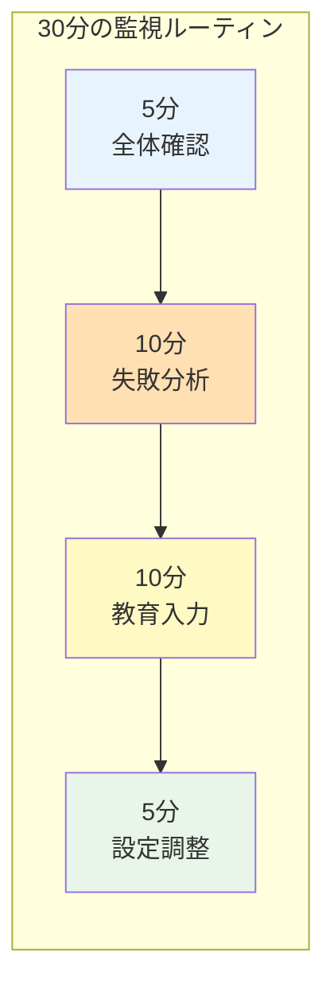

# UnsonOS 監視・育成フェーズのUI設計

## 現フェーズの正しい認識

UnsonOSは現在、**AIと人間が協働して学習する育成期**にあります。
- AIは完全自動化できるレベルではない
- 100個のSaaSは実験と検証の対象
- システム全体が学習サイクルを回している

## 監視・教育に特化した画面構成

### 1. AI監視ダッシュボード（メイン画面）

```typescript
interface AIMonitoringDashboard {
  // AI信頼度メトリクス
  trustMetrics: {
    overallAccuracy: number;        // 全体正答率: 75%
    weeklyImprovement: number;      // 週次改善率: +3%
    failureRate: number;            // 失敗率: 8%
    criticalErrors: number;         // 重大エラー: 2件
  };
  
  // 本日のAI活動サマリー
  todayActivity: {
    decisionsMode: number;          // 判断数: 234件
    autoApproved: number;           // 自動承認: 180件
    humanOverride: number;          // 人間介入: 54件
    learningPoints: number;         // 学習ポイント: 12件
  };
  
  // 要注意エリア
  attentionRequired: {
    failedDecisions: Decision[];    // 失敗した判断
    lowConfidence: Decision[];      // 確信度の低い判断
    waitingFeedback: Decision[];    // フィードバック待ち
  };
}
```

#### ビジュアルレイアウト

```
┌────────────────────────────────────────────────────────────┐
│                   AI監視ダッシュボード                       │
├────────────────────────────────────────────────────────────┤
│ ┌──────────────┐ ┌──────────────┐ ┌──────────────┐        │
│ │ AI信頼度     │ │ 本日の活動   │ │ 週次成長     │        │
│ │    75%       │ │  234判断     │ │   +3%        │        │
│ │  ▂▃▅▆█      │ │  54介入      │ │  ↗️          │        │
│ └──────────────┘ └──────────────┘ └──────────────┘        │
│                                                              │
│ 【要対応】失敗した判断（8件）                                  │
│ ┌──────────────────────────────────────────────────┐      │
│ │ ⚠️ SaaS-A: 価格変更を誤判断 → 売上-15%             │      │
│ │    [詳細を見る] [正しい判断を教える]               │      │
│ ├──────────────────────────────────────────────────┤      │
│ │ ⚠️ SaaS-B: 広告停止が早すぎた → 機会損失-200万     │      │
│ │    [詳細を見る] [正しい判断を教える]               │      │
│ └──────────────────────────────────────────────────┘      │
└────────────────────────────────────────────────────────────┘
```

### 2. AI教育画面（フィードバック入力）

```typescript
interface AIEducationScreen {
  // 失敗ケースの詳細
  failureDetails: {
    saasId: string;
    decision: string;
    actualOutcome: string;
    expectedOutcome: string;
    impactAmount: number;
  };
  
  // 教育的フィードバック入力
  feedbackForm: {
    correctDecision: string;        // 正しい判断
    reasoningExplanation: string;   // なぜそう判断すべきか
    preventionRule: string;          // 今後の予防ルール
    confidenceThreshold: number;    // この種の判断の確信度閾値
  };
  
  // 類似パターンの提示
  similarPatterns: {
    pastCases: CaseEntry[];
    suggestedLearning: string;
  };
}
```

#### 教育フォームのUI

```
┌────────────────────────────────────────────────────────────┐
│                    AI教育フィードバック                      │
├────────────────────────────────────────────────────────────┤
│ 【失敗ケース】SaaS-A 価格変更の誤判断                        │
│                                                              │
│ AIの判断: 「競合対抗で20%値下げ」                            │
│ 結果: 売上 -15%、利益率 -30%                                │
│                                                              │
│ ┌──────────────────────────────────────────────────┐      │
│ │ 正しい判断は？                                     │      │
│ │ [値下げではなく、機能追加で差別化すべきだった    ] │      │
│ └──────────────────────────────────────────────────┘      │
│                                                              │
│ ┌──────────────────────────────────────────────────┐      │
│ │ なぜ？（AIが学習すべき理由）                      │      │
│ │ [価格競争は利益率を悪化させる。当社の強みは      ] │      │
│ │ [機能の豊富さなので、それを活かすべき。          ] │      │
│ └──────────────────────────────────────────────────┘      │
│                                                              │
│ ┌──────────────────────────────────────────────────┐      │
│ │ 今後のルール                                      │      │
│ │ ☑ 利益率30%以下になる価格変更は自動承認しない     │      │
│ │ ☑ 競合対抗は価格以外の手段を優先検討             │      │
│ └──────────────────────────────────────────────────┘      │
│                                                              │
│ [AIに学習させる] [キャンセル]                               │
└────────────────────────────────────────────────────────────┘
```

### 3. 成熟度評価画面（段階的自動化の管理）

```typescript
interface MaturityAssessment {
  // カテゴリ別の成熟度
  maturityByCategory: {
    pricing: { accuracy: 72%, autoApprovalEnabled: false },
    marketing: { accuracy: 85%, autoApprovalEnabled: true },
    operations: { accuracy: 90%, autoApprovalEnabled: true },
    customerSupport: { accuracy: 65%, autoApprovalEnabled: false }
  };
  
  // 自動化レベル設定
  automationLevels: {
    level1_monitor: string[];      // 監視のみ
    level2_suggest: string[];      // 提案のみ
    level3_semiAuto: string[];     // 条件付き自動化
    level4_fullAuto: string[];     // 完全自動化
  };
  
  // 次のマイルストーン
  nextMilestone: {
    target: string;
    requiredAccuracy: number;
    currentProgress: number;
    estimatedDays: number;
  };
}
```

#### 成熟度ビジュアライゼーション

```
┌────────────────────────────────────────────────────────────┐
│                  システム成熟度評価                          │
├────────────────────────────────────────────────────────────┤
│                                                              │
│  価格戦略     ████████░░░░░░░░  72% 🔴 要監視              │
│  マーケ       ██████████████░░  85% 🟡 条件付き自動        │
│  運用         ████████████████  90% 🟢 自動化済み          │
│  CS対応       ██████░░░░░░░░░  65% 🔴 要監視              │
│                                                              │
│ ┌──────────────────────────────────────────────────┐      │
│ │ 自動化レベル調整                                  │      │
│ │                                                    │      │
│ │ 価格変更     [監視のみ ▼]  閾値: [_80_%]         │      │
│ │ 広告運用     [条件付き ▼]  閾値: [_85_%]         │      │
│ │ 在庫管理     [完全自動 ▼]  閾値: [_90_%]         │      │
│ │                                                    │      │
│ │ 💡 推奨: 価格戦略はあと2週間の学習が必要です      │      │
│ └──────────────────────────────────────────────────┘      │
└────────────────────────────────────────────────────────────┘
```

## 日次運用フロー（30分の現実的な監視）

### タイムボックス運用



## モバイル対応（外出先での最小限監視）

### スマホ用シンプルUI

```
┌─────────────────┐
│ UnsonOS Monitor │
│                 │
│ AI信頼度: 75%   │
│ 要対応: 3件     │
│                 │
│ ⚠️ 重大エラー    │
│ SaaS-A 売上-15% │
│ [詳細] [承認]   │
│                 │
│ 📊 本日: 234判断│
│ ✅ 成功: 216    │
│ ❌ 失敗: 18     │
└─────────────────┘
```

## KPI設計（監視フェーズ用）

### 主要監視指標

| 指標 | 目標 | 現在 | アクション閾値 |
|------|------|------|----------------|
| AI正答率 | 90% | 75% | 70%未満で要介入 |
| 重大エラー率 | 1%以下 | 2% | 3%で緊急対応 |
| 学習効果 | 週+5% | +3% | +1%未満で手法見直し |
| 人間介入率 | 10%以下 | 23% | 30%で設計見直し |

## 段階的な自動化ロードマップ

### Phase 1: 現在（0-3ヶ月）
- 全判断を監視
- 失敗から学習
- パターン蓄積

### Phase 2: 信頼構築（3-6ヶ月）
- 低リスク領域の自動化
- 成功パターンの確立
- 条件付き承認の導入

### Phase 3: 半自動運用（6-12ヶ月）
- 中リスク領域の自動化
- 例外処理のみ人間介入
- 週次レビュー体制

### Phase 4: 自律運用（12ヶ月〜）
- 高信頼領域の完全自動化
- 月次レビュー
- 新規領域への展開

## セキュリティと監査

### 判断の記録と追跡

```typescript
interface DecisionAudit {
  timestamp: Date;
  aiDecision: string;
  humanOverride?: string;
  outcome: string;
  learningApplied: boolean;
  responsiblePerson: string;
}
```

### アラート設定

- **即時通知**: 重大エラー、異常な判断
- **日次サマリー**: 失敗ケース、要フィードバック
- **週次レポート**: 成長率、自動化進捗

## まとめ

現フェーズのUIは「**AIを信頼できるレベルまで育てる**」ことに特化。
- 監視と教育が中心
- 失敗を学習機会として活用
- 段階的な自動化レベルの調整
- 30分/日の現実的な運用