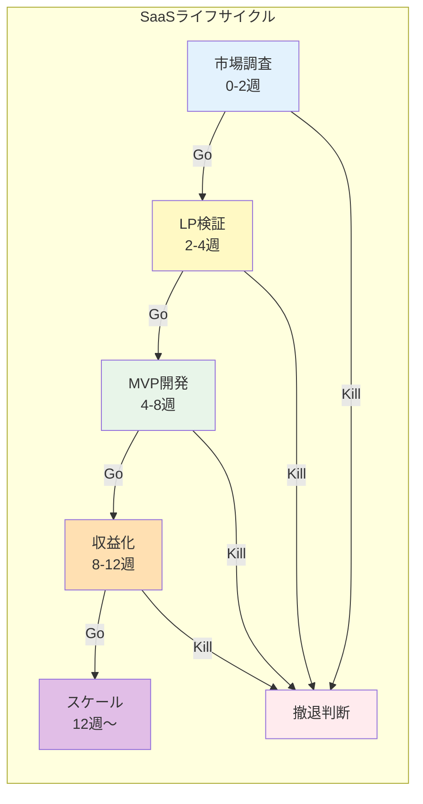

# UnsonOS フェーズ別モニタリングUI設計

## 概要

100個のSaaSはそれぞれ異なるフェーズにあり、フェーズごとに監視すべきKPIと判断ポイントが異なります。

## SaaS成長フェーズの定義



## フェーズ別モニタリングダッシュボード

### 統合ビュー: 100個のSaaSをフェーズ別に俯瞰

```typescript
interface PhaseOverviewDashboard {
  phaseDistribution: {
    research: { count: 15, alerts: 2 },      // 市場調査中
    landing: { count: 25, alerts: 5 },       // LP検証中
    mvp: { count: 30, alerts: 8 },          // MVP開発中
    monetize: { count: 20, alerts: 3 },     // 収益化中
    scale: { count: 8, alerts: 1 },         // スケール中
    sunset: { count: 2, alerts: 0 }         // 撤退準備
  };
  
  criticalDecisions: {
    goKillPending: number;    // Go/Kill判断待ち: 12件
    phaseGates: Gate[];       // フェーズゲート承認待ち
  };
}
```

#### フェーズ分布ビュー

```
┌────────────────────────────────────────────────────────────┐
│                 SaaSポートフォリオ フェーズ分布              │
├────────────────────────────────────────────────────────────┤
│                                                              │
│  市場調査  ████░░░░░░░░░░░░░░  15個 (⚠️2)                  │
│  LP検証    ████████░░░░░░░░░░  25個 (⚠️5)                  │
│  MVP開発   ██████████░░░░░░░░  30個 (⚠️8)                  │
│  収益化    ███████░░░░░░░░░░░  20個 (⚠️3)                  │
│  スケール  ███░░░░░░░░░░░░░░░   8個 (⚠️1)                  │
│                                                              │
│  【要判断】Go/Kill Decision: 12件待ち                        │
└────────────────────────────────────────────────────────────┘
```

## Phase 0: 市場調査フェーズ（0-2週）

### 監視すべきKPI

```typescript
interface MarketResearchMonitoring {
  targetMarket: {
    tam: number;              // 市場規模（Total Addressable Market）
    competition: number;      // 競合数
    searchVolume: number;     // 検索ボリューム
    trendsScore: number;       // トレンドスコア
  };
  
  feasibility: {
    technicalComplexity: 'low' | 'medium' | 'high';
    estimatedCost: number;
    timeToMarket: number;     // 予想開発期間（週）
  };
  
  aiDecisions: {
    nicheFinding: string;     // ニッチ市場の発見
    opportunityScore: number; // 機会スコア（0-100）
    goKillRecommendation: 'go' | 'kill' | 'pivot';
  };
}
```

### UI: 市場調査モニタリング画面

```
┌────────────────────────────────────────────────────────────┐
│              SaaS-A: 市場調査フェーズ (Day 5/14)            │
├────────────────────────────────────────────────────────────┤
│                                                              │
│ 【市場分析】                                                 │
│ TAM: ¥500億  競合: 12社  検索: 50K/月  トレンド: ↑85       │
│                                                              │
│ 【AIの仮説】                                                 │
│ "中小企業向け在庫管理で、音声入力特化のニッチを発見"         │
│ 機会スコア: 72/100                                          │
│                                                              │
│ 【Go/Kill判断】締切: あと9日                                 │
│ AI推奨: Go（ニッチだが確実な需要あり）                       │
│                                                              │
│ [詳細分析を見る] [LPコンセプト作成へ進む] [Kill]            │
└────────────────────────────────────────────────────────────┘
```

## Phase 1: LP検証フェーズ（2-4週）

### 監視すべきKPI

```typescript
interface LandingPageMonitoring {
  traffic: {
    visitors: number;         // 訪問者数
    source: {                // 流入元
      organic: number;
      ads: number;
      social: number;
    };
    adSpend: number;         // 広告費
    cpc: number;             // クリック単価
  };
  
  conversion: {
    signupRate: number;      // 登録率（目標: 10%）
    bounceRate: number;      // 直帰率
    timeOnPage: number;      // 滞在時間
    heatmap: HeatmapData;    // クリックヒートマップ
  };
  
  messaging: {
    headline: string;
    valueProposition: string;
    abTestResults: ABTest[];
  };
}
```

### UI: LP検証モニタリング画面

```
┌────────────────────────────────────────────────────────────┐
│              SaaS-B: LP検証フェーズ (Week 1/2)              │
├────────────────────────────────────────────────────────────┤
│                                                              │
│ 【LP成績】                                                   │
│ 訪問: 1,234  登録: 89  CVR: 7.2% 🟡（目標10%）             │
│                                                              │
│ 【広告効率】                                                │
│ 支出: ¥45,000  CPC: ¥120  CAC: ¥506                       │
│                                                              │
│ 【A/Bテスト結果】                                           │
│ A案「作業時間を50%削減」: CVR 6.5%                          │
│ B案「月額¥2,980で使い放題」: CVR 7.8% 🏆                   │
│                                                              │
│ 【AIの判断】                                                │
│ "価格訴求が効果的。MVP開発へ進むべき"                       │
│                                                              │
│ [ヒートマップ] [ユーザーフィードバック] [MVP着手] [撤退]    │
└────────────────────────────────────────────────────────────┘
```

## Phase 2: MVP開発フェーズ（4-8週）

### 監視すべきKPI

```typescript
interface MVPMonitoring {
  development: {
    featuresCompleted: number;    // 完成機能数
    bugsOpen: number;            // 未解決バグ
    velocity: number;            // 開発速度
    estimatedLaunch: Date;       // 予定リリース日
  };
  
  earlyAccess: {
    betaUsers: number;           // ベータユーザー数
    activeRate: number;          // アクティブ率
    feedback: UserFeedback[];    // フィードバック
    nps: number;                // NPS（-100〜100）
  };
  
  retention: {
    day1: number;               // 1日後継続率
    day7: number;               // 7日後継続率（目標: 30%）
    day30: number;              // 30日後継続率
  };
}
```

### UI: MVP開発モニタリング画面

```
┌────────────────────────────────────────────────────────────┐
│              SaaS-C: MVP開発フェーズ (Week 5/8)             │
├────────────────────────────────────────────────────────────┤
│                                                              │
│ 【開発進捗】                                                 │
│ ████████████░░░░░  75% (12/16機能完成)  バグ: 3件          │
│                                                              │
│ 【ベータテスト】                                            │
│ ユーザー: 45名  アクティブ: 67%  NPS: +12                  │
│                                                              │
│ 【継続率】    Day1: 78% ✅  Day7: 34% ✅  Day30: 測定中    │
│                                                              │
│ 【主要フィードバック】                                      │
│ 😍 "音声入力が革命的に便利"（8件）                          │
│ 😐 "レポート機能が弱い"（5件）                              │
│                                                              │
│ 【AIの判断】                                                │
│ "継続率良好。レポート機能改善後、有料化へ移行推奨"          │
│                                                              │
│ [フィードバック詳細] [機能優先度変更] [有料化準備]          │
└────────────────────────────────────────────────────────────┘
```

## Phase 3: 収益化フェーズ（8-12週）

### 監視すべきKPI

```typescript
interface MonetizationMonitoring {
  pricing: {
    model: 'freemium' | 'trial' | 'paid';
    tiers: PricingTier[];
    averagePrice: number;
  };
  
  revenue: {
    mrr: number;                // 月次経常収益
    arpu: number;              // ユーザー単価
    conversionRate: number;     // 有料転換率（目標: 7%）
    churnRate: number;         // 解約率
    ltv: number;               // 顧客生涯価値
  };
  
  unitEconomics: {
    cac: number;               // 顧客獲得コスト
    paybackPeriod: number;     // 回収期間（月）
    ltvCacRatio: number;       // LTV/CAC比率（目標: 3以上）
  };
}
```

### UI: 収益化モニタリング画面

```
┌────────────────────────────────────────────────────────────┐
│              SaaS-D: 収益化フェーズ (Week 10/12)            │
├────────────────────────────────────────────────────────────┤
│                                                              │
│ 【収益指標】                                                 │
│ MRR: ¥458,000  ARPU: ¥3,200  有料転換: 8.5% ✅            │
│                                                              │
│ 【ユニットエコノミクス】                                    │
│ CAC: ¥8,000  LTV: ¥28,000  LTV/CAC: 3.5 ✅                │
│ 回収期間: 2.5ヶ月                                           │
│                                                              │
│ 【価格最適化A/Bテスト】                                     │
│ ¥2,980/月: 転換率9.2%、解約率12%                           │
│ ¥3,980/月: 転換率6.8%、解約率8% ← 現在                    │
│                                                              │
│ 【AIの判断】                                                │
│ "価格を¥3,480に調整し、年間プラン導入でLTV向上可能"         │
│                                                              │
│ [価格変更] [プラン追加] [スケール準備]                      │
└────────────────────────────────────────────────────────────┘
```

## Phase 4: スケールフェーズ（12週〜）

### 監視すべきKPI

```typescript
interface ScaleMonitoring {
  growth: {
    momGrowth: number;         // 月次成長率
    marketShare: number;       // 市場シェア
    virality: number;          // バイラル係数
  };
  
  operations: {
    supportTickets: number;    // サポート件数
    responseTime: number;      // 対応時間
    automationRate: number;    // 自動化率
    marginImprovement: number; // 利益率改善
  };
  
  competitive: {
    position: number;          // 市場ポジション
    differentiation: string[]; // 差別化要因
    threats: CompetitiveThreat[];
  };
}
```

## フェーズゲート判断UI

### Go/Kill判断画面

```
┌────────────────────────────────────────────────────────────┐
│                  フェーズゲート判断                          │
├────────────────────────────────────────────────────────────┤
│                                                              │
│ SaaS-E: LP検証 → MVP開発への移行判断                        │
│                                                              │
│ 【達成状況】                                                 │
│ ✅ 登録率: 11.2%（目標10%）                                 │
│ ⚠️ CAC: ¥650（目標¥500）                                   │
│ ✅ 市場フィードバック: ポジティブ                           │
│                                                              │
│ 【リスク評価】                                              │
│ • 競合参入リスク: 低                                        │
│ • 技術的難易度: 中                                          │
│ • 予想投資額: ¥200万                                        │
│                                                              │
│ 【AI推奨】                                                  │
│ "CACは高いが改善可能。需要は確実なのでGo推奨"               │
│                                                              │
│ [📊 詳細データ] [Go - MVP開発へ] [Pivot - 方向転換] [Kill]  │
└────────────────────────────────────────────────────────────┘
```

## 複数フェーズの同時監視

### マルチフェーズダッシュボード

```
┌────────────────────────────────────────────────────────────┐
│            要注意SaaS - フェーズ別アラート                   │
├────────────────────────────────────────────────────────────┤
│                                                              │
│ 【市場調査】2件                                             │
│ • SaaS-A: TAM小さすぎ（¥10億）→ Kill候補                   │
│ • SaaS-B: 競合20社超 → Pivot検討                           │
│                                                              │
│ 【LP検証】5件                                               │
│ • SaaS-C: CVR 3%（目標10%）→ メッセージ見直し              │
│ • SaaS-D: CPC ¥500超 → 広告戦略変更                        │
│                                                              │
│ 【MVP開発】3件                                              │
│ • SaaS-E: Day7継続率15% → 機能改善急務                     │
│ • SaaS-F: 開発遅延2週間 → リソース追加検討                  │
│                                                              │
│ 【収益化】1件                                               │
│ • SaaS-G: 解約率20%超 → 緊急対策必要                       │
└────────────────────────────────────────────────────────────┘
```

## AIの学習ポイント（フェーズ別）

### 各フェーズでAIが学ぶべきパターン

| フェーズ | 学習ポイント | 失敗例 | 成功パターン |
|---------|------------|--------|-------------|
| 市場調査 | ニッチの見極め | TAM過小評価 | 競合少×需要明確 |
| LP検証 | コピー最適化 | 機能訴求偏重 | 価値・価格バランス |
| MVP開発 | 機能優先度 | 過剰機能 | コア機能に集中 |
| 収益化 | 価格設定 | 安すぎ/高すぎ | 段階的調整 |
| スケール | 投資判断 | 早すぎる拡大 | 利益率確保後拡大 |

## モバイル用フェーズ監視

### スマホでの簡易チェック

```
┌─────────────────┐
│ Phase Monitor   │
├─────────────────┤
│                 │
│ 🔴 要判断: 3件  │
│                 │
│ LP検証          │
│ SaaS-A CVR:3%   │
│ [Kill] [Pivot]  │
│                 │
│ MVP開発         │
│ SaaS-B 継続:15% │
│ [改善] [撤退]   │
│                 │
│ 収益化          │
│ SaaS-C 解約:20% │
│ [対策] [様子見] │
└─────────────────┘
```

## まとめ

各フェーズで監視すべきKPIと判断ポイントが明確に異なる：

- **市場調査**: TAM、競合、機会の評価
- **LP検証**: CVR、CAC、メッセージング
- **MVP開発**: 継続率、NPS、開発速度
- **収益化**: LTV/CAC、有料転換率、解約率
- **スケール**: 成長率、自動化率、競合優位性

これらを適切に監視し、フェーズゲートで的確なGo/Kill判断を行うことが重要。