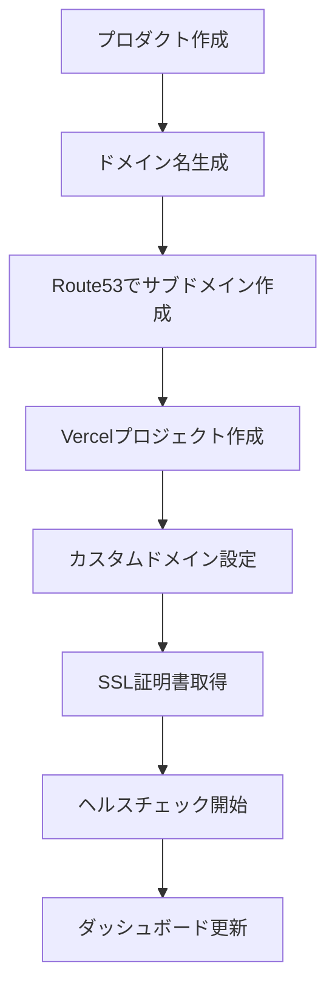
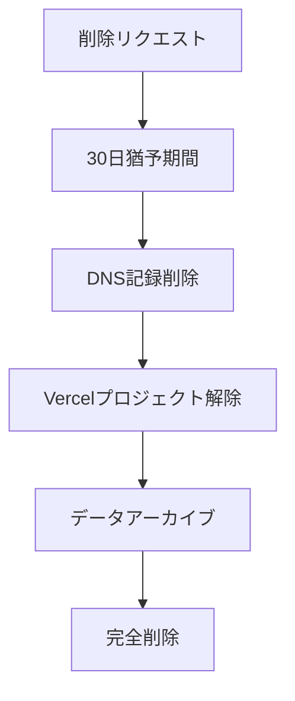

# ドメイン自動化システム設計書

## 概要
100-200個のマイクロSaaSとLPを効率的に管理するための、ドメイン自動化システムの設計と実装。

## 🎯 目的
- **大規模展開**: 100-200個のサービスに対応
- **自動化**: ドメイン作成からSSL証明書まで完全自動化
- **統一管理**: 単一ダッシュボードで全ドメインを管理
- **コスト最適化**: 必要に応じたドメイン取得・解放

## 🏗️ システムアーキテクチャ

### 1. ドメイン命名規則
```
# プロダクトドメイン（サブドメイン方式）
{product-id}.unson.jp          # メインサービス
api.{product-id}.unson.jp      # API
dashboard.{product-id}.unson.jp # 管理画面

# 例：
ai-coach.unson.jp
api.ai-coach.unson.jp
dashboard.ai-coach.unson.jp
```

### 2. 技術スタック
```yaml
DNS管理:
  - AWS Route53 (メインDNS)
  - Cloudflare (CDN・セキュリティ層)

ホスティング:
  - Vercel (フロントエンド・LP)
  - AWS Lambda/ECS (バックエンド)
  - Convex (リアルタイムDB)

SSL/セキュリティ:
  - Let's Encrypt (自動SSL)
  - Cloudflare (DDoS対策・WAF)

API統合:
  - Route53 API
  - Vercel API
  - Cloudflare API
```

## 📋 実装フェーズ

### Phase 1: 基盤構築（1週間）
- [ ] Route53 API統合
- [ ] Vercel API統合
- [ ] ドメイン管理DB設計
- [ ] 基本CRUD操作実装

### Phase 2: 自動化（1週間）
- [ ] ドメイン自動作成フロー
- [ ] SSL証明書自動取得
- [ ] デプロイメント連携
- [ ] ヘルスチェック実装

### Phase 3: 管理UI（1週間）
- [ ] ドメイン管理ダッシュボード
- [ ] 一括操作機能
- [ ] 監視・アラート画面
- [ ] コスト分析ビュー

## 🔧 API設計

### ドメイン管理API
```typescript
// ドメイン作成
POST /api/domains
{
  "productId": "ai-coach-001",
  "subdomain": "ai-coach",
  "type": "production" | "staging",
  "hosting": "vercel" | "aws",
  "ssl": true
}

// ドメイン一覧取得
GET /api/domains
Response: {
  "domains": [
    {
      "id": "dom_xxx",
      "productId": "ai-coach-001",
      "fqdn": "ai-coach.unson.jp",
      "status": "active",
      "ssl": {
        "enabled": true,
        "expires": "2025-12-31"
      },
      "hosting": {
        "provider": "vercel",
        "deploymentId": "dpl_xxx"
      },
      "health": {
        "status": "healthy",
        "lastCheck": "2025-01-22T09:00:00Z"
      }
    }
  ]
}

// ドメイン削除
DELETE /api/domains/{domainId}
```

## 📊 データモデル

### Convexスキーマ
```typescript
// domains テーブル
export const domains = defineTable({
  productId: v.string(),
  subdomain: v.string(),
  fqdn: v.string(),
  type: v.union(v.literal("production"), v.literal("staging")),
  status: v.union(
    v.literal("pending"),
    v.literal("active"),
    v.literal("suspended"),
    v.literal("deleted")
  ),
  hosting: v.object({
    provider: v.string(),
    deploymentId: v.optional(v.string()),
    url: v.optional(v.string()),
  }),
  ssl: v.object({
    enabled: v.boolean(),
    provider: v.string(),
    expires: v.optional(v.string()),
  }),
  dns: v.object({
    nameservers: v.array(v.string()),
    records: v.array(v.object({
      type: v.string(),
      name: v.string(),
      value: v.string(),
      ttl: v.number(),
    })),
  }),
  metrics: v.object({
    requests: v.number(),
    bandwidth: v.number(),
    uptime: v.number(),
  }),
  createdAt: v.number(),
  updatedAt: v.number(),
})
.index("by_product", ["productId"])
.index("by_status", ["status"])
.index("by_subdomain", ["subdomain"]);
```

## 🚀 自動化フロー

### 新規プロダクト作成時


### ドメイン削除時


## 💰 コスト管理

### 月額コスト試算
```
Route53:
- ホストゾーン: $0.50/月
- クエリ: $0.40/100万クエリ
- 200サービス想定: $100/月

Vercel (Pro):
- $20/月（無制限プロジェクト）

Cloudflare (Pro):
- $20/月

合計: 約$140/月（200サービス運用時）
```

## 🔒 セキュリティ考慮事項

1. **APIキー管理**
   - 環境変数での管理
   - ローテーション自動化
   - 最小権限原則

2. **DNS セキュリティ**
   - DNSSEC有効化
   - レート制限
   - DDoS対策

3. **アクセス制御**
   - IP制限（管理画面）
   - 2要素認証
   - 監査ログ

## 📈 成功指標

- **自動化率**: 95%以上
- **ドメイン作成時間**: 5分以内
- **月間稼働率**: 99.9%以上
- **コスト削減**: 手動管理比70%削減

## 🔄 次のステップ

1. **即座に実装**
   - Route53 API統合
   - 基本的なCRUD操作

2. **1週間以内**
   - Vercel API統合
   - 自動化フロー実装

3. **2週間以内**
   - 管理ダッシュボード
   - 監視・アラート機能

## 📚 参考資料

- [AWS Route53 API Documentation](https://docs.aws.amazon.com/route53/)
- [Vercel API Documentation](https://vercel.com/docs/rest-api)
- [Cloudflare API Documentation](https://developers.cloudflare.com/api)