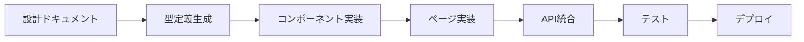

# UnsonOS UI実装のためのフォルダ構成設計

## 現在のリポジトリ構造

```
unson_os/
├── src/                     # 🚨 現在：UnsonOSのLP（マーケティングサイト）
│   ├── app/                 # Next.js App Router
│   │   ├── (marketing)/     # 会社紹介、採用、問い合わせ
│   │   ├── (product)/       # プロダクト紹介、ドキュメント
│   │   └── api/             # お問い合わせ、ウェイトリスト登録
│   ├── components/          # LP用コンポーネント
│   ├── lib/                 # LP用ユーティリティ
│   └── types/               # LP用型定義
├── docs/                    # 戦略・設計ドキュメント
├── playbooks/              # プレイブック定義
├── scripts/                # 開発・運用スクリプト
├── convex/                 # Convex（お問い合わせ、ウェイトリスト管理）
├── package.json            # Next.js + LP関連依存関係
└── README.md
```

## 推奨フォルダ構成（実装追加版）

## 構造変更の選択肢

### Option A: 現在のsrcをapps/landingに移動（推奨）

```
unson_os/
├── docs/                           # 既存: 戦略・設計ドキュメント
├── playbooks/                      # 既存: プレイブック定義
├── scripts/                        # 既存: 開発・運用スクリプト
├── convex/                         # 既存: Convex（LP用DB）
│
├── apps/                           # 🆕 アプリケーション層
│   ├── landing/                    # 🔄 現在のsrcを移動（UnsonOS LP）
│   │   ├── src/
│   │   │   ├── app/
│   │   │   │   ├── (marketing)/    # 会社紹介、採用等
│   │   │   │   ├── (product)/      # プロダクト紹介、ドキュメント
│   │   │   │   └── api/            # LP用API
│   │   │   ├── components/         # LP用コンポーネント
│   │   │   ├── lib/               # LP用ユーティリティ
│   │   │   └── types/             # LP用型定義
│   │   ├── public/                # LP用静的ファイル
│   │   ├── package.json           # LP用依存関係
│   │   ├── next.config.js         # LP用Next.js設定
│   │   └── tailwind.config.js     # LP用スタイル設定
│   │
│   ├── management-ui/              # 🆕 メイン管理ダッシュボード
│   │   ├── src/
│   │   │   ├── app/                # Next.js App Router
│   │   │   │   ├── (dashboard)/    # ダッシュボード関連ルート
│   │   │   │   │   ├── page.tsx    # 統合ダッシュボード
│   │   │   │   │   ├── loading.tsx
│   │   │   │   │   └── layout.tsx
│   │   │   │   ├── saas/           # SaaS管理
│   │   │   │   │   ├── page.tsx    # SaaS一覧
│   │   │   │   │   ├── [id]/       # SaaS詳細
│   │   │   │   │   │   ├── page.tsx
│   │   │   │   │   │   └── [phase]/  # フェーズ別詳細
│   │   │   │   │   │       └── page.tsx
│   │   │   │   │   └── components/ # SaaS専用コンポーネント
│   │   │   │   ├── gates/          # Gate承認
│   │   │   │   │   ├── page.tsx    # Gate承認キュー
│   │   │   │   │   ├── [id]/       # Gate詳細
│   │   │   │   │   └── components/
│   │   │   │   ├── phases/         # フェーズ別管理
│   │   │   │   │   ├── market-research/
│   │   │   │   │   ├── landing-validation/
│   │   │   │   │   ├── mvp-development/
│   │   │   │   │   ├── monetization/
│   │   │   │   │   └── scale/
│   │   │   │   ├── ai-monitoring/   # AI監視・教育
│   │   │   │   │   ├── dashboard/
│   │   │   │   │   ├── failures/
│   │   │   │   │   ├── education/
│   │   │   │   │   └── maturity/
│   │   │   │   ├── auth/            # 認証
│   │   │   │   ├── settings/        # 設定
│   │   │   │   ├── globals.css
│   │   │   │   └── layout.tsx       # ルートレイアウト
│   │   │   │
│   │   │   ├── components/         # 共通UIコンポーネント
│   │   │   │   ├── ui/             # 基本UIコンポーネント
│   │   │   │   │   ├── button.tsx
│   │   │   │   │   ├── card.tsx
│   │   │   │   │   ├── modal.tsx
│   │   │   │   │   ├── data-table.tsx
│   │   │   │   │   ├── chart.tsx
│   │   │   │   │   └── phase-indicator.tsx
│   │   │   │   ├── layout/         # レイアウトコンポーネント
│   │   │   │   │   ├── header.tsx
│   │   │   │   │   ├── sidebar.tsx
│   │   │   │   │   ├── breadcrumb.tsx
│   │   │   │   │   └── navigation.tsx
│   │   │   │   ├── dashboard/      # ダッシュボード専用
│   │   │   │   │   ├── kpi-card.tsx
│   │   │   │   │   ├── phase-distribution.tsx
│   │   │   │   │   ├── alert-list.tsx
│   │   │   │   │   └── quick-actions.tsx
│   │   │   │   ├── saas/           # SaaS管理専用
│   │   │   │   │   ├── saas-table.tsx
│   │   │   │   │   ├── saas-card.tsx
│   │   │   │   │   ├── phase-tabs.tsx
│   │   │   │   │   ├── kpi-chart.tsx
│   │   │   │   │   └── playbook-flow.tsx
│   │   │   │   ├── gates/          # Gate承認専用
│   │   │   │   │   ├── gate-card.tsx
│   │   │   │   │   ├── phase-gate-card.tsx
│   │   │   │   │   ├── approval-form.tsx
│   │   │   │   │   ├── decision-history.tsx
│   │   │   │   │   └── impact-analysis.tsx
│   │   │   │   ├── phases/         # フェーズ別コンポーネント
│   │   │   │   │   ├── market-research/
│   │   │   │   │   │   ├── tam-indicator.tsx
│   │   │   │   │   │   ├── competition-analysis.tsx
│   │   │   │   │   │   └── opportunity-score.tsx
│   │   │   │   │   ├── landing-validation/
│   │   │   │   │   │   ├── cvr-tracker.tsx
│   │   │   │   │   │   ├── ab-test-results.tsx
│   │   │   │   │   │   └── heatmap-viewer.tsx
│   │   │   │   │   ├── mvp-development/
│   │   │   │   │   │   ├── retention-chart.tsx
│   │   │   │   │   │   ├── nps-meter.tsx
│   │   │   │   │   │   └── feedback-list.tsx
│   │   │   │   │   ├── monetization/
│   │   │   │   │   │   ├── unit-economics.tsx
│   │   │   │   │   │   ├── pricing-optimizer.tsx
│   │   │   │   │   │   └── ltv-cac-ratio.tsx
│   │   │   │   │   └── scale/
│   │   │   │   │       ├── growth-metrics.tsx
│   │   │   │   │       ├── competitive-position.tsx
│   │   │   │   │       └── automation-status.tsx
│   │   │   │   ├── ai/             # AI関連コンポーネント
│   │   │   │   │   ├── trust-meter.tsx
│   │   │   │   │   ├── learning-curve.tsx
│   │   │   │   │   ├── failure-log.tsx
│   │   │   │   │   ├── education-form.tsx
│   │   │   │   │   └── maturity-assessment.tsx
│   │   │   │   └── common/         # 汎用コンポーネント
│   │   │   │       ├── kpi-indicator.tsx
│   │   │   │       ├── trend-arrow.tsx
│   │   │   │       ├── status-badge.tsx
│   │   │   │       ├── progress-bar.tsx
│   │   │   │       └── date-range-picker.tsx
│   │   │   │
│   │   │   ├── lib/                # ユーティリティ・設定
│   │   │   │   ├── types/          # TypeScript型定義
│   │   │   │   │   ├── saas.ts
│   │   │   │   │   ├── phases.ts
│   │   │   │   │   ├── gates.ts
│   │   │   │   │   ├── playbooks.ts
│   │   │   │   │   ├── ai.ts
│   │   │   │   │   └── api.ts
│   │   │   │   ├── hooks/          # カスタムフック
│   │   │   │   │   ├── use-saas-list.ts
│   │   │   │   │   ├── use-phase-data.ts
│   │   │   │   │   ├── use-gate-queue.ts
│   │   │   │   │   ├── use-ai-monitoring.ts
│   │   │   │   │   └── use-real-time.ts
│   │   │   │   ├── utils/          # ユーティリティ関数
│   │   │   │   │   ├── phase-utils.ts
│   │   │   │   │   ├── kpi-calculator.ts
│   │   │   │   │   ├── date-utils.ts
│   │   │   │   │   ├── format-utils.ts
│   │   │   │   │   └── validation.ts
│   │   │   │   ├── api/            # API クライアント
│   │   │   │   │   ├── saas.ts
│   │   │   │   │   ├── gates.ts
│   │   │   │   │   ├── playbooks.ts
│   │   │   │   │   ├── ai.ts
│   │   │   │   │   └── base.ts
│   │   │   │   ├── store/          # 状態管理
│   │   │   │   │   ├── dashboard.ts
│   │   │   │   │   ├── saas.ts
│   │   │   │   │   ├── gates.ts
│   │   │   │   │   └── ai.ts
│   │   │   │   ├── constants/      # 定数
│   │   │   │   │   ├── phases.ts
│   │   │   │   │   ├── kpis.ts
│   │   │   │   │   └── colors.ts
│   │   │   │   └── config/         # 設定
│   │   │   │       ├── database.ts
│   │   │   │       ├── auth.ts
│   │   │   │       └── feature-flags.ts
│   │   │   │
│   │   │   ├── styles/             # スタイル
│   │   │   │   ├── globals.css
│   │   │   │   ├── components.css
│   │   │   │   └── phases.css
│   │   │   │
│   │   │   └── middleware.ts       # Next.js ミドルウェア
│   │   │
│   │   ├── public/                 # 静的ファイル
│   │   │   ├── icons/
│   │   │   ├── images/
│   │   │   └── favicon.ico
│   │   │
│   │   ├── package.json
│   │   ├── next.config.js
│   │   ├── tailwind.config.js
│   │   ├── tsconfig.json
│   │   └── .env.local
│   │
│   ├── mobile-app/                 # 🆕 モバイルアプリ（将来）
│   │   └── (React Native構成)
│   │
│   └── api-gateway/                # 🆕 APIゲートウェイ（将来）
│       └── (API統合レイヤー)
│
├── packages/                       # 🆕 共有パッケージ
│   ├── shared-types/               # 型定義共有
│   │   ├── src/
│   │   │   ├── saas.ts
│   │   │   ├── phases.ts
│   │   │   ├── gates.ts
│   │   │   ├── playbooks.ts
│   │   │   └── index.ts
│   │   ├── package.json
│   │   └── tsconfig.json
│   │
│   ├── ui-components/              # UIコンポーネントライブラリ
│   │   ├── src/
│   │   │   ├── components/
│   │   │   ├── styles/
│   │   │   └── index.ts
│   │   ├── package.json
│   │   └── storybook/              # Storybook設定
│   │
│   ├── phase-logic/                # フェーズロジック共有
│   │   ├── src/
│   │   │   ├── market-research/
│   │   │   ├── landing-validation/
│   │   │   ├── mvp-development/
│   │   │   ├── monetization/
│   │   │   ├── scale/
│   │   │   └── utils/
│   │   └── package.json
│   │
│   ├── ai-utils/                   # AI関連ユーティリティ
│   │   ├── src/
│   │   │   ├── monitoring/
│   │   │   ├── education/
│   │   │   ├── decision-making/
│   │   │   └── pattern-recognition/
│   │   └── package.json
│   │
│   └── api-client/                 # API クライアント共有
│       ├── src/
│       │   ├── clients/
│       │   ├── types/
│       │   └── utils/
│       └── package.json
│
├── services/                       # 🆕 バックエンドサービス（将来）
│   ├── resolver-engine/            # Resolverエンジン
│   ├── casebook-service/           # CaseBook管理
│   ├── gate-service/               # Gate承認処理
│   ├── phase-service/              # フェーズ管理
│   └── ai-service/                 # AI管理・監視
│
├── infrastructure/                 # 🆕 インフラ設定（将来）
│   ├── docker/                     # Docker設定
│   ├── k8s/                        # Kubernetes設定
│   ├── terraform/                  # インフラ as Code
│   └── monitoring/                 # 監視設定
│
├── database/                       # 🆕 データベース設計
│   ├── migrations/                 # マイグレーション
│   ├── seeds/                      # テストデータ
│   ├── schemas/                    # スキーマ定義
│   └── docs/                       # DB設計ドキュメント
│
├── tools/                          # 🆕 開発ツール
│   ├── codegen/                    # コード生成
│   ├── testing/                    # テストユーティリティ
│   └── deployment/                 # デプロイツール
│
├── .github/                        # GitHub設定
│   ├── workflows/                  # CI/CD
│   └── ISSUE_TEMPLATE/
│
├── package.json                    # ルートパッケージ設定
├── pnpm-workspace.yaml             # pnpm workspaces設定
├── turbo.json                      # Turbo設定（モノレポ最適化）
├── tsconfig.json                   # TypeScript設定（ルート）
└── README.md
```

## 設計の考慮事項

### 1. モノレポ構成の採用理由

- **統一性**: 戦略ドキュメントと実装の一体管理
- **共有**: 型定義、ロジック、コンポーネントの再利用
- **効率性**: 一つのリポジトリでの一元管理
- **整合性**: ドキュメントとコードの同期

### 2. フェーズ別アーキテクチャ

```typescript
// フェーズ別の型安全性
interface PhaseComponentProps<T extends Phase> {
  phase: T;
  data: PhaseData[T];
  onAction: (action: PhaseAction[T]) => void;
}

// 使用例
<MarketResearchComponent 
  phase="market-research"
  data={marketResearchData}
  onAction={handleMarketResearchAction}
/>
```

### 3. 段階的実装計画

#### Phase 1: MVP実装（2-3ヶ月）
```
apps/management-ui/
├── 基本ダッシュボード
├── SaaS一覧（基本機能）
├── フェーズ表示（静的）
└── 簡易Gate承認
```

#### Phase 2: フェーズ特化実装（2-3ヶ月）
```
+ フェーズ別詳細画面
+ AI監視基本機能
+ リアルタイム更新
+ モバイル対応
```

#### Phase 3: 高度機能実装（3-6ヶ月）
```
+ 完全AI統合
+ 自動化機能
+ 高度分析
+ マルチテナント
```

### 4. 技術スタック

```json
{
  "frontend": {
    "framework": "Next.js 14",
    "language": "TypeScript",
    "styling": "Tailwind CSS",
    "ui": "shadcn/ui",
    "charts": "Recharts",
    "state": "Zustand",
    "forms": "React Hook Form",
    "validation": "Zod"
  },
  "backend": {
    "runtime": "Node.js",
    "database": "Convex",
    "vector": "Qdrant",
    "knowledge": "Neon + pgvector",
    "queue": "Convex Crons"
  },
  "tooling": {
    "monorepo": "pnpm workspaces + Turbo",
    "testing": "Vitest + Playwright",
    "ci-cd": "GitHub Actions",
    "deployment": "Vercel"
  }
}
```

### 5. 開発フロー



## 代替案: マイクロフロントエンド構成

### Option B: 分離アプリ構成

```
unson_os/                           # 戦略リポジトリ（現在）
unson_os_ui/                       # 管理UI専用リポジトリ
unson_os_mobile/                   # モバイル専用リポジトリ
unson_os_api/                      # API専用リポジトリ
```

**利点**: 各チームの独立開発
**欠点**: 整合性維持の複雑さ

### Option B: srcディレクトリ内で共存（非推奨）

現在のLP構造をそのままにして、ダッシュボードを追加する構成。

```
src/
├── app/
│   ├── (marketing)/        # 既存: LP関連
│   ├── (product)/          # 既存: プロダクト紹介
│   ├── (dashboard)/        # 🆕 管理ダッシュボード
│   └── api/                # LP用API + ダッシュボードAPI
└── components/
    ├── ui/                 # 既存: LP用UI
    ├── forms/              # 既存: LP用フォーム  
    ├── dashboard/          # 🆕 ダッシュボード用
    └── phases/             # 🆕 フェーズ別コンポーネント
```

**問題点**:
- LP用とダッシュボード用が混在して保守性悪化
- 依存関係の管理が複雑
- 独立したデプロイができない
- チーム開発時の責任範囲があいまい

### Option C: LP別リポジトリ化（非推奨）

LPを別のリポジトリに移動し、戦略リポジトリを管理UIに集中させる構成。

**問題点**:
- 戦略ドキュメントとマーケティングサイトの一貫性維持が困難
- リポジトリ間での情報共有のオーバーヘッド
- 既存のConvex設定等の移行コスト

## 推奨決定

**Option A（apps/構成移行）を推奨**

**理由**:
1. **責務分離**: LPと管理UIの明確な分離
2. **戦略一体性**: 戦略ドキュメントと実装の統合管理
3. **拡張性**: 将来のモバイルアプリ等への対応
4. **開発効率**: 独立した開発・デプロイサイクル
5. **フェーズ別対応**: 複雑なフェーズ管理ロジックの整理

## 移行手順

詳細な移行計画は [migration-plan.md](./migration-plan.md) を参照。

### 簡易手順
```bash
# 1. 現状バックアップ
git checkout -b backup/current-structure

# 2. apps構造作成
mkdir -p apps/landing apps/management-ui

# 3. LP移行
mv src apps/landing/src
mv public apps/landing/public
# 設定ファイル移行...

# 4. 管理UI構築
# 新規作成...
```