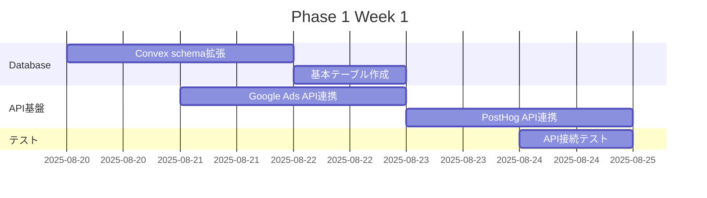
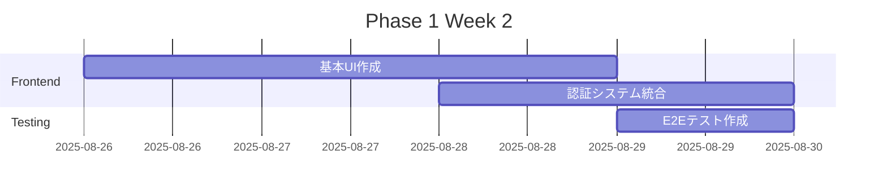
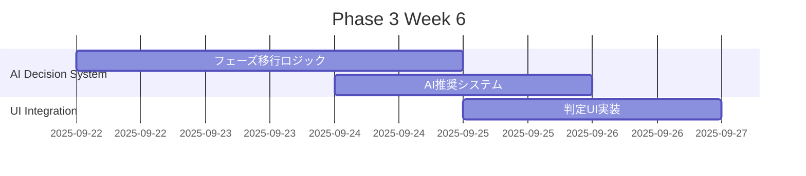
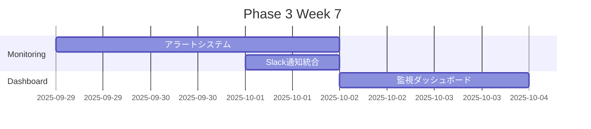

# LP検証システムMVP 実装ロードマップ

## プロジェクト概要

### ゴール
現在手動で行っているLP検証プロセスを完全自動化し、6個のマイクロSaaSプロダクトを効率的に管理できるシステムを構築する。

### 成功指標
- **LP検証作業時間**: 90%削減
- **CPA**: 平均15%改善  
- **CVR判定精度**: 向上
- **新プロダクト立ち上げ速度**: 3倍向上
- **フェーズ移行成功率**: 80%以上

## 実装フェーズ

### Phase 1: 基盤構築 (Week 1-2)

#### Week 1: データベース・API基盤
**目標**: 基本的なデータ構造とAPI基盤の構築



**実装項目**:
- [ ] Convex schemaにLP検証関連テーブル追加
  - `lpValidationSessions`
  - `automationExecutions` 
  - `phaseTransitionEvaluations`
  - `systemAlerts`
- [ ] Google Ads API接続設定
  - 認証設定
  - 基本クエリ機能
  - エラーハンドリング
- [ ] PostHog API接続設定
  - プロジェクト接続
  - 基本分析クエリ
  - データ取得テスト

**成果物**:
- 拡張されたConvex schema
- Google Ads/PostHog API接続ライブラリ
- 接続テスト結果レポート

#### Week 2: 基本UI・認証システム
**目標**: 管理画面の基本構造と認証システム



**実装項目**:
- [ ] LP検証ダッシュボード基本UI
  - プロダクト一覧表示
  - KPI表示コンポーネント
  - ステータス表示
- [ ] ユーザー認証・権限管理
  - Convex認証統合
  - ロールベースアクセス制御
- [ ] 基本的なCRUD操作
  - セッション作成・編集
  - 設定変更機能

**成果物**:
- 動作するダッシュボードUI
- 認証済みアクセス機能
- 基本操作のE2Eテスト

### Phase 2: 自動化エンジン実装 (Week 3-5)

#### Week 3: Google Ads自動最適化
**目標**: 4時間サイクルでのGoogle Ads自動最適化機能


**実装項目**:
- [ ] Google Ads最適化エンジン
  - キーワードパフォーマンス分析
  - 入札価格自動調整
  - 低パフォーマンス広告停止
- [ ] 最適化ルール設定
  - CPA上限による調整ルール
  - CVR閾値による判定
  - リスクレベル管理
- [ ] Vercel Cron Jobs設定
  - 4時間毎の自動実行
  - エラーハンドリング・リトライ
  - 実行ログ記録

**成果物**:
- Google Ads自動最適化システム
- 設定可能な最適化ルール
- 自動実行スケジュール

#### Week 4: PostHog分析・LP改善
**目標**: 24時間サイクルでのLP分析・改善システム


**実装項目**:
- [ ] PostHog分析エンジン
  - ユーザー行動分析
  - ファネル分析
  - ヒートマップ・離脱ポイント特定
- [ ] AI改善提案システム
  - 分析結果からの課題抽出
  - 改善優先度判定
  - 実装可能性評価
- [ ] Claude API統合
  - 改善提案の自動生成
  - コード実装指示作成

**成果物**:
- PostHog分析システム
- AI改善提案エンジン
- Claude API連携機能

#### Week 5: Claude Code自動実装
**目標**: 改善提案の自動実装・デプロイシステム


**実装項目**:
- [ ] Claude Code自動実装システム
  - 改善提案からコード生成
  - A/Bテスト設定自動化
  - Git連携（ブランチ作成・PR作成）
- [ ] 自動デプロイメント
  - Vercel自動デプロイ
  - テスト自動実行
  - ロールバック機能
- [ ] A/Bテスト管理
  - PostHog Feature Flag連携
  - テスト期間自動管理
  - 結果自動評価

**成果物**:
- Claude Code自動実装システム
- 自動デプロイ・A/Bテスト機能
- 統合テストスイート

### Phase 3: AI判定・意思決定システム (Week 6-7)

#### Week 6: フェーズ移行判定システム
**目標**: AI支援によるフェーズ移行判定機能



**実装項目**:
- [ ] フェーズ移行判定エンジン
  - KPI達成度自動評価
  - 統計的有意性検証
  - リスク分析機能
- [ ] AI推奨システム
  - Claude APIによる判定理由生成
  - 改善提案の優先度付け
  - 次アクション推奨
- [ ] 承認ワークフロー
  - 人間による最終判断UI
  - 判定履歴管理
  - 通知・アラートシステム

**成果物**:
- フェーズ移行判定システム
- AI推奨・承認ワークフロー
- 判定履歴管理機能

#### Week 7: 監視・アラートシステム
**目標**: システム監視とアラート機能



**実装項目**:
- [ ] アラートシステム
  - KPI異常値検知
  - 自動化エラー監視
  - システム健全性チェック
- [ ] 通知システム
  - Slack連携
  - メール通知
  - 緊急度別通知ルール
- [ ] 監視ダッシュボード
  - システム稼働状況
  - パフォーマンス指標
  - エラー・警告表示

**成果物**:
- 包括的監視・アラートシステム
- Slack/メール通知機能
- システム監視ダッシュボード

### Phase 4: 本番運用・最適化 (Week 8-12)

#### Week 8-9: 本番デプロイ・検証
**目標**: 実プロダクトでの運用開始と初期調整

**実装項目**:
- [ ] 本番環境デプロイ
- [ ] 実プロダクト接続・データ移行
- [ ] パフォーマンス監視・調整
- [ ] 初期運用問題の修正

#### Week 10-11: 運用最適化
**目標**: システム最適化とユーザー体験向上

**実装項目**:
- [ ] パフォーマンスボトルネック解消
- [ ] UI/UX改善
- [ ] 追加機能実装
- [ ] ドキュメント整備

#### Week 12: 拡張準備
**目標**: 追加プロダクト対応とスケールアップ準備

**実装項目**:
- [ ] 複数プロダクト同時管理対応
- [ ] スケーリング性能検証
- [ ] 運用プロセス標準化
- [ ] チームトレーニング実施

## 技術実装詳細

### 開発環境セットアップ

#### 必要なアカウント・サービス
```bash
# Google Ads API
- Google Ads Developer Token
- OAuth 2.0認証設定
- Test Account設定

# PostHog
- Project作成
- API Key取得
- Feature Flag設定

# Claude API
- Anthropic API Key
- 使用量制限設定

# Slack
- Webhook URL設定
- Bot Token (オプション)

# Vercel
- Cron Functions有効化
- Environment Variables設定
```

#### ローカル開発環境
```bash
# 環境変数設定
cp .env.example .env.local
# 必要な環境変数を設定

# 依存関係インストール
npm install

# Convex開発環境起動
npx convex dev

# Next.js開発サーバー起動
npm run dev

# テスト実行
npm run test
npm run test:e2e
```

### コード品質・テスト戦略

#### テストカバレッジ目標
- **Unit Tests**: 80%以上
- **Integration Tests**: 主要API・機能100%
- **E2E Tests**: クリティカルパス100%

#### テスト実装計画
```typescript
// テストカテゴリ別実装計画
const testingStrategy = {
  unit: {
    // ビジネスロジック
    'optimization-rules': '最適化ルールロジック',
    'kpi-calculations': 'KPI計算ロジック',
    'phase-gate-logic': 'フェーズ移行判定ロジック',
    
    // ユーティリティ
    'api-connectors': '外部API接続',
    'data-transformers': 'データ変換処理',
  },
  
  integration: {
    'google-ads-api': 'Google Ads API統合',
    'posthog-api': 'PostHog API統合', 
    'claude-api': 'Claude API統合',
    'convex-queries': 'Convex クエリ・変更',
  },
  
  e2e: {
    'lp-validation-flow': 'LP検証フロー全体',
    'automation-execution': '自動化実行プロセス',
    'phase-transition': 'フェーズ移行プロセス',
    'alert-handling': 'アラート処理フロー',
  }
};
```

### パフォーマンス要件

#### レスポンス時間目標
- **ダッシュボード読み込み**: < 2秒
- **API レスポンス**: < 500ms
- **自動化処理実行**: < 30秒
- **大量データ分析**: < 5分

#### リソース使用量制限
- **メモリ使用量**: < 512MB (Vercel Function)
- **実行時間**: < 10分 (Cron Jobs)
- **API呼び出し**: 制限内 (各サービス)
- **データベースクエリ**: < 100ms

### セキュリティ要件

#### データ保護
- [ ] API Keyの安全な管理
- [ ] 個人情報の暗号化
- [ ] アクセスログ記録
- [ ] 不正アクセス検知

#### 認証・認可
- [ ] 多要素認証対応
- [ ] ロールベースアクセス制御
- [ ] セッション管理
- [ ] API Rate Limiting

## リスク管理・対策

### 技術リスク

#### High Risk
**外部API制限・障害**
- 影響: システム停止
- 対策: フォールバック機能、手動操作モード
- 監視: API応答時間・エラー率

**自動最適化の誤動作**
- 影響: 広告費増加・CVR低下  
- 対策: 安全装置、人間承認フロー
- 監視: KPI異常値検知

#### Medium Risk
**パフォーマンス劣化**
- 影響: ユーザー体験低下
- 対策: キャッシュ機能、クエリ最適化
- 監視: レスポンス時間監視

**データ不整合**
- 影響: 判定精度低下
- 対策: データ検証機能、バックアップ
- 監視: データ整合性チェック

### 運用リスク

#### 人的リスク
**システム理解不足**
- 対策: 詳細ドキュメント、トレーニング実施
**運用プロセス未確立**  
- 対策: 運用マニュアル作成、段階的導入

#### ビジネスリスク
**期待効果未達成**
- 対策: 段階的検証、KPI監視
**運用コスト増加**
- 対策: コスト監視、効率化施策

## 成功指標・評価方法

### 短期指標 (1ヶ月)
```yaml
効率化指標:
  lp_validation_time_reduction: 90%  # LP検証作業時間削減
  manual_task_automation: 80%       # 手動作業自動化率
  
品質指標:
  cpa_improvement: 15%              # CPA改善率
  cvr_accuracy: 95%                # CVR判定精度
  system_uptime: 99.9%             # システム稼働率
```

### 中期指標 (3ヶ月)
```yaml
スケール指標:
  product_launch_speed: 3x          # 新プロダクト立ち上げ速度
  phase_transition_success: 80%     # フェーズ移行成功率
  concurrent_product_management: 10 # 同時管理プロダクト数

コスト指標:
  operational_cost_reduction: 50%   # 運用コスト削減
  error_rate: <1%                  # システムエラー率
```

### 長期指標 (6ヶ月)
```yaml
ビジネス指標:
  total_products_managed: 50-100   # 管理プロダクト数
  automated_decision_rate: 70%     # 自動判定率
  human_intervention_rate: <30%    # 人間介入率

ROI指標:
  development_cost_recovery: 6ヶ月 # 開発コスト回収期間
  productivity_increase: 5x        # 生産性向上倍率
```

## 継続的改善計画

### 月次レビュー
- [ ] KPI達成度評価
- [ ] システムパフォーマンス分析
- [ ] ユーザーフィードバック収集
- [ ] 改善提案検討・実装

### 四半期評価
- [ ] ROI計算・効果測定
- [ ] 技術的負債解消
- [ ] 新機能開発計画
- [ ] スケーリング準備

### 年次戦略レビュー
- [ ] システム全体見直し
- [ ] 技術スタック更新検討
- [ ] 組織・プロセス改善
- [ ] 次年度ロードマップ策定

---

このロードマップに従って実装を進めることで、LP検証システムMVPを成功裏に完成させ、UnsonOSのスケーリングを実現します。