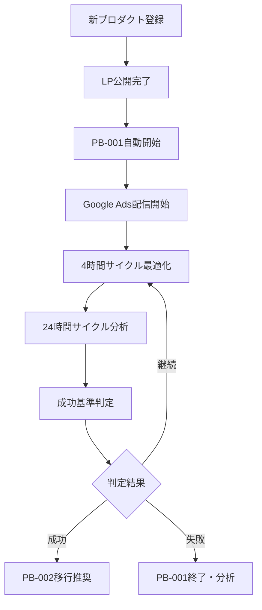

# LP検証システム × プレイブック統合設計

## 概要

LP検証システムは、既存の「プレイブック駆動型プロダクト管理システム」と密接に連携する必要があります。この統合により、標準化されたLP検証プロセス（PB-001）の自動実行と、フェーズ移行判定の体系的な管理を実現します。

## プレイブック体系との関係

### 🎯 既存プレイブック構造
```
PB-001: LP CVRテスト（フェーズ1）
├─ 目的: CVR 10%以上でニーズ検証
├─ 期間: 3-5日、サンプル1000以上
├─ 成功基準: CVR≥10%, p<0.05, n≥1000
└─ 失敗基準: CVR<5%, 5日経過

PB-002: MVP構築（フェーズ2）※予定
├─ 前提: PB-001成功
├─ 期間: 4-6週間
└─ 目標: 週次200人、転換率7%

PB-003: グロース施策（フェーズ3）※予定
├─ 前提: PB-002成功
└─ 目標: 持続的成長
```

### 🔄 LP検証システムの役割
LP検証システムは「**PB-001の自動実行エンジン**」として機能します：

- **自動実行**: PB-001の手順を4時間・24時間サイクルで自動化
- **進捗監視**: プレイブック実行状況をリアルタイム追跡
- **判定支援**: 成功・失敗基準の自動評価とAI推奨
- **次フェーズ移行**: PB-002への移行判定・承認フロー

## 統合アーキテクチャ設計

### データベース統合（Convex Schema拡張）

```typescript
// プレイブック実行管理
playbookExecutions: defineTable({
  workspace_id: v.string(),
  product_id: v.string(),
  execution_id: v.string(),
  
  // プレイブック情報
  playbook_id: v.string(), // "PB-001", "PB-002", etc.
  playbook_version: v.string(), // "1.0.0"
  phase: v.number(), // 1, 2, 3
  
  // 実行状態
  status: v.union(
    v.literal("not_started"),
    v.literal("running"), 
    v.literal("completed"),
    v.literal("failed"),
    v.literal("cancelled")
  ),
  
  // KPI目標・実績
  target_metrics: v.object({
    cvr_min: v.number(), // 0.10
    sample_size: v.number(), // 1000  
    confidence_level: v.number(), // 0.95
    duration_days: v.number(), // 5
  }),
  
  current_metrics: v.object({
    cvr: v.number(),
    total_sessions: v.number(),
    total_conversions: v.number(),
    statistical_significance: v.boolean(),
    p_value: v.optional(v.number()),
  }),
  
  // 成功・失敗判定
  success_criteria: v.array(v.object({
    criterion: v.string(),
    target: v.any(),
    current: v.any(),
    satisfied: v.boolean(),
  })),
  
  // AI分析・推奨
  ai_analysis: v.optional(v.object({
    recommendation: v.union(
      v.literal("continue"),
      v.literal("success"),
      v.literal("failure"),
      v.literal("extend")
    ),
    confidence: v.number(),
    reasoning: v.string(),
    next_actions: v.array(v.string()),
  })),
  
  // 実行履歴
  started_at: v.number(),
  completed_at: v.optional(v.number()),
  duration_ms: v.optional(v.number()),
  
  // 関連セッション
  lp_validation_session_id: v.string(),
  
  created_at: v.number(),
  updated_at: v.number(),
})
.index("by_workspace", ["workspace_id"])
.index("by_product", ["product_id"])
.index("by_playbook", ["playbook_id"])
.index("by_status", ["status"])
.index("by_product_status", ["product_id", "status"]),

// プレイブックステップ実行詳細
playbookStepExecutions: defineTable({
  workspace_id: v.string(),
  execution_id: v.string(), // 親のplaybookExecutions
  step_id: v.string(),
  
  // ステップ情報
  step_name: v.string(),
  step_order: v.number(),
  step_type: v.union(
    v.literal("data_collection"),
    v.literal("analysis"),
    v.literal("optimization"),
    v.literal("decision_point"),
    v.literal("notification")
  ),
  
  // 実行状態
  status: v.union(
    v.literal("pending"),
    v.literal("running"),
    v.literal("completed"),
    v.literal("failed"),
    v.literal("skipped")
  ),
  
  // 実行結果
  input_data: v.any(),
  output_data: v.any(),
  execution_details: v.any(),
  
  // エラー情報
  error_message: v.optional(v.string()),
  retry_count: v.number(),
  
  started_at: v.number(),
  completed_at: v.optional(v.number()),
  duration_ms: v.optional(v.number()),
  
  created_at: v.number(),
})
.index("by_execution", ["execution_id"])
.index("by_status", ["status"])
.index("by_step_order", ["execution_id", "step_order"]),
```

### プレイブック実行エンジン

```typescript
// convex/playbooks/pb001-executor.ts
export class PB001Executor {
  constructor(
    private ctx: MutationCtx,
    private productId: string,
    private sessionId: string
  ) {}

  async execute(): Promise<PlaybookExecution> {
    const executionId = ulid();
    
    // 1. プレイブック実行開始
    await this.ctx.db.insert("playbookExecutions", {
      workspace_id: "unson",
      product_id: this.productId,
      execution_id: executionId,
      playbook_id: "PB-001",
      playbook_version: "1.0.0", 
      phase: 1,
      status: "running",
      target_metrics: {
        cvr_min: 0.10,
        sample_size: 1000,
        confidence_level: 0.95,
        duration_days: 5,
      },
      current_metrics: {
        cvr: 0,
        total_sessions: 0,
        total_conversions: 0,
        statistical_significance: false,
      },
      success_criteria: [
        {
          criterion: "CVR_TARGET",
          target: 0.10,
          current: 0,
          satisfied: false,
        },
        {
          criterion: "SAMPLE_SIZE",
          target: 1000,
          current: 0,
          satisfied: false,
        },
        {
          criterion: "STATISTICAL_SIGNIFICANCE", 
          target: true,
          current: false,
          satisfied: false,
        }
      ],
      lp_validation_session_id: this.sessionId,
      started_at: Date.now(),
      created_at: Date.now(),
      updated_at: Date.now(),
    });

    // 2. プレイブックステップ実行
    const steps = this.getPB001Steps();
    for (const step of steps) {
      await this.executeStep(executionId, step);
    }

    return { execution_id: executionId };
  }

  private getPB001Steps(): PlaybookStep[] {
    return [
      {
        id: "step-001",
        name: "LP公開確認",
        type: "data_collection",
        order: 1,
        action: async () => this.verifyLPDeployment()
      },
      {
        id: "step-002", 
        name: "PostHog/GA設定確認",
        type: "data_collection",
        order: 2,
        action: async () => this.verifyAnalyticsSetup()
      },
      {
        id: "step-003",
        name: "Google Ads配信開始",
        type: "optimization",
        order: 3,
        action: async () => this.startGoogleAdscampaign()
      },
      {
        id: "step-004",
        name: "4時間毎最適化実行",
        type: "optimization",
        order: 4,
        action: async () => this.scheduleOptimizations()
      },
      {
        id: "step-005",
        name: "24時間毎分析・改善",
        type: "analysis",
        order: 5,
        action: async () => this.scheduleAnalysisOptimizations()
      },
      {
        id: "step-006",
        name: "成功・失敗基準判定",
        type: "decision_point",
        order: 6,
        action: async () => this.evaluateSuccessCriteria()
      }
    ];
  }

  private async executeStep(
    executionId: string, 
    step: PlaybookStep
  ): Promise<void> {
    const stepExecutionId = ulid();
    
    // ステップ実行開始記録
    await this.ctx.db.insert("playbookStepExecutions", {
      workspace_id: "unson",
      execution_id: executionId,
      step_id: stepExecutionId,
      step_name: step.name,
      step_order: step.order,
      step_type: step.type,
      status: "running",
      retry_count: 0,
      started_at: Date.now(),
      created_at: Date.now(),
    });

    try {
      // ステップ実行
      const result = await step.action();
      
      // 成功記録
      await this.ctx.db.patch(stepExecutionId, {
        status: "completed",
        output_data: result,
        completed_at: Date.now(),
        duration_ms: Date.now() - step.startTime,
      });

    } catch (error) {
      // エラー記録
      await this.ctx.db.patch(stepExecutionId, {
        status: "failed",
        error_message: error.message,
        completed_at: Date.now(),
      });
      
      throw error;
    }
  }

  async evaluateSuccessCriteria(): Promise<EvaluationResult> {
    const currentMetrics = await this.getCurrentMetrics();
    const criteria = await this.getSuccessCriteria();
    
    // 各基準の評価
    const evaluations = criteria.map(criterion => ({
      ...criterion,
      current: currentMetrics[criterion.key],
      satisfied: this.evaluateCriterion(criterion, currentMetrics)
    }));
    
    // 全体判定
    const allSatisfied = evaluations.every(e => e.satisfied);
    const recommendation = this.generateRecommendation(evaluations, currentMetrics);
    
    return {
      overall_status: allSatisfied ? "success" : "in_progress",
      criteria_evaluations: evaluations,
      ai_recommendation: recommendation,
      next_actions: this.generateNextActions(recommendation)
    };
  }
}
```

### UI統合（プレイブック表示）

```typescript
// components/playbook/PlaybookExecutionStatus.tsx
interface PlaybookExecutionStatusProps {
  productId: string;
  currentExecution: PlaybookExecution;
}

export function PlaybookExecutionStatus({ 
  productId, 
  currentExecution 
}: PlaybookExecutionStatusProps) {
  const steps = useQuery(api.playbooks.getExecutionSteps, {
    executionId: currentExecution.execution_id
  });

  return (
    <Card>
      <CardHeader>
        <h3 className="text-lg font-semibold">
          🎯 プレイブック実行状況: {currentExecution.playbook_id}
        </h3>
      </CardHeader>
      <CardContent>
        {/* 全体進捗 */}
        <div className="mb-4">
          <div className="flex justify-between text-sm">
            <span>実行進捗</span>
            <span>{getExecutionProgress(steps)}%</span>
          </div>
          <ProgressBar 
            value={getExecutionProgress(steps)} 
            className="mt-1"
          />
        </div>

        {/* ステップ別状況 */}
        <div className="space-y-2">
          {steps?.map((step, index) => (
            <div 
              key={step.step_id}
              className="flex items-center space-x-3"
            >
              <StepStatusIcon status={step.status} />
              <span className="text-sm">{step.step_name}</span>
              {step.status === "running" && (
                <Spinner className="w-4 h-4" />
              )}
            </div>
          ))}
        </div>

        {/* 成功基準達成状況 */}
        <div className="mt-4 p-3 bg-gray-50 rounded">
          <h4 className="text-sm font-medium mb-2">📊 成功基準達成状況</h4>
          {currentExecution.success_criteria.map((criterion, index) => (
            <div key={index} className="flex justify-between text-sm">
              <span>{criterion.criterion}</span>
              <span className={
                criterion.satisfied ? 'text-green-600' : 'text-gray-500'
              }>
                {criterion.satisfied ? '✅' : '⏳'} 
                {formatCriterionValue(criterion)}
              </span>
            </div>
          ))}
        </div>

        {/* AI推奨表示 */}
        {currentExecution.ai_analysis && (
          <div className="mt-4 p-3 bg-blue-50 rounded">
            <h4 className="text-sm font-medium mb-1">🤖 AI分析・推奨</h4>
            <p className="text-sm text-gray-700">
              {currentExecution.ai_analysis.reasoning}
            </p>
            <div className="mt-2">
              <RecommendationBadge 
                recommendation={currentExecution.ai_analysis.recommendation}
                confidence={currentExecution.ai_analysis.confidence}
              />
            </div>
          </div>
        )}
      </CardContent>
    </Card>
  );
}
```

### フェーズ移行判定の統合

```typescript
// convex/phase-transition.ts
export const evaluatePhaseTransition = internalMutation({
  args: { 
    productId: v.string(),
    fromPhase: v.number(),
    toPhase: v.number()
  },
  handler: async (ctx, args) => {
    // 現在のプレイブック実行状況確認
    const currentPlaybook = await ctx.db
      .query("playbookExecutions")
      .withIndex("by_product_status", q => 
        q.eq("product_id", args.productId)
         .eq("status", "running")
      )
      .first();

    if (!currentPlaybook) {
      throw new Error("No active playbook execution found");
    }

    // プレイブック成功基準確認
    const allCriteriaSatisfied = currentPlaybook.success_criteria
      .every(criterion => criterion.satisfied);

    if (!allCriteriaSatisfied) {
      return {
        recommendation: "continue_current_phase",
        reasoning: "プレイブック成功基準未達成のため継続実行",
        unsatisfied_criteria: currentPlaybook.success_criteria
          .filter(c => !c.satisfied)
      };
    }

    // フェーズ移行推奨
    const nextPlaybook = getNextPhasePlaybook(args.toPhase);
    
    return {
      recommendation: "approve_transition",
      reasoning: `${currentPlaybook.playbook_id}の全基準達成。${nextPlaybook}への移行を推奨`,
      transition_plan: {
        from_playbook: currentPlaybook.playbook_id,
        to_playbook: nextPlaybook,
        estimated_duration: getPlaybookDuration(nextPlaybook)
      }
    };
  }
});
```

## プレイブック自動実行フロー

### 1. PB-001開始トリガー


### 2. プレイブック実行監視
- **リアルタイム進捗**: ステップ実行状況をUI表示
- **成功基準監視**: CVR・サンプル数・統計的有意性を自動追跡
- **AI分析更新**: 4時間毎にAI推奨を再生成・更新

### 3. フェーズ移行判定
- **自動判定**: 成功基準達成時に移行推奨を生成
- **人間承認**: 最終的な移行判断は人間が実施
- **次フェーズ準備**: PB-002等の次プレイブック準備

## まとめ

この統合により、LP検証システムは単なる自動化ツールから「**プレイブック駆動型の標準化されたプロダクト管理システムの一部**」として機能します。

### 実現される価値
- **標準化**: PB-001の確実な実行で品質担保
- **自動化**: 手動作業の90%削減
- **学習**: 実行履歴から組織的学習の蓄積
- **スケール**: 複数プロダクト並行実行の基盤

プレイブック統合により、UnsonOSの「Company-as-a-Product」ビジョンの実現に重要な一歩となります。

---
*Last Updated: 2025-08-20*
*Related: docs/strategy/product-management-system.md, docs/playbooks/pb-001-lp-cvr-test.md*