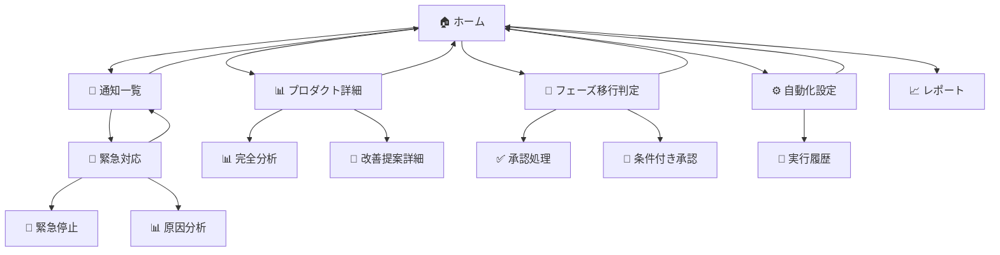
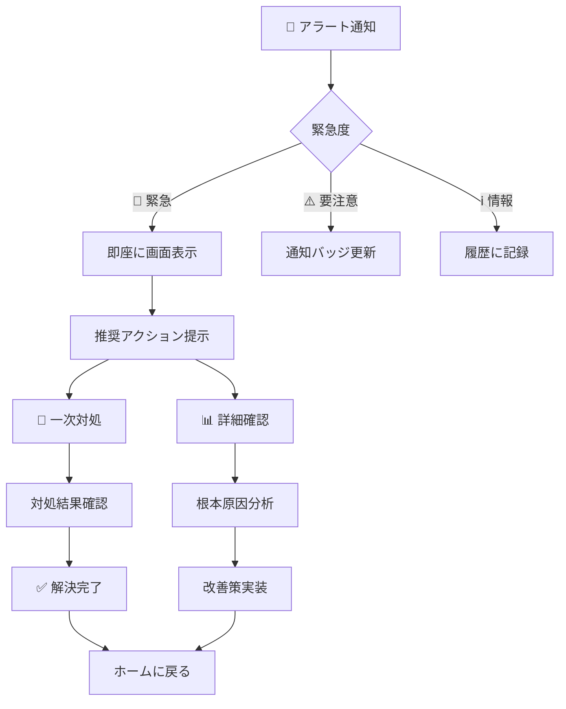

# LP検証システムMVP UI遷移図

## システム概要

### 対象ユーザー
- **プライマリ**: プロダクトマネージャー（意思決定者）
- **セカンダリ**: マーケティング担当者（運用監視者）

### 利用シーン
1. **朝の状況確認**（8:00-9:00）: 夜間処理結果の確認
2. **緊急対応**（随時）: アラート対応・異常値処理
3. **週次判定**（月曜10:00）: フェーズ移行判定

### デザイン原則（UXデザインの法則準拠）
- **ヤコブの法則**: 既存UIパターンの踏襲
- **ヒックの法則**: 選択肢の最小化（主要アクション1-2個）
- **フィッツの法則**: 親指リーチ内CTA配置
- **ドハティの閾値**: 0.4秒以内の体感応答
- **段階的開示**: 詳細情報の段階的展開

## メイン画面構成

### 🏠 ホーム画面（ダッシュボード）
```
┌─────────────────────────────────────────────┐
│ 📱 LP検証センター                    🔔[3] │
├─────────────────────────────────────────────┤
│ 🎯 今日の状況                               │
│ ┌─────────────────────────────────────────┐ │
│ │ ✅ 正常: 4製品  ⚠️ 要注意: 2製品      │ │
│ │ 🎲 自動調整: 15件実行済み             │ │
│ └─────────────────────────────────────────┘ │
│                                             │
│ 📊 プロダクト別状況                         │
│ ┌──AI Bridge────┬──AI Coach──────────────┐ │
│ │CVR: 8.2% 📈   │CVR: 12.1% ✅          │ │
│ │CPA: ¥280      │CPA: ¥250              │ │
│ │[詳細]         │[🚀 移行判定]           │ │
│ └───────────────┴─────────────────────────┘ │
│ ┌──AI Stylist───┬──MyWa──────────────────┐ │
│ │CVR: 5.4% ⚠️   │本番運用中              │ │
│ │CPA: ¥420      │ARR: ¥50万             │ │
│ │[🔧 改善案]     │[📈 レポート]           │ │
│ └───────────────┴─────────────────────────┘ │
│                                             │
│ 🤖 AI推奨アクション                         │
│ ┌─────────────────────────────────────────┐ │
│ │AI Coach: MVP開発移行を推奨               │ │
│ │理由: CVR 12.1%達成、統計的有意性確保    │ │
│ │[✅ 承認] [📊 詳細確認] [⏸ 保留]      │ │
│ └─────────────────────────────────────────┘ │
├─────────────────────────────────────────────┤
│[🏠ホーム][📊詳細][⚙️設定][📈レポート]     │
└─────────────────────────────────────────────┘
```

### 🔔 通知・アラート画面
```
┌─────────────────────────────────────────────┐
│ ← 通知・アラート                      [全読] │
├─────────────────────────────────────────────┤
│ 🚨 緊急                                     │
│ ┌─────────────────────────────────────────┐ │
│ │AI Stylist CPA超過 (¥420 > ¥300)        │ │
│ │5分前 • 広告費増加中                     │ │
│ │                                        │ │
│ │推奨対応:                                │ │
│ │[🛑 広告一時停止] ← 主要アクション       │ │
│ │[📊 原因を確認]   [⚙️ 手動調整]      │ │
│ └─────────────────────────────────────────┘ │
│                                             │
│ ⚠️ 要注意                                   │
│ ┌─────────────────────────────────────────┐ │
│ │AI Bridge CVR改善必要 (8.2% < 10%)       │ │
│ │30分前 • セッション数: 1,247             │ │
│ │[📝 改善提案を確認]                      │ │
│ └─────────────────────────────────────────┘ │
│                                             │
│ ✅ 完了                                     │
│ ┌─────────────────────────────────────────┐ │
│ │Google Ads最適化完了                     │ │
│ │2時間前 • 15件のキーワード調整実行       │ │
│ │[📊 結果を確認]                          │ │
│ └─────────────────────────────────────────┘ │
└─────────────────────────────────────────────┘
```

## 詳細遷移フロー

### 📊 プロダクト詳細画面（AI Bridge例）
```
┌─────────────────────────────────────────────┐
│ ← AI世代間ブリッジ                         │
├─────────────────────────────────────────────┤
│ 📈 現在のパフォーマンス                     │
│ ┌─────────────────────────────────────────┐ │
│ │CVR: 8.2% (目標: 10%)                   │ │
│ │[████████░░] 82%達成                    │ │
│ │                                        │ │
│ │CPA: ¥280 (目標: ¥300以内) ✅          │ │
│ │セッション: 1,247 (1,000以上) ✅        │ │
│ │統計的有意性: 未達成 ⏳                  │ │
│ └─────────────────────────────────────────┘ │
│                                             │
│ 📉 課題分析                                 │
│ ┌─────────────────────────────────────────┐ │
│ │主な離脱ポイント:                        │ │
│ │• 価格セクション (45%離脱)               │ │
│ │• フォーム到達率低下 (15% → 期待20%)     │ │
│ │[📊 ヒートマップ] [📝 改善提案]          │ │
│ └─────────────────────────────────────────┘ │
│                                             │
│ 🤖 AI改善提案                               │
│ ┌─────────────────────────────────────────┐ │
│ │1. 価格表示方法変更                      │ │
│ │   月額表示 → 1日あたり表示              │ │
│ │   期待効果: CVR +2-3%                   │ │
│ │   [🚀 自動実装] [👁 プレビュー]         │ │
│ │                                        │ │
│ │2. CTAボタン配置最適化                   │ │
│ │   期待効果: CVR +1-2%                   │ │
│ │   [🚀 A/Bテスト開始]                   │ │
│ └─────────────────────────────────────────┘ │
│                                             │
│ [📊 完全な分析] [⚙️ 手動調整] [🏠 ホーム] │
└─────────────────────────────────────────────┘
```

### 🚀 フェーズ移行判定画面（AI Coach例）
```
┌─────────────────────────────────────────────┐
│ ← AI自分時間コーチ - MVP移行判定            │
├─────────────────────────────────────────────┤
│ 🎯 移行判定結果                             │
│ ┌─────────────────────────────────────────┐ │
│ │✅ フェーズ1 → フェーズ2移行 推奨         │ │
│ │                                        │ │
│ │📊 達成状況:                            │ │
│ │• CVR: 12.1% ✅ (目標: 10%以上)         │ │  
│ │• CPA: ¥250 ✅ (目標: ¥300以内)         │ │
│ │• セッション: 2,134 ✅ (目標: 1,000+)   │ │
│ │• 統計的有意性: 確保 ✅ (p < 0.05)      │ │
│ └─────────────────────────────────────────┘ │
│                                             │
│ 🤖 AI分析・推奨                             │
│ ┌─────────────────────────────────────────┐ │
│ │【移行推奨理由】                          │ │
│ │✓ 全KPI基準を安定的にクリア              │ │
│ │✓ 市場ニーズの確実性を確認               │ │  
│ │✓ 競合優位性も明確                      │ │
│ │                                        │ │
│ │【次フェーズ予測】                        │ │
│ │• MVP開発期間: 4-6週間                  │ │
│ │• 初期ユーザー: 200-300名見込み          │ │
│ │• 技術的リスク: 低                      │ │
│ │                                        │ │
│ │信頼度: 95% ⭐⭐⭐⭐⭐                  │ │
│ └─────────────────────────────────────────┘ │
│                                             │
│ 👨‍💼 最終判断                                │
│ ┌─────────────────────────────────────────┐ │
│ │[✅ 承認・MVP開発開始]  ← 主要アクション   │ │
│ │                                        │ │  
│ │[📊 追加データ確認] [📝 条件付き承認]   │ │
│ │[❌ 却下・継続検証] [💬 チーム相談]     │ │
│ └─────────────────────────────────────────┘ │
└─────────────────────────────────────────────┘
```

### ⚙️ 自動化設定・履歴画面
```
┌─────────────────────────────────────────────┐
│ ← 自動化センター                           │
├─────────────────────────────────────────────┤
│ 🔄 実行状況                                 │
│ ┌─────────────────────────────────────────┐ │
│ │Google Ads最適化   [🟢 ON]  2時間前実行   │ │
│ │LP自動改善        [🟢 ON]  18時間前実行  │ │
│ │Claude実装        [🟡 MANUAL] 待機中     │ │
│ │アラート監視      [🟢 ON]  継続実行中    │ │
│ └─────────────────────────────────────────┘ │
│                                             │
│ 📜 最近の実行履歴                           │
│ ┌─────────────────────────────────────────┐ │
│ │🎯 Google Ads最適化 - 2時間前              │ │
│ │   ┌─AI Bridge: キーワード入札 3件調整─┐  │ │
│ │   │┌─低パフォ「世代間対話支援」停止──┐│  │ │
│ │   ││効果: CPA ¥295→¥280 (¥15改善)   ││  │ │
│ │   │└─────────────────────────────┘│  │ │
│ │   └─────────────────────────────────┘  │ │
│ │   [📊 詳細] [🔄 手動実行]              │ │
│ │                                        │ │
│ │🎨 LP改善提案 - 昨日 22:30                │ │
│ │   AI Stylist: フォーム改善提案生成       │ │
│ │   期待効果: CVR +2.5%                   │ │
│ │   [👁 確認] [🚀 実装]                  │ │
│ └─────────────────────────────────────────┘ │
│                                             │
│ [📊 パフォーマンス] [⚙️ 設定] [🏠 ホーム] │
└─────────────────────────────────────────────┘
```

## 画面遷移マップ

### メイン遷移


### アラート対応フロー


## UI設計仕様（UXデザインの法則準拠）

### 📱 モバイル仕様（フィッツの法則）
```yaml
タップ領域:
  最小サイズ: 44×44px
  推奨サイズ: 48×48px
  マージン: 8px以上

親指リーチゾーン:
  主要CTA: 画面下部1/3に配置
  緊急アクション: 画面中央下
  戻るボタン: 左上（既存慣習）

ナビゲーション:
  タイプ: 下部固定タブバー
  項目数: 4個（ヒックの法則）
  アクティブ状態: 色・アイコン変化
```

### ⚡ パフォーマンス仕様（ドハティの閾値）
```yaml
応答時間目標:
  タップ反応: < 100ms
  画面遷移: < 400ms
  データ更新: < 400ms
  重いグラフ: < 2s（プログレス表示）

ローディング戦略:
  軽いデータ: スケルトンスクリーン
  重いデータ: プログレスバー + 予測時間
  エラー時: 再試行ボタン + 説明

インライン更新:
  KPI数値: リアルタイム更新
  通知バッジ: 即時反映
  ステータス: 色・アイコン変更
```

### 🎯 段階的開示（テスラーの法則）
```yaml
情報階層:
  L1_サマリー: 3-5個の主要指標
  L2_詳細: カテゴリ別展開
  L3_分析: 専門情報・ログ

展開パターン:
  アコーディオン: 詳細情報
  モーダル: 独立した作業
  新画面: 複雑なワークフロー

緊急時UI:
  主要アクション: 1個（太いボタン）
  副次アクション: 2-3個（細いボタン）
  詳細情報: 折りたたみ
```

### 🔄 状態管理・フィードバック
```yaml
状態表示:
  成功: 緑色 + チェックアイコン
  警告: 黄色 + 警告アイコン
  エラー: 赤色 + エラーアイコン
  処理中: グレー + スピナー

進捗表示:
  CVR達成率: プログレスバー
  フェーズ移行: ステップインジケーター
  処理状況: パーセンテージ

通知:
  成功時: 緑トースト 3秒表示
  エラー時: 赤バナー 手動消去
  情報時: バッジ更新のみ
```

## 実装技術仕様

### フロントエンド
```typescript
// コンポーネント設計
interface UIComponent {
  accessibility: 'AA準拠';
  responsive: 'モバイルファースト';
  animation: 'duration < 200ms';
  loading: 'スケルトン対応';
}

// 状態管理
interface AppState {
  notifications: NotificationState[];
  products: ProductState[];
  automation: AutomationState;
  ui: UIState;
}
```

### パフォーマンス最適化
```typescript
// 仮想化・遅延読み込み
const VirtualizedList = lazy(() => import('./VirtualizedList'));
const HeavyChart = lazy(() => import('./HeavyChart'));

// キャッシュ戦略
const cacheConfig = {
  dashboard: { ttl: 30000 }, // 30秒
  products: { ttl: 60000 },  // 1分
  history: { ttl: 300000 },  // 5分
};
```

この UI遷移図により、UXデザインの法則に基づいた直感的で効率的なLP検証システムが実現できます。