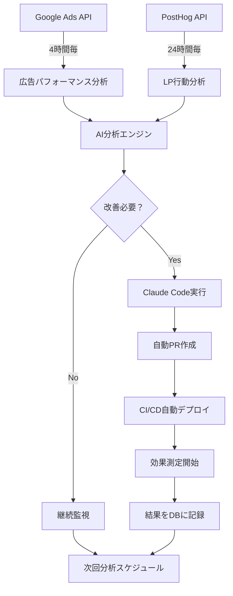

# UnsonOS LP検証システム MVP ストーリーボード

## 📋 概要

LP検証フェーズを完全自動化し、AI駆動による継続的改善サイクルを実現するシステムのMVP版ストーリーボードです。Google Ads × PostHog × Claude Codeの連携により、4時間〜24時間サイクルでの自動分析・改善を行います。

## 🎯 目標とKPI

### 主要目標
- **LP CVR 10%以上の達成**
- **CPA 3,000円以下の維持**
- **改善サイクルの完全自動化**
- **リアルタイムKPI可視化**

### 成功指標
- 自動改善により週次CVR向上率: 5%以上
- 広告予算効率化: CPA 20%改善
- 改善提案→実装→効果測定サイクル: 24時間以内

## 🔄 システムアーキテクチャ

### 自動分析・改善サイクル



## 🛠️ 技術スタック

### バックエンド自動化
- **Google Ads API**: キーワード・広告パフォーマンス取得
- **PostHog API**: ユーザー行動・CVRデータ取得
- **Claude Code API**: 自動コード修正・PR作成
- **Convex**: リアルタイムデータ管理
- **Neon pgvector**: 改善履歴・学習データ蓄積

### フロントエンド
- **Next.js (apps/portal)**: 統合ダッシュボード
- **Real-time Charts**: KPI変化のリアルタイム表示
- **改善履歴UI**: AI改善内容と効果の可視化

## 📱 UI/UX フロー

### メイン ダッシュボード

```
┌─────────────────────────────────────────────────────────────┐
│ 🎯 LP検証ダッシュボード                              ⚡ LIVE │
├─────────────────────────────────────────────────────────────┤
│                                                            │
│ 📊 リアルタイムKPI                                          │
│ ┌─────────────┬─────────────┬─────────────┬─────────────┐   │
│ │ CVR         │ CPA         │ 広告費      │ セッション   │   │
│ │ 12.3% ↗️    │ ¥2,850 ↘️   │ ¥45,000    │ 1,247       │   │
│ │ +2.1% (4h)  │ -¥150 (4h)  │ 今日       │ 今日        │   │
│ └─────────────┴─────────────┴─────────────┴─────────────┘   │
│                                                            │
│ 🔄 自動改善ステータス                                       │
│ ┌──────────────────────────────────────────────────────┐   │
│ │ ⏰ 次回分析: 3時間27分後                              │   │
│ │ 🤖 前回改善: 6時間前 - CTA文言変更 (CVR +1.8%向上)   │   │
│ │ 📈 実行中: なし                                      │   │
│ └──────────────────────────────────────────────────────┘   │
│                                                            │
│ 📈 KPI推移グラフ (24時間)                                  │
│ [CVR/CPA/セッション数の時系列グラフ]                        │
│                                                            │
│ 🎨 改善履歴                                                │
│ ┌──────────────────────────────────────────────────────┐   │
│ │ 2025-08-20 14:30 - ヘッダーCTA文言変更              │   │
│ │ 効果: CVR 10.1% → 12.3% (+2.2pt)                    │   │
│ │                                                      │   │
│ │ 2025-08-20 06:15 - 価格表示位置変更                 │   │
│ │ 効果: CPA ¥3,200 → ¥2,850 (-¥350)                   │   │
│ │                                                      │   │
│ │ 2025-08-19 18:45 - キーワード追加 (5件)             │   │
│ │ 効果: セッション数 +15% 向上                         │   │
│ └──────────────────────────────────────────────────────┘   │
└─────────────────────────────────────────────────────────────┘
```

### プロダクト別詳細ビュー

```
┌─────────────────────────────────────────────────────────────┐
│ 📱 AI自分時間コーチ - LP検証詳細                            │
├─────────────────────────────────────────────────────────────┤
│                                                            │
│ 💰 予算管理                                                │
│ ┌──────────────────────────────────────────────────────┐   │
│ │ 総予算: ¥100,000 | 消化: ¥45,000 (45%) | 残り: 15日  │   │
│ │ 日次ペース: ¥3,000 | 推奨ペース: ¥3,333               │   │
│ │ ⚠️ 予算ペース遅れ - キーワード拡張を推奨              │   │
│ └──────────────────────────────────────────────────────┘   │
│                                                            │
│ 🎯 キーワードパフォーマンス                                │
│ ┌─────────────────┬─────────┬─────────┬─────────┬───────┐ │
│ │ キーワード       │ CTR     │ CPC     │ CVR     │ CPA   │ │
│ ├─────────────────┼─────────┼─────────┼─────────┼───────┤ │
│ │ 自分時間 作り方  │ 3.2% ↗️ │ ¥85     │ 11.5%   │ ¥850  │ │
│ │ ワーママ 時短    │ 2.8%    │ ¥92     │ 9.1%    │ ¥1,010│ │
│ │ 育児 スケジュール│ 4.1% ↗️ │ ¥76 ↘️  │ 13.2% ↗️│ ¥576  │ │
│ └─────────────────┴─────────┴─────────┴─────────┴───────┘ │
│                                                            │
│ 🔄 AI改善提案 (次回実行予定: 2時間15分後)                   │
│ ┌──────────────────────────────────────────────────────┐   │
│ │ 1. 🎯 除外キーワード追加推奨                          │   │
│ │    "無料" "格安" → CVR低下要因 (confidence: 85%)     │   │
│ │                                                      │   │
│ │ 2. 📝 LP文言変更推奨                                 │   │
│ │    ヘッダー "忙しいママ向け" → "3分で自分時間確保"   │   │
│ │    予想効果: CVR +1.5pt向上                          │   │
│ │                                                      │   │
│ │ 3. 💰 入札調整推奨                                   │   │
│ │    "育児 スケジュール" +20% (高CVRキーワード)        │   │
│ └──────────────────────────────────────────────────────┘   │
└─────────────────────────────────────────────────────────────┘
```

## ⚙️ 自動化ワークフロー

### 1. Google Ads 分析（4時間毎）

#### データ取得
```typescript
interface AdPerformanceData {
  campaignId: string
  adGroupId: string
  keyword: string
  impressions: number
  clicks: number
  cost: number
  ctr: number
  cpc: number
  conversions: number
  conversionRate: number
  cpa: number
  timestamp: Date
}
```

#### 分析 & 改善トリガー
```typescript
// 自動改善判定ロジック
const improvements = await analyzeAdPerformance({
  // CPA悪化検知
  if (currentCPA > targetCPA * 1.2) {
    return [
      { type: 'keyword_pause', keywords: lowPerformingKeywords },
      { type: 'bid_adjustment', adjustment: -0.15 }
    ]
  }
  
  // 予算消化遅れ検知  
  if (budgetPace < 0.8) {
    return [
      { type: 'keyword_expansion', suggestions: relatedKeywords },
      { type: 'bid_increase', topPerformers: highCVRKeywords }
    ]
  }
})
```

### 2. LP行動分析（24時間毎）

#### PostHog データ取得
```typescript
interface LPAnalyticsData {
  pageViews: number
  uniqueVisitors: number
  bounceRate: number
  timeOnPage: number
  conversionEvents: ConversionEvent[]
  heatmapData: HeatmapData
  userJourney: UserJourneyData[]
}
```

#### AI改善提案生成
```typescript
// Claude Code でLP改善提案
const improvements = await generateLPImprovements({
  analytics: lpData,
  currentContent: await readLPContent(),
  targetMetrics: { cvr: 0.10, bounceRate: 0.50 }
})

// 例: 改善提案内容
interface LPImprovement {
  type: 'copy_change' | 'layout_change' | 'cta_optimization'
  element: string
  currentValue: string
  proposedValue: string
  expectedImpact: number
  confidence: number
}
```

### 3. 自動コード修正 & デプロイ

#### Claude Code実行フロー
```bash
# 1. 改善提案をもとにClaude Codeでファイル修正
claude-code --repo unson_os --file "products/validation/2025-08-003-ai-coach/lp/src/components/HeroSection.tsx" --task "CTAボタン文言を'今すぐ始める'から'3分で自分時間を確保'に変更"

# 2. 自動PR作成
git checkout -b "auto-improvement/cta-copy-$(date +%Y%m%d-%H%M)"
git add . && git commit -m "🤖 AI改善: CTAボタン文言最適化

予想効果: CVR +1.5pt向上
根拠: PostHog行動分析による時間価値訴求の有効性確認"

# 3. 自動マージ & デプロイ
gh pr create --title "🤖 AI改善: CTAボタン文言最適化" --auto-merge
# Vercel自動デプロイ実行
```

## 📊 効果測定 & フィードバックループ

### 改善効果の自動測定
```typescript
interface ImprovementResult {
  improvementId: string
  deployedAt: Date
  beforeMetrics: {
    cvr: number
    cpa: number
    sessions: number
  }
  afterMetrics: {
    cvr: number
    cpa: number  
    sessions: number
  }
  impact: {
    cvrChange: number
    cpaChange: number
    sessionsChange: number
  }
  statisticalSignificance: number
  status: 'measuring' | 'positive' | 'negative' | 'neutral'
}
```

### 学習データ蓄積
```sql
-- Neon pgvectorでの改善パターン学習
INSERT INTO improvement_patterns (
  product_category,
  improvement_type,
  context_embedding, -- pgvector
  success_rate,
  avg_impact
) VALUES (
  'coaching',
  'cta_optimization', 
  $1, -- 改善コンテキストのembedding
  0.78, -- 成功率
  0.025 -- 平均CVR向上率
);
```

## 🎉 期待される成果

### 短期（1週間）
- **自動分析サイクル確立**: 4時間/24時間周期での分析実行
- **初回改善実装**: AI提案による自動LP修正
- **KPI向上**: CVR 2-3pt向上

### 中期（1ヶ月）  
- **改善パターン学習**: 10-15回の改善実施とデータ蓄積
- **予算効率化**: CPA 20%改善達成
- **プロセス最適化**: 改善→効果測定サイクル短縮

### 長期（3ヶ月）
- **完全自動化**: 人手介入なしでの継続的改善
- **横展開**: 他プロダクトへの改善パターン適用
- **ROI最大化**: 投資対効果の最適化達成

---

このMVPストーリーボードにより、LP検証フェーズの完全自動化と継続的改善サイクルを実現し、UnsonOSの各プロダクトのマーケティング効率を飛躍的に向上させます。