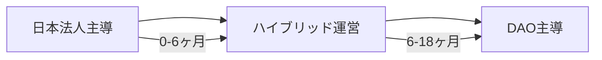

# Unson OS DAO実装ガイド

## 概要

本ガイドは、Unson OS DAOの技術的実装と運用手順を詳細に記載したものです。法的フレームワークに基づき、実際にDAOを構築・運用するための具体的なステップを提供します。

## 1. スマートコントラクト配当モデル

### 推奨アーキテクチャ：ハイブリッドモデル

**特徴：**
- オフチェーン貢献度計算
- オンチェーン配当実行
- 段階的な自動化移行

### 実装フェーズ

#### Phase 1：手動運用（初期）
```
1. エクセルで貢献度集計
2. 配当額計算
3. Safeマルチシグで送金
4. トランザクション公開
```

#### Phase 2：半自動化（3-6ヶ月）
```solidity
// 配当プールコントラクト概要
contract DividendPool {
    mapping(address => uint256) public allocations;
    
    function updateAllocations(address[] memory members, uint256[] memory amounts) onlyOwner {
        // オフチェーン計算結果を反映
    }
    
    function claim() public {
        // ユーザーが自分の配当を請求
    }
}
```

#### Phase 3：完全自動化（6ヶ月以降）
- Superfluidによるストリーミング配信
- 貢献度のオンチェーン化（SBT等）
- DAO投票による配当承認

## 2. PROFITトークン実装設計

### 基本仕様

```solidity
// PROFITトークン仕様
- 動的発行（月次）
- 1:1 USDC交換可能
- 譲渡制限付き
- 自動バーン機能
```

### 配当計算式

```
個人配当額 = Fund残高 × (トークン保有割合 × 活動係数)

活動係数 = 貢献度スコア / 全体貢献度スコア合計
```

### セキュリティ考慮事項

1. **監査必須項目**
   - Reentrancy攻撃対策
   - オーバーフロー/アンダーフロー対策
   - アクセス制御の適切性

2. **緊急時対応**
   - Pausable機能の実装
   - アップグレード可能性の検討
   - タイムロック機構

## 3. ガバナンスプロセス

### Snapshot設定

```yaml
# snapshot設定例
space: unson-os-dao
strategies:
  - name: erc20-balance-of
    params:
      address: "0x..." # UNSONトークンアドレス
      decimals: 18
voting:
  delay: 86400 # 1日
  period: 604800 # 7日
  type: single-choice
  quorum: 0.2 # 20%投票率
```

### 提案カテゴリー

| カテゴリー | 必要賛成率 | 実行権限 |
|----------|-----------|---------|
| 通常提案 | 50%以上 | コアチーム実行 |
| 重要変更 | 66%以上 | マルチシグ承認必須 |
| 緊急対応 | - | コアチーム即時実行（事後承認） |

## 4. 技術スタック

### 推奨構成

```
フロントエンド:
- Next.js + TypeScript
- ethers.js / wagmi
- RainbowKit (ウォレット接続)

バックエンド:
- Convex (オフチェーンデータ)
- IPFS (ドキュメント保存)
- The Graph (チェーンデータインデックス)

スマートコントラクト:
- Solidity 0.8.x
- OpenZeppelin Contracts
- Hardhat (開発環境)
```

## 5. 先行事例からの実装ヒント

### CityDAO方式
- Wyoming DAO LLCの定款をNFTに埋め込み
- 現実資産とオンチェーンの紐付け

### YGG方式
- ステーキングによる報酬分配
- 複数トークンの役割分離

### MolochDAO方式
- RageQuit機能（脱退権）
- シンプルなガバナンス構造

## 6. 配当実行の具体的手順

### 月次配当フロー

1. **収益集計**（毎月1日）
   ```
   - 日本法人から売上データ取得
   - 40%相当額をUSDCに換算
   ```

2. **貢献度計算**（毎月5日）
   ```
   - GitHub活動
   - Discord参加
   - 提案/投票参加
   - その他貢献
   ```

3. **配当承認**（毎月10日）
   ```
   - 配当案をSnapshot提出
   - 7日間の投票期間
   ```

4. **配当実行**（毎月20日）
   ```
   - 承認された配当をスマートコントラクトに送信
   - PROFITトークン発行またはUSDC直接送付
   ```

## 7. 監視とレポーティング

### ダッシュボード要件

```typescript
interface DAOMetrics {
  totalRevenue: number;
  distributedAmount: number;
  activeMembers: number;
  pendingProposals: number;
  treasuryBalance: {
    USDC: number;
    UNSON: number;
  };
}
```

### 透明性レポート（月次）

1. 収益・配当実績
2. メンバー活動統計
3. ガバナンス投票結果
4. 技術的インシデント

## 8. リスク管理実装

### スマートコントラクトリスク

```solidity
// 多段階セキュリティ実装例
contract SecureDAO {
    uint256 constant TIMELOCK = 2 days;
    mapping(bytes32 => uint256) public proposalTimelocks;
    
    modifier timelocked(bytes32 proposalId) {
        require(
            block.timestamp >= proposalTimelocks[proposalId],
            "Timelock not expired"
        );
        _;
    }
}
```

### オペレーショナルリスク

1. **マルチシグ設定**
   - 5人中3人の承認必要
   - 定期的な署名者レビュー

2. **バックアップ計画**
   - コントラクト移行手順
   - 緊急連絡体制

## 9. コンプライアンス実装

### KYC/AML対応

```typescript
// メンバー管理システム
interface Member {
  address: string;
  kycStatus: 'pending' | 'verified' | 'rejected';
  contributionScore: number;
  lastActivity: Date;
  jurisdiction: string;
}
```

### 規制対応チェックリスト

- [ ] 米国人除外メカニズム
- [ ] 日本人向け税務ガイド提供
- [ ] 配当上限設定（規制回避）
- [ ] 活動証跡の保存

## 10. 移行計画

### 中央集権→分散化ロードマップ



### 段階的権限移譲

1. **初期**：コアチームがマルチシグ管理
2. **中期**：DAO投票で重要決定
3. **後期**：完全なDAO自治

## 11. 永続ロイヤリティシステム

### 概要

「貢献=作品が働き続ける限り報われる永続ロイヤリティ」として、コードが実際に使用され続ける限り報酬を受け取れるシステムを実装します。

### コア設計

#### 11.1 PR単位での貢献NFT（SBT）発行

```solidity
// 貢献SBT仕様
struct ContributionSBT {
    string repo;
    string commitRange;
    string moduleId;
    uint256 mergedAt;
    address[] reviewers;
    uint8 riskLevel;
    bool isActive;
}
```

**特徴：**
- PRマージ時に自動ミント
- 譲渡不可（SBT）で投機性を排除
- 権利の証憑として機能

#### 11.2 使用連動ロイヤリティ計算

**月次配分プールの決定：**
```
pool_m(t) = Pool_total(t) × [ w_m × usage_m(t) ] / Σ_k [ w_k × usage_k(t) ]
```

- `usage_m(t)`: その月の実運転メトリクス（リクエスト数、収益寄与額等）
- `w_m`: モジュール重要度係数（セキュリティ層は高め）

**PR単位の持分計算：**
```
own_{c,m}(t) = [ active_lines_{c,m}(t) × complexity_{c,m} × runtime_touch_{c,m}(t) ]
               / Σ_c' [ …同分子… ]
```

- `active_lines`: 現時点で生き残っているコード行数
- `complexity`: サイクロマチック複雑度等で補正
- `runtime_touch`: 実行時の呼び出し頻度

### 実装フェーズ

#### Phase 1: オフチェーン運用（0-3ヶ月）

```typescript
// 月次計算スクリプトの概要
async function calculateMonthlyRoyalties() {
  // 1. git blame で生存行マトリクスを作成
  const blameData = await runGitBlame('-w -M -C');
  
  // 2. OpenTelemetryからusageデータ取得
  const usageMetrics = await getUsageMetrics();
  
  // 3. 各PRの payout を算出
  const payouts = calculatePayouts(blameData, usageMetrics);
  
  // 4. Merkle配布リストを作成
  const merkleTree = generateMerkleTree(payouts);
  
  return merkleTree;
}
```

#### Phase 2: オンチェーン透明化（3-6ヶ月）

```solidity
// ロイヤリティ配布コントラクト
contract RoyaltyVault {
    mapping(bytes32 => uint256) public merkleRoots;
    mapping(address => mapping(uint256 => bool)) public claimed;
    
    function registerMerkleRoot(
        uint256 month,
        bytes32 merkleRoot
    ) external onlyOwner {
        merkleRoots[month] = merkleRoot;
    }
    
    function claim(
        uint256 month,
        uint256 amount,
        bytes32[] calldata merkleProof
    ) external {
        // Merkle proof検証とクレーム処理
    }
}
```

#### Phase 3: 精度向上（6-12ヶ月）

1. **詳細なランタイムトレース**
   - OpenTelemetryで関数/ルート単位のタグ付け
   - 実際の収益貢献度をより正確に測定

2. **複雑度の自動評価**
   - lizard等でコードメトリクス自動採点
   - セキュリティクリティカルなコードに加点

3. **モジュールマッピング**
   - CODEOWNERSファイルで収益帰属を明示化

### 数値例

月次売上 ¥10,000,000の場合：
- コミュニティプール（40%）= ¥4,000,000
- コアモジュールAの利用寄与（60%）= ¥2,400,000
- 初期コアPRの現存・実行比重（30%）= ¥720,000

成長後（売上2倍）：
- プール = ¥8,000,000
- モジュールA（60%）= ¥4,800,000
- 同PRの比重（20%に低下）= ¥960,000
→ **比率は下がっても金額は上がる**

### ガバナンスルール

1. **譲渡不可性**
   - 貢献SBTは売買不可（投資商品化を防止）

2. **除外条件**
   - 重大脆弱性・不正が判明したPRはロイヤリティ停止

3. **上限設定**
   - 個人の月次受取にプール比10%等の相対上限

4. **非コード貢献**
   - マーケティング等は効果測定可能な分のみ
   - 寿命付きSBT（3-6ヶ月）として発行

### 法務整理

- **性質**：著作権等の使用料（ロイヤリティ）
- **条件**：使用され続ける限りの限定的権利
- **譲渡性**：SBTで第三者売買不可
- **税務**：受取人は雑所得/事業所得として申告

## まとめ

本実装ガイドに従うことで、法的に健全かつ技術的に堅牢なDAOシステムを構築できます。永続ロイヤリティシステムにより、長期的な貢献が適切に報われる仕組みを実現し、優秀な開発者の継続的な参加を促進します。重要なのは段階的なアプローチを取り、各フェーズでの学習を次に活かすことです。透明性を保ちながら、着実に分散化を進めていきましょう。