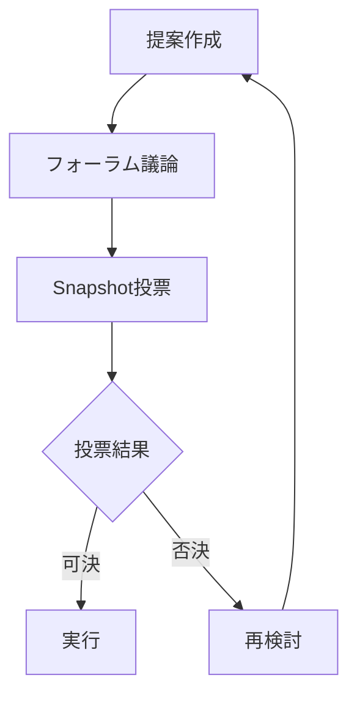

# 雲孫DAO構造とガバナンス

## 概要

雲孫DAOは、分散型自律組織として、コミュニティメンバーが公平に価値創造に参加し、その成果を共有できる仕組みを提供します。透明性、公平性、持続可能性を重視した設計になっています。

## 収益分配構造

### 基本配分

```
売上 100%
 ├─ 45% 運営・再投資（OPEX/広告/インフラ）
 ├─ 15% Founding Member Bonus（創業期長期報酬）
 └─ 40% Community Dividend Fund（DAO配当）
```

### 詳細説明

#### 運営・再投資（45%）
- インフラコスト
- 開発ツール・サービス
- 広告費用
- 緊急対応資金

#### Founding Member Bonus（15%）
- 創業メンバーへの長期インセンティブ
- 12ヶ月のベスティング期間
- 初期リスクへの報酬

#### Community Dividend Fund（40%）
- すべての貢献者への配当原資
- 四半期ごとの分配
- 活動量に応じた公平な配分

## トークンエコノミクス

### UNSONトークン

| 項目 | 内容 |
|-----|------|
| 発行総量 | 1億枚（追加発行なし） |
| ブロックチェーン | Base（Ethereum L2） |
| 規格 | ERC-20 |
| 初期価格 | 1 UNSON = 0.01 USD |

### 初期配分

```
総発行量 100,000,000 UNSON
 ├─ 25% 創業チーム（2年ベスティング）
 ├─ 40% コミュニティトレジャリー
 ├─ 20% エコシステム開発
 ├─ 10% 流動性提供
 └─  5% 予備
```

### トークンの権利

1. **配当請求権**
   - 四半期ごとの収益分配
   - 保有量×活動係数で計算

2. **ガバナンス投票権**
   - 重要な意思決定への参加
   - 1トークン = 1票

3. **RageQuit権**
   - いつでもトークンを焼却してUSDCを受領
   - 保有比率に応じた金額

## 貢献度評価システム

### 活動係数の計算

| 活動種別 | ポイント | 説明 |
|---------|---------|------|
| コードコミット | +3 | 承認されたPull Request |
| Issue解決 | +2 | クローズされたIssue |
| メディア確認 | +1 | デザイン・動画の品質確認 |
| Q&A回答 | +1 | Slackでの有用な回答 |
| 提案採用 | +2 | 会議での提案が実装された |

### 配当計算式

```
個人配当額 = Fund残高 × (UNSON保有比率 × 活動係数)

活動係数 = Σ(各活動ポイント) / 全体の活動ポイント合計
```

## ガバナンス構造

### 意思決定プロセス



### 投票ルール

| 項目 | 基準 |
|-----|------|
| 最小参加率 | 20% |
| 可決基準 | 賛成66%以上 |
| 投票期間 | 7日間 |
| 実行猶予 | 48時間 |

### 提案カテゴリー

1. **通常提案**
   - 新機能の追加
   - プロセスの改善
   - パートナーシップ

2. **重要提案**
   - トークノミクスの変更
   - 大規模投資（>100万円）
   - 基本方針の変更

3. **緊急提案**
   - セキュリティ対応
   - 重大バグ修正
   - 規制対応

## スマートコントラクト

### コア機能

```solidity
// 概念的な実装
contract UnsonDAO {
    // 配当分配
    function distributeDividends() external {
        uint256 totalFund = address(this).balance;
        for (address holder : tokenHolders) {
            uint256 share = calculateShare(holder);
            payable(holder).transfer(share);
        }
    }
    
    // RageQuit
    function rageQuit(uint256 amount) external {
        require(balanceOf(msg.sender) >= amount);
        uint256 usdcAmount = calculateQuitAmount(amount);
        burnTokens(msg.sender, amount);
        transferUSDC(msg.sender, usdcAmount);
    }
}
```

### セキュリティ対策

1. **マルチシグ管理**
   - 3/5署名による重要操作
   - タイムロック機能

2. **監査**
   - 年1回の外部監査
   - バグバウンティプログラム

3. **緊急停止**
   - Pause機能の実装
   - 24時間以内の対応体制

## 創業メンバーの定義

### 資格要件

1. **時点条件**
   - 初課金ゲート突破**前日**まで
   - 業務委託契約締結済み
   - 初コミットまたは初貢献済み

2. **実績条件**（30日以内）
   - エンジニア: 100行以上のコード
   - デザイナー: 5枚以上のLP/画面
   - マーケター: 10セット以上の広告

### ベスティングスケジュール

| メンバー | 割当 | ベスティング | 支払頻度 |
|---------|------|-------------|---------|
| 代表 | 40% | 即時100% | 月次 |
| キュレーター | 20% | 12ヶ月均等 | 四半期 |
| クラフツマン | 20% | 12ヶ月均等 | 四半期 |
| 開発リーダー | 20% | 12ヶ月均等 | 四半期 |

## 法的構造

### 組織体制

```
雲孫合同会社（日本）
    ↓
Wyoming DAO LLC（米国）
    ↓
各国の規制に応じた子会社
```

### コンプライアンス

1. **ライセンス**
   - コア: AGPL v3
   - 拡張: BUSL 1.1
   - SDK: MIT/Apache 2.0

2. **知的財産**
   - CLA（貢献者ライセンス契約）必須
   - 商標の適切な管理

3. **税務**
   - 各国の税法に準拠
   - 透明な会計報告

## 実装ロードマップ

### Phase 1（0-30日）
- Safe（マルチシグウォレット）作成
- UNSONトークン発行
- 基本的なガバナンス構造

### Phase 2（30-60日）
- Stripe連携による自動分配
- Snapshot投票システム導入
- 初回テスト配当

### Phase 3（60-90日）
- 本番配当開始
- RageQuit機能実装
- コミュニティ拡大

### Phase 4（90日以降）
- 外部監査実施
- エコシステム拡張
- 国際展開

## KPIと目標

| 指標 | 3ヶ月 | 6ヶ月 | 12ヶ月 |
|-----|-------|-------|--------|
| トークンホルダー数 | 100+ | 500+ | 1,000+ |
| 投票参加率 | 30%+ | 40%+ | 50%+ |
| 配当総額 | 100万円 | 500万円 | 2,000万円 |
| RageQuit率 | <10% | <7% | <5% |

## リスク管理

### 技術的リスク
- スマートコントラクトの脆弱性
- → 外部監査とバグバウンティ

### 規制リスク
- 証券法違反の可能性
- → 法務アドバイザーとの連携

### 経済的リスク
- トークン価値の変動
- → 安定的な収益基盤の構築

## まとめ

雲孫DAOは、AIと人間が協働する新しい組織形態です。透明性の高いガバナンス、公平な価値分配、持続可能な成長を実現し、参加者全員が組織の成功から恩恵を受けられる仕組みを提供します。これにより、従来の企業では実現できなかった、真に分散型の価値創造エコシステムを構築します。