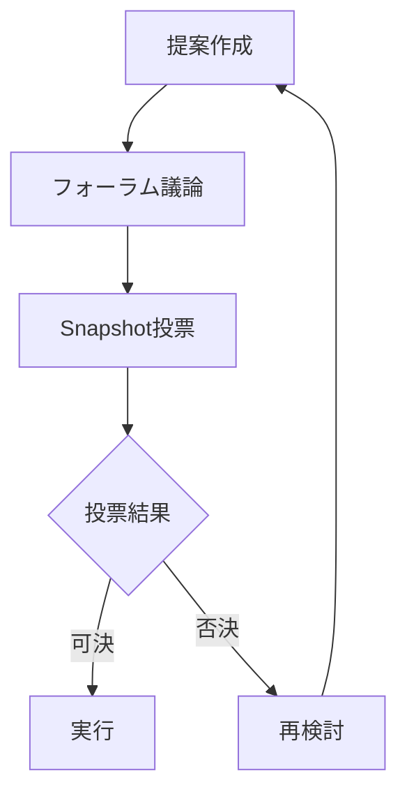

# 雲孫DAO構造とガバナンス

## 概要

雲孫DAOは、分散型自律組織として、コミュニティメンバーが公平に価値創造に参加し、その成果を共有できる仕組みを提供します。透明性、公平性、持続可能性を重視した設計になっています。

## 収益分配構造

### 基本配分（更新版）

```
売上 100%
 ├─ 45% 運営・再投資（Jibble実績×¥1,000/h先払い+OPEX）
 ├─ 15% Founding Member Bonus（Safe"founder-bonus"にプール）
 └─ 40% Community Dividend Fund（DAO Treasury）
```

**自動分流システム**: Stripe Webhookで三つのSafeへUSDC自動振替

### 詳細説明

#### 運営・再投資（45%）
- 開発・広告・インフラなど日常OPEX
- 時給1,000円×Jibble実績の先払い
- 再投資プール（新プロダクト開発）
- 緊急対応資金

#### Founding Member Bonus（15%）
- 創業締切日までに実績条件を満たしたメンバーへの長期報酬
- 12ヶ月線形ベスティング（代表除く）
- 離脱で未ベスト分はDAO Fundへ戻る

**具体的な配分**:
| メンバー | 割当 | ベスティング | 受取頻度 |
|---------|------|-------------|---------|
| 代表 | 40% | 即時100% | 月次 |
| キュレーター | 20% | 12ヶ月線形 | 四半期 |
| クラフツマン | 20% | 12ヶ月線形 | 四半期 |
| 開発リーダー | 20% | 12ヶ月線形 | 四半期 |

#### Community Dividend Fund（40%）
- UNFトークン保有者（社内外全コントリビューター）へ四半期ごとに自動配当
- Superfluidを使用したUSDCストリーム送金
- 活動係数による公平な配分

## トークンエコノミクス

### UNSONトークン

| 項目 | 内容 |
|-----|------|
| 発行総量 | 1億枚（追加発行なし） |
| ブロックチェーン | Base（Ethereum L2） |
| 規格 | ERC-20 |
| 初期価格 | 1 UNSON = 0.01 USD |

### 初期配分

```
総発行量 100,000,000 UNSON
 ├─ 25% 創業チーム（2年ベスティング）
 ├─ 40% コミュニティトレジャリー
 ├─ 20% エコシステム開発
 ├─ 10% 流動性提供
 └─  5% 予備
```

### トークンの権利

1. **配当請求権**
   - 四半期ごとの収益分配
   - 保有量×活動係数で計算

2. **ガバナンス投票権**
   - 重要な意思決定への参加
   - 1トークン = 1票

3. **RageQuit権**
   - いつでもトークンを焼却してUSDCを受領
   - 保有比率に応じた金額

## 貢献度評価システム

### 永続ロイヤリティ制度

**基本理念：**「貢献した作品が働き続ける限り報われる」

1. **PRベースの貢献トラッキング**
   - PRマージ時に譲渡不可NFT（SBT）を自動発行
   - コードの生存・使用状況をgit blameとランタイムトレースで追跡
   - 削除・置換されたコードは自動的に配当対象外に

2. **使用連動型の配当計算**
   - 実際の利用メトリクス（API呼び出し、収益貢献等）に基づく
   - コードが残り、使われる限り永続的に報酬発生
   - 新規貢献により相対比率は自然に希釈

3. **段階的実装**
   - Phase 1: オフチェーン計算（git blame + usage集計）
   - Phase 2: SBT発行とオンチェーン配布
   - Phase 3: 精密なランタイムトレース導入

詳細は[実装ガイド](./dao-implementation-guide.md#11-永続ロイヤリティシステム)を参照。

### 基本活動評価

| 活動種別 | ポイント | 説明 |
|---------|---------|------|
| コードコミット | +3 | 承認されたPull Request |
| Issue解決 | +2 | クローズされたIssue |
| メディア確認 | +1 | デザイン・動画の品質確認 |
| Q&A回答 | +1 | Slackでの有用な回答 |
| 提案採用 | +2 | 会議での提案が実装された |

### 配当計算式

**基本配当（活動ベース）：**
```
個人配当額 = Fund残高 × (UNSON保有比率 × 活動係数)
活動係数 = Σ(各活動ポイント) / 全体の活動ポイント合計
```

**永続ロイヤリティ（コード貢献）：**
```
PR配当額 = モジュール配当 × (生存行数 × 複雑度 × 実行頻度) / 総計
```

## ガバナンス構造

### 意思決定プロセス



### 投票ルール

| 項目 | 基準 |
|-----|------|
| 最小参加率 | 20% |
| 可決基準 | 賛成66%以上 |
| 投票期間 | 7日間 |
| 実行猶予 | 48時間 |

### 提案カテゴリー

1. **通常提案**
   - 新機能の追加
   - プロセスの改善
   - パートナーシップ

2. **重要提案**
   - トークノミクスの変更
   - 大規模投資（>100万円）
   - 基本方針の変更

3. **緊急提案**
   - セキュリティ対応
   - 重大バグ修正
   - 規制対応

## スマートコントラクト

### コア機能

```solidity
// 概念的な実装
contract UnsonDAO {
    // 配当分配
    function distributeDividends() external {
        uint256 totalFund = address(this).balance;
        for (address holder : tokenHolders) {
            uint256 share = calculateShare(holder);
            payable(holder).transfer(share);
        }
    }
    
    // RageQuit
    function rageQuit(uint256 amount) external {
        require(balanceOf(msg.sender) >= amount);
        uint256 usdcAmount = calculateQuitAmount(amount);
        burnTokens(msg.sender, amount);
        transferUSDC(msg.sender, usdcAmount);
    }
}
```

### セキュリティ対策

1. **マルチシグ管理**
   - 3/5署名による重要操作
   - タイムロック機能

2. **監査**
   - 年1回の外部監査
   - バグバウンティプログラム

3. **緊急停止**
   - Pause機能の実装
   - 24時間以内の対応体制

## 創業メンバーの定義

### 資格要件

1. **時点条件**
   - **初課金ゲート突破前日**までに参加
   - 業務委託契約締結済み
   - 初コミットまたは初貢献済み

2. **実績条件**（30日以内）
   - エンジニア: 100行以上のコード
   - デザイナー: 5枚以上のLP/画面
   - マーケター: 10セット以上の広告

**重要**: 初課金ゲート突破後の参加者は、貢献度に応じたコミュニティ配当（40%）の対象となるが、創業メンバーボーナス（15%）の対象外

### ベスティングスケジュール（更新版）

| メンバー | 割当 | ベスティング | 支払頻度 |
|---------|------|-------------|---------|
| 代表 | 40% | 即時100% | 月次 |
| キュレーター | 20% | 12ヶ月線形 | 四半期 |
| クラフツマン | 20% | 12ヶ月線形 | 四半期 |
| 開発リーダー | 20% | 12ヶ月線形 | 四半期 |

**備考**: 総計15%。離脱で未ベスト分はDAO Fundへ戻る

## 法的構造

### 組織体制

```
合同会社雲孫（日本）
├─ 事業運営・サービス提供
└─ IPライセンス契約（40%ロイヤルティ）
    ↓
マーシャル諸島DAO LLC（営利型）
├─ トークン発行・管理
├─ コミュニティガバナンス
└─ 収益分配（3% GRT税）
```

### 法的フレームワーク

詳細は[DAO法的フレームワーク](./dao-legal-framework.md)を参照。

**主要ポイント：**
- マーシャル諸島の営利型DAO LLCとして設立
- 日本法人とはIPライセンス契約で連携
- トークンは「報酬」として位置づけ、証券性リスクを軽減

### コンプライアンス

1. **ライセンス**
   - コア: AGPL v3
   - 拡張: BUSL 1.1
   - SDK: MIT/Apache 2.0

2. **知的財産**
   - CLA（貢献者ライセンス契約）必須
   - 商標はDAO法人名義へ段階的移管
   - IPライセンス契約による収益化

3. **税務とKYC**
   - マーシャル諸島：3% GRT（総収入税）
   - 日本人受取人：雑所得として申告
   - 創設メンバー3名のKYC必須
   - 10%以上ガバナンス権保有者の追加KYC

4. **証券法対応**
   - トークン販売は行わない（配布のみ）
   - 貢献度連動型の報酬設計
   - 日本では募集行為を避ける

## 実装ロードマップ

### 120日間の詳細計画

#### Phase 1: Foundation（0-30日）
**マイルストーン**:
- Safe & UNSONトークン設計
- マーシャル諸島DAO LLC設立準備
- Stripe Webhookを45/15/40に更新
- 初期コミュニティ形成（100人）

**具体的なタスク**:
- Safe作成とマルチシグ設定
- UNSONトークン仕様策定（総量1億枚）
- マーシャル諸島DAO LLC設立手続き開始（KYC準備）
- Discord/Slackコミュニティ構築
- IPライセンス契約書案の作成

#### Phase 2: Infrastructure（30-60日）
**マイルストーン**:
- Snapshot・SubDAOテンプレート実装
- 自動監視Bot開発
- Founder Bonus Safe割当％を設定
- 基本的なガバナンス機能

**具体的なタスク**:
- Snapshot統合とガバナンス投票システム
- GitHub APIとの連携（貢献度計算）
- SubDAOアーキテクチャの実装
- 基本的なセキュリティ監査

#### Phase 3: Operations（60-90日）
**マイルストーン**:
- 初回15%プール額を四半期末に配当
- 投票実績公開
- 最初のSubDAO立ち上げ
- 外部監査実施

**具体的なタスク**:
- Superfluidを用いた自動配当システム
- 透明性レポートの自動生成
- Ads-SubDAOまたはData-SubDAOの実装
- セキュリティ監査とバグ修正

#### Phase 4: Growth（90-120日）
**マイルストーン**:
- Quadratic Funding Round #1開催
- 外部投資家への提案
- 国際展開の準備
- エコシステムパートナーシップ

**具体的なタスク**:
- GitcoinスタイルのQuadratic Funding実装
- Token Warrant/SAFE+Tokenの法的整備
- 多言語対応（英語、中国語等）
- 他DAOとの連携協定

## KPIと目標

| 指標 | 3ヶ月 | 6ヶ月 | 12ヶ月 |
|-----|-------|-------|--------|
| トークンホルダー数 | 100+ | 500+ | 1,000+ |
| 投票参加率 | 30%+ | 40%+ | 50%+ |
| 配当総額 | 100万円 | 500万円 | 2,000万円 |
| RageQuit率 | <10% | <7% | <5% |

## リスク管理

### 技術的リスク
- スマートコントラクトの脆弱性
- → 外部監査とバグバウンティ

### 規制リスク
- 証券法違反の可能性
- → 法務アドバイザーとの連携

### 経済的リスク
- トークン価値の変動
- → 安定的な収益基盤の構築

## まとめ

雲孫DAOは、AIと人間が協働する新しい組織形態です。透明性の高いガバナンス、公平な価値分配、持続可能な成長を実現し、参加者全員が組織の成功から恩恵を受けられる仕組みを提供します。これにより、従来の企業では実現できなかった、真に分散型の価値創造エコシステムを構築します。