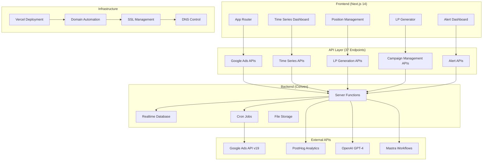
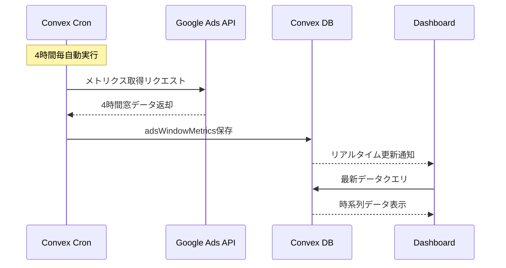
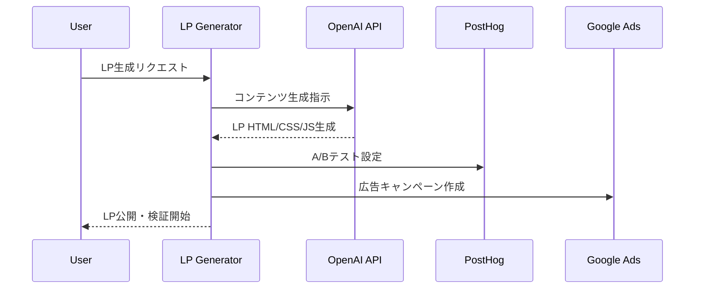

# LP Suite システムアーキテクチャ

## 🏗️ 全体アーキテクチャ

LP Suiteは、Next.js 14 + Convex + Google Ads APIを核とした統合LP検証プラットフォームです。



## ⚡ 技術スタック詳細

### Frontend Technology
```typescript
// Next.js 14 App Router
- TypeScript: 型安全性確保
- Tailwind CSS: レスポンシブUI
- shadcn/ui: 一貫性のあるコンポーネント（HeadlessUIから変更）
- React Hook Form + Zod: フォーム管理・バリデーション
- Chart.js + React-Chartjs-2: 時系列データ可視化（Rechartsから変更）
```

### Backend Infrastructure  
```typescript
// Convex Backend
- リアルタイムデータベース: ライブクエリ対応
- サーバーレス関数: mutation/query/action
- Cron Jobs: 4時間毎自動化処理
- ファイルストレージ: 画像・ドキュメント管理
- 認証: Convex Auth (将来実装予定)
```

### API統合
```typescript
// External API Integration
- Google Ads API v19: 広告データ取得・最適化
- PostHog: A/Bテスト・イベント追跡
- OpenAI GPT-4: LP自動生成・最適化提案
- Mastra: 複雑なワークフロー自動化
- MCP Protocol: 外部ツール統合
```

## 🔄 データフロー設計

### Google Ads データ同期フロー


### LP生成・検証フロー


## 📊 API設計パターン

### RESTful API構造
```
apps/lp-suite/src/app/api/
├── ads-sync/                    # Google Ads同期
│   ├── route.ts                 # 手動同期実行
│   └── schedule/route.ts        # 定期同期設定
├── time-series-real-data/       # 時系列データ取得
├── campaigns/                   # キャンペーン管理
│   ├── sync-from-google-ads/
│   └── counts/
├── positions/                   # プロダクト管理
│   ├── [id]/
│   └── purge/
├── alerts/                      # アラート管理
└── comprehensive-ads-automation/ # 包括的自動化
```

### API応答パターン
```typescript
// 統一レスポンス形式
interface ApiResponse<T> {
  success: boolean
  data?: T
  error?: string
  metadata?: {
    timestamp: string
    requestId: string
    processingTime: number
  }
}

// 時系列データ応答例
interface TimeSeriesResponse {
  success: true
  data: Array<{
    timeSlot: string      // "20h~24h"
    impressions: number
    clicks: number
    cost: number
    ctr: number          // 小数点2桁
    cpc: number
    cvr: number
    cpa: number
  }>
  metadata: {
    dateRange: string
    totalWindows: number
    lastSyncTime: string
    dataFreshness: "fresh" | "stale" | "missing"
  }
}
```

## 🔀 状態管理設計

### Convex ライブクエリ
```typescript
// リアルタイム状態管理
export function useWindowMetrics(productId: string) {
  return useQuery(api.ads.getWindowMetricsByProduct, {
    product_id: productId,
    window_hours: 4,
    limit: 48
  })
}

// 楽観的更新パターン
export function useOptimisticCampaignUpdate() {
  const updateCampaign = useMutation(api.campaigns.update)
  
  return useOptimistic(updateCampaign, {
    onSuccess: (result) => {
      // 成功時の楽観的UI更新
    },
    onError: (error) => {
      // エラー時のロールバック
    }
  })
}
```

### フロントエンド状態
```typescript
// Zustand for Client State
interface AppState {
  selectedProduct: string
  timeRange: '4h' | '1d' | '1w'
  alertFilters: AlertFilter[]
  
  // Actions
  setProduct: (id: string) => void
  setTimeRange: (range: string) => void
  toggleAlertFilter: (filter: AlertFilter) => void
}
```

## 🚀 自動化アーキテクチャ

### Convex Cron Jobs
```typescript
// convex/crons.ts
const crons = cronJobs()

// Google Ads 4時間毎データ同期
crons.interval("ads-sync", { hours: 4 }, api.ads.syncGoogleAdsData)

// 異常値検知・アラート
crons.interval("anomaly-detection", { minutes: 30 }, api.alerts.detectAnomalies)

// 日次レポート生成  
crons.daily("daily-reports", { hourUTC: 2 }, api.analytics.generateDailyReport)

// 週次キャンペーン最適化
crons.weekly("weekly-optimization", { 
  dayOfWeek: "monday", 
  hourUTC: 1 
}, api.campaigns.weeklyOptimization)
```

### Mastra ワークフロー統合
```typescript
// mastra/workflows/ads-optimization.ts
export const adsOptimizationWorkflow = workflow({
  name: "ads-4h-automation",
  triggerAndReturn: trigger.interval({
    every: "4h"
  }),
  
  run: async ({ step }) => {
    // 1. データ同期
    const syncResult = await step.run("sync-google-ads", () => 
      syncGoogleAdsData()
    )
    
    // 2. パフォーマンス分析
    const analysis = await step.run("analyze-performance", () =>
      analyzePerformanceMetrics(syncResult)
    )
    
    // 3. 最適化実行
    if (analysis.needsOptimization) {
      await step.run("optimize-campaigns", () =>
        optimizeCampaigns(analysis.recommendations)
      )
    }
    
    // 4. アラート送信
    if (analysis.hasAnomalies) {
      await step.run("send-alerts", () =>
        sendAnomalyAlerts(analysis.anomalies)
      )
    }
  }
})
```

## 🔒 セキュリティ・パフォーマンス

### セキュリティ対策
```typescript
// API認証・認可
interface SecurityLayer {
  // API Key管理
  googleAdsAuth: "OAuth2.0 + Refresh Token"
  openaiAuth: "Bearer Token"
  
  // レート制限
  rateLimiting: {
    googleAds: "1000req/day",
    openai: "500req/hour"
  }
  
  // データ暗号化
  encryption: {
    transit: "HTTPS/TLS 1.3",
    rest: "AES-256 (Convex managed)"
  }
}
```

### パフォーマンス最適化
```typescript
// データ取得最適化
interface PerformanceStrategy {
  // キャッシュ戦略
  cache: {
    windowMetrics: "5分間キャッシュ",
    dailyMetrics: "30分間キャッシュ",
    staticData: "24時間キャッシュ"
  }
  
  // バッチ処理
  batching: {
    googleAdsSync: "プロダクト毎並列処理",
    metricCalculation: "ベクトル化計算"
  }
  
  // インデックス最適化
  indexing: {
    timeSeries: "by_product_ts複合インデックス",
    workspace: "by_workspace分割戦略"
  }
}
```

## 🌐 デプロイメント・運用

### インフラ構成
```yaml
# Vercel Production
domains:
  primary: lp-suite.unson.com
  staging: lp-suite-staging.vercel.app

# Convex Backend
environment: production
region: us-east-1
scaling: auto

# External Services
google_ads:
  api_version: v19
  sandbox: false
  
convex:
  deployment: production
  region: us-east-1
```

### 監視・ログ
```typescript
// アプリケーション監視
interface MonitoringSetup {
  // メトリクス
  performance: {
    apiResponseTime: "< 500ms p95",
    cronJobSuccess: "> 99%",
    errorRate: "< 1%"
  }
  
  // ログ集約
  logging: {
    convexLogs: "Convex Dashboard",
    vercelLogs: "Vercel Dashboard", 
    customLogs: "Console + Discord"
  }
  
  // アラート設定
  alerts: {
    cronFailure: "即座にDiscord通知",
    apiError: "5分間で5回以上エラー時",
    performanceDegradation: "レスポンス時間2倍時"
  }
}
```

---

## 📈 スケーラビリティ計画

### Phase 3: マルチプロダクト対応
- 100プロダクト同時管理
- 地域別最適化
- マルチ言語対応

### Phase 4: エンタープライズ展開
- API公開・サードパーティ連携
- 高度なダッシュボードカスタマイズ
- SLA保証・24時間サポート

**最終更新**: 2025年9月4日  
**アーキテクチャバージョン**: v2.0