# LP Suite データベース設計

## 📊 Convex スキーマ設計

LP Suiteは、Convexリアルタイムデータベースを使用してマルチプロダクト・マルチテナント環境でのLP検証・Google Ads管理を実現しています。

## 🏗️ ER図（完全版）

以下のER図は、LP Suiteの完全なデータベース設計を示しています：

```mermaid
erDiagram
    %% Core LP Validation System
    lpValidationSessions ||--o{ automationExecutions : "has_many"
    lpValidationSessions ||--o{ playbookExecutions : "has_many"
    lpValidationSessions ||--o{ systemAlerts : "triggers"
    
    %% Playbook Management
    playbooks ||--o{ playbookExecutions : "executed_by"
    playbookExecutions ||--o{ playbookStepExecutions : "contains"
    playbooks ||--o{ playbookRuns : "run_as"
    
    %% Product Management (Fixed: product_id as consistent PK/FK)
    products ||--o{ lpValidationSessions : "validates"
    products ||--o{ playbookRuns : "runs"
    products ||--o{ phaseReviews : "reviewed"
    products ||--o{ adsDailyMetrics : "tracks"
    products ||--o{ adsWindowMetrics : "tracks"
    products ||--o{ campaigns : "advertises"
    products ||--o{ lpConfigs : "configures"
    products ||--o{ lpAbTests : "tests"
    
    %% Google Ads Integration
    campaigns ||--o{ adsDailyMetrics : "generates"
    campaigns ||--o{ adsWindowMetrics : "generates"
    campaigns ||--o{ alerts : "triggers"
    
    %% A/B Testing
    lpConfigs ||--o{ lpAbTests : "variant_of"
    lpAbTests ||--o{ posthogFlagSync : "syncs_to"
    
    %% Contact & Applications (Fixed: workspace_id consistency)
    contacts }o--|| serviceApplications : "applies_as"
    waitlist }o--|| discordApplications : "upgrades_to"
    
    %% Workspace Management (Added missing relationships)
    lpValidationSessions ||--|| contacts : "workspace_scoped"
    lpValidationSessions ||--|| waitlist : "workspace_scoped"
    lpValidationSessions ||--|| productRequests : "workspace_scoped"
    
    lpValidationSessions {
        string workspace_id PK
        string product_id FK
        string session_id PK
        string status
        string product_name
        string lp_url
        number start_date
        number end_date
        number target_cvr
        number target_cpa
        number min_sessions
        number current_cvr
        number current_cpa
        number total_sessions
        number total_conversions
        number total_spend
        boolean statistical_significance
        string google_ads_campaign_id
        string posthog_project_id
        boolean automation_enabled
        boolean auto_optimization
        boolean auto_deployment
        string current_playbook_id
        string current_playbook_status
        string created_by
        number created_at
        number updated_at
    }
    
    automationExecutions {
        string workspace_id FK
        string session_id FK
        string execution_id PK
        string execution_type
        string status
        any input_data
        any execution_details
        any output_data
        any metrics_before
        any metrics_after
        string impact_analysis
        string ai_reasoning
        number confidence_score
        number started_at
        number completed_at
        number duration_ms
        string error_message
        number retry_count
        number created_at
    }
    
    playbookExecutions {
        string workspace_id FK
        string session_id FK
        string execution_id PK
        string playbook_id FK
        string playbook_name
        string playbook_version
        string status
        number current_phase
        number total_phases
        number phase_completion_percentage
        any configuration
        array next_actions
        any kpi_targets
        any kpi_current
        boolean success_criteria_met
        number started_at
        number completed_at
        number estimated_completion
        string execution_summary
        array lessons_learned
        number created_at
        number updated_at
    }
    
    playbookStepExecutions {
        string workspace_id FK
        string execution_id FK
        string step_execution_id PK
        number phase_number
        number step_number
        string step_name
        string step_type
        string status
        any input_parameters
        any execution_details
        any output_results
        any success_criteria
        boolean success_achieved
        string ai_analysis
        array recommendations
        number started_at
        number completed_at
        number duration_ms
        string error_message
        number retry_count
        number created_at
        number updated_at
    }
    
    systemAlerts {
        string workspace_id FK
        string alert_id PK
        string alert_type
        string severity
        string title
        string message
        string related_session_id FK
        string related_product_id FK
        string status
        boolean notification_sent
        array notification_channels
        string resolved_by
        number resolved_at
        string resolution_notes
        number created_at
    }
    
    playbooks {
        string workspace_id FK
        string id PK
        string name
        string description
        string version
        string category
        array steps
        array successMetrics
        number created_at
        number updated_at
    }
    
    playbookRuns {
        string workspace_id FK
        string productId FK
        string productName
        string playbookId FK
        number phase
        string status
        number startedAt
        number completedAt
        array actualMetrics
        array lessons
        string notes
        string failureReason
        number created_at
        number updated_at
    }
    
    products {
        string workspace_id FK
        string product_id PK
        string name
        string description
        string longDescription
        string category
        string price
        string users
        number rating
        string status
        array features
        string serviceUrl
        string lpUrl
        array advertisingLPs
        boolean isReal
        number launchDate
        number created_at
        number updated_at
    }
    
    adsDailyMetrics {
        string workspace_id FK
        string product_id FK
        string platform
        string date
        number impressions
        number clicks
        number cost
        number conversions
        number created_at
        number updated_at
    }
    
    adsWindowMetrics {
        string workspace_id FK
        string product_id FK
        string platform
        number ts_start
        number window_hours
        number impressions
        number clicks
        number cost
        number conversions
        number created_at
        number updated_at
    }
    
    campaigns {
        string workspace_id FK
        string product_id FK
        string campaign_id PK
        string campaign_name
        string platform
        string status
        string campaign_type
        number budget_daily
        number target_cpa
        number target_roas
        number start_date
        number end_date
        number created_at
        number updated_at
    }
    
    alerts {
        string workspace_id FK
        string alert_id PK
        string product_id FK
        string alert_type
        string severity
        string title
        string message
        string status
        number threshold_value
        number current_value
        string session_id FK
        string campaign_id FK
        string resolved_by
        number resolved_at
        string resolution_notes
        number created_at
        number updated_at
    }
    
    phaseReviews {
        string workspace_id FK
        string productId FK
        string productName
        number phase
        string status
        number startDate
        number endDate
        array kpiResults
        array executedPlaybooks
        array keyLearnings
        array nextActions
        object gateDecision
        number createdAt
        number updatedAt
    }
    
    lpConfigs {
        string workspace_id FK
        string config_id PK
        string product_id FK
        string name
        string description
        any content
        string version
        boolean is_control
        boolean is_active
        number created_at
        number updated_at
    }
    
    lpAbTests {
        string workspace_id FK
        string test_id PK
        string product_id FK
        string name
        string description
        string status
        string posthog_flag_key
        string control_config_id FK
        array variant_configs
        string primary_metric
        array secondary_metrics
        number target_sample_size
        number current_sample_size
        number significance_threshold
        number start_date
        number end_date
        number planned_duration_days
        boolean auto_declare_winner
        boolean auto_stop_on_significance
        boolean auto_traffic_allocation
        number created_at
        number updated_at
        string created_by
    }
    
    posthogFlagSync {
        string workspace_id FK
        string ab_test_id FK
        string flag_key
        string sync_type
        any before_state
        any after_state
        boolean success
        string error_message
        number synced_at
    }
    
    contacts {
        string workspace_id FK
        string contact_id PK
        string name
        string email
        string company
        string phone
        string type
        string message
        string status
        number createdAt
        number updatedAt
    }
    
    discordApplications {
        string workspace_id FK
        string application_id PK
        string email
        string name
        array reasons
        string otherReason
        string skills
        string expectations
        string status
        string discordInviteLink
        number processedAt
        string rejectionReason
    }
    
    careerApplications {
        string workspace_id FK
        string application_id PK
        string name
        string email
        string position
        string experience
        string coverLetter
        string portfolio
        string status
        string notes
        number createdAt
        number updatedAt
    }
    
    productRequests {
        string workspace_id FK
        string request_id PK
        string name
        string email
        string productType
        string description
        string priority
        string status
        number createdAt
        number updatedAt
    }
    
    waitlist {
        string workspace_id FK
        string waitlist_id PK
        string email
        string name
        string company
        array interests
        string source
        string status
        number createdAt
        number invitedAt
    }
    
    serviceApplications {
        string workspace_id FK
        string serviceName
        string email FK
        string name
        any formData
        string status
        string notes
        number processedAt
        number createdAt
        number updatedAt
    }
```



## 🔍 設計品質分析

### ✅ 修正後の設計品質

1. **製品中心設計** (修正完了):
   - `products.product_id` (PK) → `adsDailyMetrics/adsWindowMetrics.product_id` (FK)
   - 完全に統一されたプロダクト別Google Adsデータ分離

2. **階層的プレイブック実行**:
   - `playbooks` → `playbookExecutions` → `playbookStepExecutions`
   - 適切な実行管理構造

3. **A/Bテスト管理**:
   - `lpConfigs` → `lpAbTests` → `posthogFlagSync` 
   - PostHogとの連携まで考慮

### ✅ 解決済み問題

1. **製品IDの統一** (FIXED):
   ```
   products.product_id (PK) ← 統一済み
   adsDailyMetrics.product_id (FK)
   adsWindowMetrics.product_id (FK)
   campaigns.product_id (FK)
   lpConfigs.product_id (FK)
   ```

2. **インデックス整合性確保**:
   - 全テーブルで`product_id`ベースのインデックス統一
   - 高速検索とデータ整合性を両立

### ✅ 完全なマルチテナント設計

1. **ワークスペース分離の完全性** (修正完了):
   - ✅ 全テーブルで`workspace_id`を統一追加
   - ✅ `contacts`, `waitlist`, `productRequests`, `discordApplications`, `careerApplications`に追加
   - ✅ `products`テーブルにも`workspace_id`追加でワークスペース分離完了

2. **適切なPK設計**:
   - Email重複問題を解決（複数ワークスペースで同じemailが可能）
   - 各テーブルで専用のPK(`contact_id`, `application_id`, `request_id`, `waitlist_id`)を採用

3. **Convex制約の限界**:
   - 外部キー制約なしのため、アプリケーションレベルでの整合性チェック必須
   - データ挿入時の存在確認処理が重要

## ✅ Google Adsデータ問題の根本解決

**修正内容**:
1. ✅ `products.product_id`をPKに統一
2. ✅ 全関連テーブルで`product_id`参照に統一
3. ✅ インデックス設計の一貫性確保
4. ✅ 全テーブルで`workspace_id`追加による完全なマルチテナント対応
5. ✅ Email重複問題解決（専用PK採用）

**期待効果**:
- AI-BRIDGE、MYWA、AI-COACH、AI-STYLIST等すべてのプロダクトで一貫したデータ管理
- Google Ads同期処理の確実な動作
- 完全なワークスペース分離によるマルチテナント対応
- Email重複なしの柔軟な顧客管理
- スケーラブルなプロダクト追加対応

## 📊 主要テーブル詳細

### Google Ads関連

#### adsWindowMetrics
4時間窓での広告パフォーマンスデータ。時系列分析の基盤。

```typescript
interface AdsWindowMetrics {
  workspace_id: string
  product_id: string        // AI-BRIDGE, MYWA, etc.
  platform: string         // "Google Ads"
  ts_start: number         // Unixタイムスタンプ(ms)
  window_hours: number     // 4時間固定
  impressions: number
  clicks: number
  cost: number            // JPY
  conversions: number
}
```

#### adsDailyMetrics  
日次集計データ。レポート・ダッシュボード用。

### LP検証関連

#### lpValidationSessions
LP検証の実行単位。Google Adsキャンペーンと1:1対応。

#### lpAbTests
A/Bテスト設定。PostHogフィーチャーフラグと連携。

## 🚀 パフォーマンス最適化

### インデックス戦略
```typescript
// 時系列クエリ最適化
.index("by_product_ts", ["product_id", "ts_start"]) 

// ワークスペース分離
.index("by_workspace_product", ["workspace_id", "product_id"])

// ステータス検索
.index("by_status", ["status"])
```

### データサイズ管理
- **4時間窓データ**: 90日保持後自動削除
- **日次集計**: 1年保持
- **プレイブック実行ログ**: 6ヶ月保持

## 🔧 開発・運用考慮事項

### データ整合性
- **アプリケーションレベル**: 外部キー制約をConvex関数で実装
- **バッチ更新**: トランザクション相当の処理をConvex mutationで実現
- **エラーハンドリング**: 部分失敗時のロールバック戦略

### 監視・アラート
- **データ品質**: 異常値・欠損データの自動検知
- **パフォーマンス**: クエリ実行時間の監視
- **容量管理**: テーブルサイズ・使用量の追跡

---

**最終更新**: 2025年9月4日  
**設計ステータス**: Phase 2完了・運用中