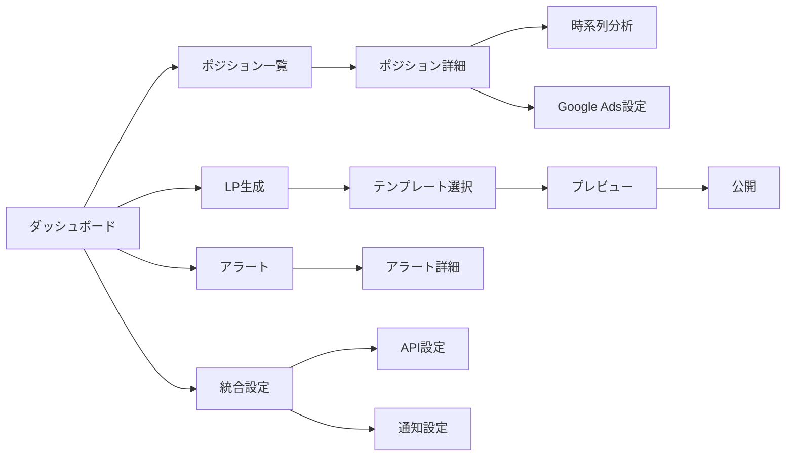

# LP Suite UI設計書

## 📂 ドキュメント構成

### 📱 ページ設計
- [ダッシュボード](./pages/dashboard.md) - 統合ダッシュボードトップページ
- [ポジション一覧](./pages/position-list.md) - プロダクト管理一覧画面
- [ポジション詳細](./pages/position-detail.md) - プロダクト詳細・時系列分析
- [LP生成](./pages/lp-generator.md) - AI駆動LP生成フォーム
- [広告イベント](./pages/ads-event.md) - Google Ads イベント詳細
- [統合管理](./pages/integration.md) - 統合設定・管理画面
- [ドメイン管理](./pages/domains.md) - ドメイン設定・SSL管理

### 🧩 コンポーネント設計
- [TimeSeriesList](./components/time-series-list.md) - 時系列イベントリスト
- [MetricsChart](./components/metrics-chart.md) - グラフ・チャート表示
- [AlertDashboard](./components/alert-dashboard.md) - アラート・通知管理
- [MetricsDashboard](./components/metrics-dashboard.md) - メトリクスカード群
- [Navigation](./components/navigation.md) - ナビゲーション・ヘッダー
- [MobileNavigation](./components/mobile-navigation.md) - モバイルナビゲーション

### 🎨 デザインシステム
- [カラーパレット](./design-system/colors.md) - 色定義・使用ガイド
- [タイポグラフィ](./design-system/typography.md) - フォント・文字スタイル
- [スペーシング](./design-system/spacing.md) - 余白・レイアウト規則
- [コンポーネントパターン](./design-system/patterns.md) - 共通UIパターン
- [アイコン](./design-system/icons.md) - Lucide Reactアイコン使用法
- [レスポンシブ](./design-system/responsive.md) - ブレークポイント・対応方針

## 🎯 UI設計原則

### 1. モバイルファースト
- タッチフレンドリー（44px以上のタップ領域）
- レスポンシブグリッド（Tailwind CSS）
- プログレッシブエンハンスメント

### 2. パフォーマンス最適化
- 仮想スクロール（react-window）
- 遅延ロード（React.lazy）
- 最適化レンダリング（useMemo/useCallback）

### 3. アクセシビリティ
- キーボードナビゲーション対応
- ARIA属性適切な使用
- コントラスト比4.5:1以上

### 4. 一貫性
- shadcn/uiコンポーネント活用（HeadlessUIから変更）
- 統一されたインタラクション
- 予測可能な動作

## 🛠️ 技術スタック

```typescript
const techStack = {
  framework: "Next.js 14 (App Router)",
  styling: "Tailwind CSS",
  components: "shadcn/ui", // HeadlessUIから変更
  icons: "Lucide React",
  charts: "Chart.js + React-Chartjs-2", // Rechartsから変更
  forms: "React Hook Form + Zod",
  state: "React State + Convex",
  animation: "Framer Motion (一部)"
}
```

## 📊 画面遷移図



## 🎨 UIコンポーネント階層

```
App
├── Layout
│   ├── Header
│   │   ├── Logo
│   │   ├── Navigation
│   │   └── UserMenu
│   ├── Sidebar (Desktop)
│   ├── MobileNavigation (Mobile)
│   └── Footer
│
├── Pages
│   ├── Dashboard
│   │   ├── StatsCards
│   │   ├── RecentEvents
│   │   └── QuickActions
│   │
│   ├── PositionDetail
│   │   ├── MetricsCards
│   │   ├── TimeRangeTabs
│   │   ├── MetricsChart
│   │   └── TimeSeriesList
│   │
│   └── LPGenerator
│       ├── StepIndicator
│       ├── FormSections
│       └── Preview
│
└── SharedComponents
    ├── Card
    ├── Button
    ├── Badge
    ├── Alert
    └── Skeleton
```

## 📐 レイアウトグリッド

### デスクトップ（1024px+）
- 12カラムグリッド
- ガター: 24px
- マージン: 32px

### タブレット（768px-1023px）
- 8カラムグリッド
- ガター: 16px
- マージン: 24px

### モバイル（〜767px）
- 4カラムグリッド
- ガター: 12px
- マージン: 16px

---

**最終更新**: 2025年9月4日  
**UIフレームワーク**: Next.js 14 + Tailwind CSS + shadcn/ui