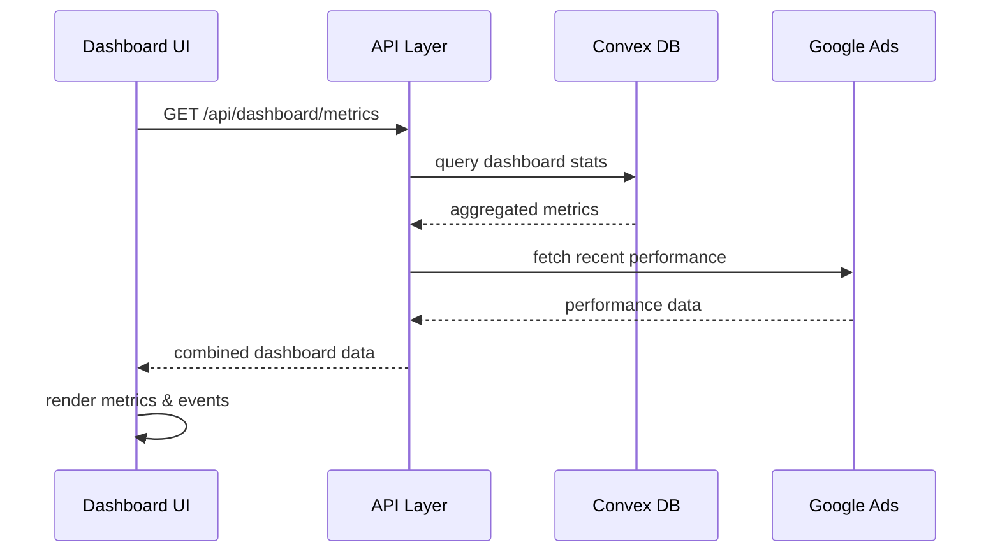

# ダッシュボード画面

## 📍 パス
`/` - IntegratedDashboard

## 🎯 画面の目的
LP Suite全体の統計情報とリアルタイムイベントを一元管理し、各機能への導線を提供する統合ダッシュボード。

## 🖼️ 画面構成

### ヘッダーセクション
```typescript
interface DashboardHeader {
  title: "LP Suite Dashboard"
  subtitle: "Google Ads最適化・LP検証プラットフォーム"
  lastUpdated: string // "最終更新: 5分前"
  refreshButton: boolean
}
```

### メトリクスカードセクション
```
┌────────────────────────────────────────────────┐
│  生成されたLP    管理ポジション   自動最適化    │
│     124個           7個            238回       │
│    +12% ↑         +2個 ↑          +45% ↑      │
├────────────────────────────────────────────────┤
│  総インプレッション  総クリック    全体CVR     │
│     245,678回        10,234回       4.17%      │
│     +18% ↑          +22% ↑        +0.3pt ↑    │
└────────────────────────────────────────────────┘
```

### リアルタイムイベントセクション
```typescript
interface RecentEvent {
  id: number
  type: 'success' | 'warning' | 'info'
  message: string
  time: string     // "2分前"
  category: string // "最適化", "アラート", "同期"
  link?: string    // 詳細ページへのリンク
}
```

**表示例:**
```
最近のイベント
━━━━━━━━━━━━━━━━━━━━━━━━━━━━━━━━━━━━
✅ [最適化] AI-BRIDGEのCPA改善完了 - 2分前
⚠️ [アラート] MYWAでCTR低下を検知 - 15分前  
ℹ️ [同期] Google Ads データ同期完了 - 1時間前
✅ [LP生成] 新規LP「AI-COACH」公開 - 2時間前
━━━━━━━━━━━━━━━━━━━━━━━━━━━━━━━━━━━━
```

### クイックアクションセクション
```tsx
const quickActions = [
  {
    icon: Target,
    label: "ポジション管理",
    href: "/position",
    color: "blue"
  },
  {
    icon: FileText,
    label: "LP生成",
    href: "/generator",
    color: "green"
  },
  {
    icon: BarChart3,
    label: "レポート",
    href: "/reports",
    color: "purple"
  },
  {
    icon: Settings,
    label: "設定",
    href: "/settings",
    color: "gray"
  }
]
```

## 📊 データフロー



## 💻 実装コード

### メインコンポーネント
```tsx
'use client'

export default function IntegratedDashboard() {
  const [systemData, setSystemData] = useState<RealSystemData | null>(null)
  const [loading, setLoading] = useState(true)

  useEffect(() => {
    const fetchRealData = async () => {
      try {
        // Convex統計取得
        const metricsRes = await fetch('/api/dashboard/metrics')
        const metrics = await metricsRes.json()
        
        // リアルタイムイベント取得
        const eventsRes = await fetch('/api/dashboard/events')
        const events = await eventsRes.json()
        
        setSystemData({ ...metrics, recentEvents: events })
      } catch (error) {
        console.error('Dashboard data fetch error:', error)
      } finally {
        setLoading(false)
      }
    }
    
    fetchRealData()
    const interval = setInterval(fetchRealData, 60000) // 1分毎更新
    
    return () => clearInterval(interval)
  }, [])
  
  return (
    <div className="min-h-screen bg-gray-50">
      <DashboardHeader />
      <MetricsGrid data={systemData?.metrics} loading={loading} />
      <RecentEventsList events={systemData?.recentEvents} />
      <QuickActionsGrid />
    </div>
  )
}
```

### メトリクスカードコンポーネント
```tsx
interface MetricCardProps {
  title: string
  value: string | number
  change: number
  trend: 'up' | 'down' | 'neutral'
  icon: React.ComponentType
  loading?: boolean
}

function MetricCard({ title, value, change, trend, icon: Icon, loading }: MetricCardProps) {
  if (loading) {
    return <SkeletonCard />
  }
  
  const trendColor = trend === 'up' ? 'text-green-600' : 
                     trend === 'down' ? 'text-red-600' : 
                     'text-gray-600'
  
  return (
    <div className="bg-white rounded-lg p-6 shadow-sm border">
      <div className="flex items-start justify-between">
        <div>
          <p className="text-sm text-gray-600">{title}</p>
          <p className="text-2xl font-bold mt-1">{value}</p>
          <div className="flex items-center mt-2">
            {trend === 'up' && <TrendingUp className="w-4 h-4" />}
            {trend === 'down' && <TrendingDown className="w-4 h-4" />}
            <span className={`text-sm ml-1 ${trendColor}`}>
              {change > 0 ? '+' : ''}{change}%
            </span>
          </div>
        </div>
        <Icon className="w-8 h-8 text-gray-400" />
      </div>
    </div>
  )
}
```

## 🎨 スタイリング

### カラースキーマ
- **背景**: `bg-gray-50` - ライトグレー背景
- **カード**: `bg-white` - 白背景 + `shadow-sm` + `border`
- **成功**: `text-green-600` - 上昇トレンド
- **警告**: `text-yellow-600` - 警告イベント
- **危険**: `text-red-600` - 下降トレンド

### レスポンシブ対応
```tsx
// グリッドレイアウト
<div className="grid grid-cols-1 md:grid-cols-2 lg:grid-cols-3 gap-6">
  {/* メトリクスカード */}
</div>

// モバイル時のスタック表示
<div className="space-y-4 lg:space-y-0 lg:grid lg:grid-cols-3 lg:gap-6">
  {/* コンテンツ */}
</div>
```

## 🔄 状態管理

```typescript
interface DashboardState {
  metrics: DashboardMetrics | null
  events: RecentEvent[]
  loading: boolean
  error: string | null
  lastUpdated: Date | null
  autoRefresh: boolean
  refreshInterval: number // ms
}
```

## ⚡ パフォーマンス最適化

1. **データキャッシュ**
   - 1分間のクライアントサイドキャッシュ
   - stale-while-revalidate戦略

2. **遅延ロード**
   - グラフコンポーネントの動的インポート
   - スクロールに応じた段階的レンダリング

3. **最適化レンダリング**
   ```tsx
   const memoizedMetrics = useMemo(() => 
     calculateDashboardMetrics(rawData), [rawData]
   )
   ```

## 🔗 関連ページ遷移

- **ポジション管理**: `/position` - 「管理ポジション」カードクリック
- **LP生成**: `/generator` - クイックアクション「LP生成」
- **詳細分析**: `/position/[id]` - イベントリストから個別遷移
- **アラート管理**: `/alerts` - 警告イベントクリック

---

**最終更新**: 2025年9月4日  
**コンポーネントパス**: `apps/lp-suite/src/app/page.tsx`