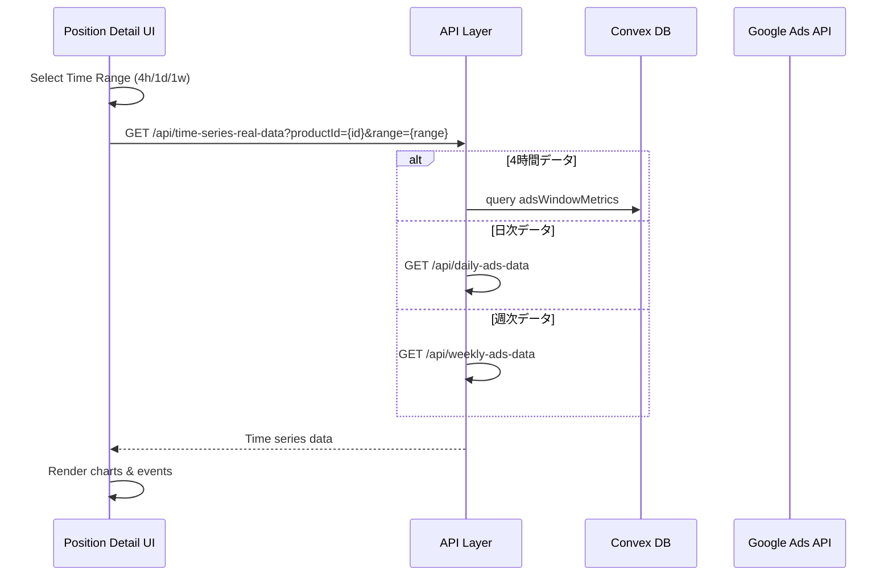

# ポジション詳細画面

## 📍 パス
`/position/[id]` - PositionDetailPage

## 🎯 画面の目的
個別プロダクト（AI-BRIDGE, MYWA等）のGoogle Ads パフォーマンスを時系列で分析し、最適化アクションを実行する詳細管理画面。

## 🖼️ 画面構成

### ヘッダーセクション
```
┌─────────────────────────────────────────────────┐
│ ← ポジション一覧  AI-BRIDGE（AI世代ブリッジ）    │
│                                    🟢 運用中    │
└─────────────────────────────────────────────────┘
```

### タイムレンジタブ
```tsx
const timeRanges = [
  { value: '4h', label: '4時間', description: 'リアルタイム分析' },
  { value: '1d', label: '1日', description: '日次トレンド' },
  { value: '1w', label: '1週間', description: '週次パフォーマンス' }
]
```

**表示例:**
```
[4時間] [1日] [1週間]
───────────────────────
```

### メトリクスカードセクション
```
┌──────────┬──────────┬──────────┬──────────┐
│   CVR    │   CTR    │   CPC    │   CPA    │
│  4.14%   │  3.48%   │   ¥86    │   ¥0     │
│  ↑+0.3   │  ↓-0.2   │  ↑+¥5    │   --     │
└──────────┴──────────┴──────────┴──────────┘
```

### 時系列グラフセクション
```typescript
interface ChartData {
  time: string          // "20:00", "9/4", "Week 35"
  impressions: number
  clicks: number  
  cost: number
  conversions: number
}

// グラフタイプ
type ChartType = 'line' | 'bar' | 'area'
```

### 時系列イベントリスト
```
━━━━━━━━━━━━━━━━━━━━━━━━━━━━━━━━━━━━━━━━━
2025年9月4日
────────────────────────────────────────────
┌────────────────────────────────────────┐
│ 20:00~24:00         1,234 impressions │
│ CVR: 4.14% ↑  CTR: 3.5%  CPC: ¥86    │
│                                        │
│ 🤖 パフォーマンス良好。CTR改善傾向    │
│ ✅ キーワード最適化実行済み           │
└────────────────────────────────────────┘

┌────────────────────────────────────────┐
│ 16:00~20:00         987 impressions   │
│ CVR: 3.8% →  CTR: 3.2%  CPC: ¥92     │
│                                        │
│ ⚠️ CTR低下を検知                      │
│ 🔄 広告文A/Bテスト開始               │
└────────────────────────────────────────┘
━━━━━━━━━━━━━━━━━━━━━━━━━━━━━━━━━━━━━━━━━
```

## 📊 データフロー



## 💻 実装コード

### メインコンポーネント
```tsx
'use client'

export default function PositionDetailPage() {
  const params = useParams()
  const [activeTimeRange, setActiveTimeRange] = useState('4h')
  const positionId = params.id as string
  const [positionData, setPositionData] = useState<any>({})
  const [ads, setAds] = useState<any[]>([])
  
  // Google Adsデータを時間範囲に応じて取得
  const loadAdsData = async (timeRange: string) => {
    const productId = positionId.toUpperCase()
    
    let endpoint: string
    if (timeRange === '1d') {
      endpoint = `/api/daily-ads-data?productId=${productId}&days=7`
    } else if (timeRange === '1w') {
      endpoint = `/api/weekly-ads-data?productId=${productId}&weeks=4`
    } else {
      endpoint = `/api/time-series-real-data?productId=${productId}`
    }
    
    try {
      const response = await fetch(endpoint)
      const data = await response.json()
      
      if (data.success && data.data) {
        setAds(data.data)
      }
    } catch (error) {
      console.error('Failed to load ads data:', error)
    }
  }
  
  useEffect(() => {
    loadAdsData(activeTimeRange)
  }, [activeTimeRange, positionId])
  
  return (
    <div className="min-h-screen bg-gray-50 p-6">
      <PositionHeader 
        name={positionData.name} 
        status={positionData.status}
      />
      
      <TimeRangeTabs 
        active={activeTimeRange}
        onChange={setActiveTimeRange}
      />
      
      <MetricsGrid metrics={calculateMetrics(ads)} />
      
      <MetricsChart 
        data={ads}
        timeRange={activeTimeRange}
      />
      
      <TimeSeriesList 
        events={mergeEventsAndAds([], ads)}
        sessionId={positionId}
      />
    </div>
  )
}
```

### メトリクスカード実装
```tsx
function MetricsGrid({ metrics }: { metrics: PositionMetrics }) {
  const cards = [
    {
      label: 'CVR',
      value: `${metrics.cvr}%`,
      change: metrics.cvrChange,
      icon: Target,
      color: metrics.cvr > 0 ? 'green' : 'gray'
    },
    {
      label: 'CTR', 
      value: `${metrics.ctr}%`,
      change: metrics.ctrChange,
      icon: TrendingUp,
      color: metrics.ctr > 3 ? 'green' : 'yellow'
    },
    {
      label: 'CPC',
      value: `¥${metrics.cpc}`,
      change: metrics.cpcChange,
      icon: DollarSign,
      color: metrics.cpc < 100 ? 'green' : 'yellow'
    },
    {
      label: 'CPA',
      value: metrics.cpa ? `¥${metrics.cpa}` : '--',
      change: metrics.cpaChange,
      icon: Target,
      color: metrics.cpa && metrics.cpa < 500 ? 'green' : 'gray'
    }
  ]
  
  return (
    <div className="grid grid-cols-2 md:grid-cols-4 gap-4 my-6">
      {cards.map(card => (
        <MetricCard key={card.label} {...card} />
      ))}
    </div>
  )
}
```

### 時系列イベント処理
```tsx
function mergeEventsAndAds(events: any[], adsData: any[]) {
  return adsData.map((ad, index) => ({
    id: `ad-${index}`,
    timestamp: ad.dateStr || ad.date,
    time: ad.timeWindow || '',
    sessions: ad.impressions,
    cvr: ad.cvr,
    ctr: ad.ctr,
    cpl: ad.cpc,
    optimizations: detectOptimizations(ad),
    anomalies: detectAnomalies(ad),
    aiComment: generateAIComment(ad),
    rawData: ad
  }))
}

function detectAnomalies(ad: any) {
  const anomalies = []
  
  if (ad.ctr < 2) {
    anomalies.push({
      type: 'low_ctr',
      severity: 'warning',
      message: 'CTRが2%を下回っています'
    })
  }
  
  if (ad.cpc > 150) {
    anomalies.push({
      type: 'high_cpc',
      severity: 'warning',
      message: 'CPCが¥150を超えています'
    })
  }
  
  return anomalies
}
```

## 🎨 スタイリング

### グラフカラーテーマ
```scss
$chart-colors: (
  impressions: #3b82f6,  // Blue
  clicks: #10b981,       // Green
  cost: #ef4444,        // Red
  conversions: #f59e0b  // Amber
);
```

### タブスタイル
```tsx
<div className="flex space-x-1 bg-gray-100 p-1 rounded-lg">
  {timeRanges.map(range => (
    <button
      className={cn(
        "px-4 py-2 rounded-md transition-colors",
        activeTimeRange === range.value
          ? "bg-white shadow-sm"
          : "hover:bg-gray-50"
      )}
    >
      {range.label}
    </button>
  ))}
</div>
```

## 🔄 状態管理

```typescript
interface PositionDetailState {
  positionId: string
  positionData: Position
  timeRange: '4h' | '1d' | '1w'
  adsData: TimeSeriesData[]
  metrics: CalculatedMetrics
  loading: boolean
  error: string | null
}
```

## ⚡ パフォーマンス最適化

1. **データフェッチング最適化**
   ```tsx
   // 時間範囲変更時のみ再取得
   useEffect(() => {
     loadAdsData(activeTimeRange)
   }, [activeTimeRange])
   ```

2. **メトリクス計算のメモ化**
   ```tsx
   const metrics = useMemo(() => 
     calculateMetrics(ads), [ads]
   )
   ```

3. **グラフの仮想化**
   - 大量データポイント時の仮想化
   - ビューポート外の要素を非レンダリング

## 🔗 関連機能

- **Google Ads設定**: 広告キャンペーン設定画面への遷移
- **A/Bテスト管理**: LP A/Bテスト設定への遷移
- **レポート生成**: パフォーマンスレポート出力
- **アラート設定**: 閾値アラート設定

---

**最終更新**: 2025年9月4日  
**コンポーネントパス**: `apps/lp-suite/src/app/position/[id]/page.tsx`