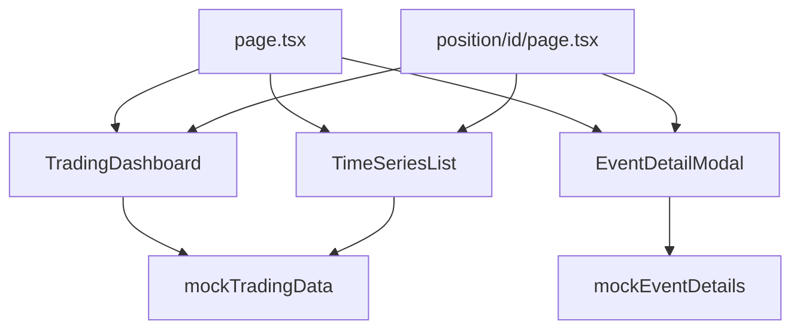

# LP検証システム UI移行 現状分析レポート

## 📊 現状分析結果

### 1. ディレクトリ構造比較

#### `lp-validation`（既存Next.js）
- **フレームワーク**: Next.js 14.0.4（App Router）
- **ビルドツール**: Next.js内蔵
- **スタイリング**: Tailwind CSS
- **パッケージマネージャー**: npm

```
src/
├── app/          # Next.js App Router
│   ├── api/      # APIルート
│   ├── position/ # 動的ルート
│   └── trading/  # 静的ページ
├── components/   # UIコンポーネント（9個）
├── lib/          # ユーティリティ・定数
└── types/        # 型定義
```

#### `lp-validation-ui`（新規Vite）
- **フレームワーク**: Vite + React
- **ビルドツール**: Vite
- **UIライブラリ**: shadcn/ui（48個のコンポーネント）
- **パッケージマネージャー**: pnpm

```
src/
├── components/   # shadcn/uiコンポーネント
│   └── ui/       # 汎用UIコンポーネント（48個）
├── pages/        # ページコンポーネント（5個）
├── hooks/        # カスタムフック
└── lib/          # ユーティリティ
```

### 2. 主要な違い

| 項目 | lp-validation | lp-validation-ui |
|------|---------------|------------------|
| フレームワーク | Next.js 14 | Vite + React |
| ルーティング | ファイルベース（App Router） | React Router（推測） |
| SSR/SSG | サポート | SPAのみ |
| データフェッチ | RSC対応 | クライアントサイド |
| コンポーネント数 | 9個（カスタム） | 48個（shadcn/ui） |
| ページ数 | 3ページ | 5ページ |

### 3. 移行対象コンポーネント

#### 優先度：高（コアコンポーネント）
1. `TradingDashboard.tsx` - FXトレーディング風UI
2. `TimeSeriesList.tsx` - 時系列イベント表示
3. `EventDetailModal.tsx` - イベント詳細モーダル

#### 優先度：中（補助コンポーネント）
4. `AlertDashboard.tsx` - アラート管理
5. `MetricsChart.tsx` - チャート表示
6. `MetricsDashboard.tsx` - メトリクス概要
7. `OptimizationLog.tsx` - 最適化ログ
8. `ReportGenerator.tsx` - レポート生成
9. `SessionOverview.tsx` - セッション概要

#### 優先度：低（ユーティリティ）
- `lib/constants.ts` - 定数定義
- `lib/types.ts` - 型定義
- `lib/utils.ts` - ユーティリティ関数
- `lib/styles.ts` - スタイル定義

### 4. 移行の課題

#### 技術的課題
1. **ルーティング方式の違い**
   - Next.js: ファイルベースルーティング
   - Vite: React Routerベース（設定必要）

2. **SSR/SSGの扱い**
   - Next.js: 標準サポート
   - Vite: 追加設定必要（vite-plugin-ssr等）

3. **API統合**
   - Next.js: API Routes内蔵
   - Vite: 別途バックエンド必要

4. **画像最適化**
   - Next.js: next/image組み込み
   - Vite: 手動設定必要

#### 構造的課題
1. **コンポーネント構造の違い**
   - lp-validation: ビジネスロジック密結合
   - lp-validation-ui: 汎用UIライブラリ中心

2. **状態管理**
   - 現在: useStateベース
   - 移行後: 状態管理ライブラリ検討必要

### 5. 移行戦略の推奨事項

#### アプローチA: 段階的移行（推奨）
1. **Phase 1**: UIコンポーネントのみ移行
2. **Phase 2**: ビジネスロジック分離
3. **Phase 3**: ルーティング統合
4. **Phase 4**: データフェッチング移行

#### アプローチB: 並行運用
1. 新UIをサブドメインで公開
2. nginx/プロキシでトラフィック制御
3. A/Bテストで段階的切り替え

### 6. 既存lp-validation-uiの活用可能性

#### 再利用可能なコンポーネント
- `Card`, `Button`, `Dialog` → EventDetailModalで活用
- `Table` → TradingDashboardで活用
- `Chart` → MetricsChartの代替
- `Alert` → AlertDashboardで活用

#### 新規作成が必要なコンポーネント
- FXトレーディング風のカスタムUI
- 時系列イベントリスト
- ポジション管理テーブル

### 7. 依存関係マップ



### 8. 作業見積もり

| タスク | 時間 | 複雑度 |
|--------|------|--------|
| 基本セットアップ | 1時間 | 低 |
| コンポーネント移行 | 4時間 | 中 |
| ルーティング設定 | 2時間 | 高 |
| データ連携 | 2時間 | 中 |
| テスト・検証 | 2時間 | 中 |
| **合計** | **11時間** | - |

### 9. 次のステップ

1. **決定事項の確認**
   - [ ] Viteベースで進めるか、Next.jsを維持するか
   - [ ] shadcn/uiコンポーネントを活用するか
   - [ ] SSR/SSGの必要性

2. **準備作業**
   - [ ] バックアップ作成
   - [ ] 移行用ブランチ作成
   - [ ] 依存パッケージの整理

3. **実装開始**
   - [ ] 基本構造のセットアップ
   - [ ] コアコンポーネントの移行
   - [ ] ルーティングの実装