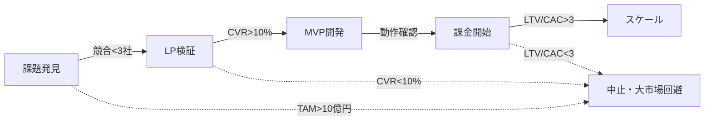

# 🚀 Unson OS 構想
## 3年で100個のマイクロSaaSを自動生成するプラットフォーム（企画段階）

### AIエンジニア向けコンセプト説明資料

⚠️ **注意：本資料は企画・構想段階のものです**

---

# 📊 アジェンダ

1. **構想の背景** - なぜ100個のSaaSなのか？
2. **想定アーキテクチャ** - どう実現したいか？
3. **開発プロセス案** - どう作る予定か？
4. **収益モデル仮説** - どう収益化するか？
5. **検証計画** - まず何から始めるか？

---

# 1️⃣ 構想の背景

## 従来のアプローチの限界

❌ **100万円×1事業**で月100万円
- 高収益を狙うため競合が激しい
- 失敗リスクが集中する
- 市場参入障壁が高い

## Unson OSの新しい発想

✅ **1万円×100事業**で月100万円
- ニッチ市場で競合回避
- リスクを100に分散
- ひとつだけ当たれば全体が成功

---

# 🎯 コアコンセプト

## Company-as-a-Product

```
会社運営 = ソフトウェア実行
├── 自動化された意思決定
├── コード化されたプロセス
└── DAO型の分散ガバナンス
```

## 3年間のロードマップ

```
1年目：10個のSaaS検証・収益化
2年目：30個のSaaS運用
3年目：100個のSaaS体制確立

毎月のサイクル：
- 5-10個のアイデア検証
- 3-4個のMVP開発
- 0.3-0.4個の収益化成功

年間成果：
- 36-48個のMVP開発
- 3-5個の収益化成功
※成功率10%：10個のMVPで1個成功
```

---

# 2️⃣ 想定技術アーキテクチャ

## 📋 アーキテクチャの分類

### A. 個別SaaSの標準テンプレート構成

**決定版: Vercel + Convex構成**
```
┌─────────────┐     ┌─────────────┐
│ Next.js 14  │────▶│   Vercel    │
│ App Router  │     │  + Cron Jobs│
└─────────────┘     └─────────────┘
       │                    │
       ▼                    ▼
┌─────────────┐     ┌─────────────┐
│   Convex    │     │   Stripe    │
│  Backend    │     │   Billing   │
└─────────────┘     └─────────────┘

なぜこの構成なのか:
├── MVP開発: 3-5日（従来の1/3）
├── コード量: 70%削減
├── 運用負荷: ほぼゼロ
└── 100個のSaaS管理が現実的
```

**開発速度の比較**
```
従来の構成（Hono + Prisma + Neon）:
└── 2週間/MVP × 100個 = 4年必要 ❌

Convex構成:
└── 5日/MVP × 100個 = 1.4年で完成 ✅

開発時間を1/3に短縮 = 3倍速で市場投入
```

### B. Unson OSプラットフォーム（フェーズ別）

**Phase 1: 手動検証（1年目）**
```
┌─────────────┐     ┌─────────────┐
│   GitHub    │────▶│ 手動デプロイ  │
│ Template    │     │ + 手動分析   │
└─────────────┘     └─────────────┘
```

**Phase 2: 半自動化（2年目）**
```
┌─────────────┐     ┌─────────────┐     ┌─────────────┐
│ Claude Code │────▶│ 自動生成     │────▶│GitHub Actions│
│    API      │     │ Template    │     │  CI/CD      │
└─────────────┘     └─────────────┘     └─────────────┘
```

**Phase 3: 段階的自動化（3年目）**
```
┌─────────────┐     ┌─────────────┐     ┌─────────────┐
│   Trend     │────▶│   AI Judge  │────▶│Auto Scale  │
│  Monitor    │     │  System     │     │ & Deploy   │
└─────────────┘     └─────────────┘     └─────────────┘
```

## 🔧 各フェーズの技術的詳細

### Phase 1（現在の検証段階）
- **テンプレート**: Next.js + Convex標準構成
- **デプロイ**: Vercel手動デプロイ（3分で完了）
- **分析**: Convex内蔵の分析機能
- **判定**: 人力によるGo/No-Go

### Phase 2（半自動化）
- **生成**: Claude Code APIでConvex関数自動生成
- **テスト**: Convexの型安全性で大幅削減
- **デプロイ**: git pushで自動デプロイ
- **判定**: リアルタイムKPIによる半自動判定

### Phase 3（段階的自動化）
- **監視**: Convexのリアルタイムクエリ
- **生成**: AIによる全自動SaaS作成
- **運用**: Convexの自動スケール（管理不要）
- **最適化**: 機械学習による継続改善

---

# 3️⃣ 開発プロセス案

## 検討中の4段階ゲートシステム



---

# 📝 Stage 1: ユーザーの思い込み破壊（1-2日）

## コアコンセプト：「仕方ない」を破壊する

### 思い込み発見のパターン
```
「デジタルコンテンツ販売は難しい」
「初期費用がかかるのは仕方ない」
「専門知識が必要なのは当然」

→ 「初期費用ゼロで誰でも簡単に」で破壊
→ 結果：流通総額50億円のプロダクトに
```

### 🎯 Unson OS独自の市場選定戦略

**個人開発者と同じ土俵で戦って勝つ**
```
× TAM 100億円以上 → 大企業が参入済み
× TAM 10億円以上 → VC資金で競合多数
○ TAM 1-10億円 → 個人開発者も狙う激戦区
○ TAM 5000万円以下 → 個人開発者のメイン戦場

Unson OSの競合優位性：
├── 開発スピード：月3-4個 vs 個人の年1-2個
├── 品質改善：システム化された継続改善
├── 市場カバー：100個の並列展開
└── 資金力：収益再投資による持続性

判定基準（個人開発者を上回る）:
├── 競合数 < 5社 （個人開発者含む）
├── 開発期間 < 2週間 （圧倒的スピード）
├── 市場成長率 > 20% （トレンド活用）
└── 改善余地 > 大 （既存解決策が不十分）
```

### キーワードA×B戦略（ニッチ特化）
```
キーワードA（トレンド）: [AI, 自動化, リモート, DX]
キーワードB（ニッチ要素）: 
- 特定業界の専門用語
- 地域限定のニーズ
- 特殊な職業・趣味
- 法規制による制約

例: 「AI × 美容師国家試験対策」
→ TAM小さいが競合ゼロ、単価高、リピート性あり
```

### AI検索での超ニッチ課題発見
```javascript
const findNicheProblems = async () => {
  // 大市場を避けて、小さく深い課題を発見
  const searches = [
    "○○業界 専用ツール 高すぎる",
    "○○職 手作業 時間かかる", 
    "○○地域 独特 課題",
    "○○資格 勉強法 効率悪い"
  ];
  
  // TAMが小さくても深い課題があるものを優先
  return searches.filter(result => 
    result.competition < 3 && 
    result.pain_level > 8 &&
    result.willingness_to_pay > 5000
  );
};
```

### 直近伸び率重視のトレンド分析
```javascript
const analyzeTrend = async (keyword) => {
  // 12ヶ月ではなく直近の伸び率で判定
  const recentGrowth = await getGrowthRate(keyword, '30days');
  const momentum = await calculateMomentum(keyword);
  return recentGrowth > 20 && momentum > 0;
};
```

---

# 🎨 Stage 2: LP検証（16時間）

## ノーコードLP作成

### 3時間で完成
1. **Framer**でデザイン
2. **コピー自動生成**
3. **A/Bテスト設定**

### 検証指標
```yaml
成功基準:
  - 登録率: 10%以上
  - 滞在時間: 2分以上
  - 支払意向: 1,000円以上
```

### 実装例
```typescript
const validateIdea = async (idea: Idea) => {
  const lp = await generateLP(idea);
  const traffic = await runAds(lp, { budget: 10000 });
  return analyzeMetrics(traffic);
};
```

---

# 🚀 Stage 3: MVP開発（2週間）

## Claude Codeで自動実装

### 必須機能チェックリスト
- [ ] ユーザー認証（Supabase Auth）
- [ ] 課金システム（Stripe）
- [ ] 使用量制限
- [ ] ダッシュボード
- [ ] メール通知

### Convexでの高速実装例
```typescript
// 3分で決済機能実装
export const createSubscription = mutation({
  args: { 
    userId: v.id("users"),
    plan: v.union(v.literal("pro"), v.literal("basic"))
  },
  handler: async (ctx, args) => {
    // Stripe決済処理
    const session = await stripe.checkout.sessions.create({
      customer: args.userId,
      price: PRICE_IDS[args.plan],
    });
    
    // DBに自動保存（型安全）
    return await ctx.db.insert("subscriptions", {
      userId: args.userId,
      plan: args.plan,
      stripeSessionId: session.id,
      status: "pending"
    });
  }
});

// フロントエンドから呼び出し（型安全）
const { createSubscription } = useAPI();
await createSubscription({ userId, plan: "pro" });
```

---

# 💰 Stage 4: 課金開始

## KPIダッシュボード

```
┌─────────────────────────────────┐
│         リアルタイムKPI          │
├─────────────┬───────────────────┤
│ MRR         │ ¥324,000         │
│ 有料転換率   │ 12.3%            │
│ チャーン率   │ 3.2%             │
│ LTV/CAC     │ 4.8x             │
└─────────────┴───────────────────┘
```

## 自動スケーリング判定
```python
if metrics['ltv_cac_ratio'] > 3:
    scale_up(product)
elif metrics['churn_rate'] > 10:
    shutdown(product)
else:
    optimize(product)
```

---

# 4️⃣ 収益モデル仮説

## 💰 資金調達計画

### フェーズ別資金調達戦略

**Phase 1（1年目）: ブートストラップ開始**
```
初期資金: 150-200万円（創業者自己資金）
├── MVP開発費: 100万円（年間20-30個のMVP）
├── インフラ・API費用: 30万円/年
├── マーケティング: 20万円
└── 運転資金: 30万円

目標: 2-3個の収益化で黒字転換（成功率10%）
```

## 💰 1個SaaS開発の詳細コスト（2025年実際料金）

### 開発フェーズのコスト
```
市場調査（OpenAI Deep Research）:
├── ChatGPT Pro: $200/月（月25クエリ）
├── 1SaaSあたり: 2-3クエリ使用
└── コスト: $16-24/SaaS（約2,500-3,500円）

コード開発（Claude Code API）:
├── Claude Opus 4: $15/1M入力、$75/1M出力
├── MVP開発: 約50万トークン使用
└── コスト: $30-40/SaaS（約4,500-6,000円）

開発時間の人件費:
├── 開発時間: 40-60時間/SaaS
├── 時給換算: 5,000円/時間
└── コスト: 20-30万円/SaaS
```

### 月間運用コスト（1個のSaaS）
```
サーバー費用（Vercel Pro）:
├── 基本料金: $20/月（約3,000円）
├── 超過料金: 帯域幅$0.15/GB、関数$0.60/M実行
└── 小規模SaaS: 月3,000-5,000円

データベース（Neon DB）:
├── Launch Plan: $19/月（約2,800円）
├── 超過料金: コンピュート時間・ストレージ従量
└── 小規模SaaS: 月2,800-4,000円

決済手数料（Stripe）:
├── 手数料: 3.6%
├── 月間売上1万円の場合
└── コスト: 360円/月

総運用コスト: 6,160-9,360円/月/SaaS
```

### 1個SaaS開発の総コスト
```
初期開発: 23-30万円
├── 市場調査: 3,500円
├── AI開発: 6,000円  
├── 人件費: 25万円
└── その他: 1万円

年間運用: 7-11万円
├── サーバー・DB: 6-9万円
├── 決済手数料: 1-2万円
└── 保守: 微少

合計（1年目）: 30-41万円/SaaS
```

**Phase 2（2年目）: 内部資金循環**
```
資金源: 初期SaaSからの収益再投資
├── 年間収益目標: 400-600万円（2-3個の成功SaaS）
├── 再投資率: 70%（280-420万円）
├── 新規MVP開発: 年間15-20個
└── 期待成功数: 1-2個追加

目標: 持続的な資金循環の確立
```

### 💡 Convex導入による収益モデル改善
```
成功率10%を前提とした計算（Convex効果）:

1年目（60個MVP開発）: ← 3倍速
├── 開発コスト: 300-400万円（人件費削減）
├── 成功数: 6個
├── 年間収益: 720-1,440万円（各SaaS月1-2万円）
└── 損益: +320-1,040万円（初年度黒字化）

2年目（累計120個MVP、12個成功）:
├── 追加開発コスト: 300万円  
├── 累計成功数: 12個
├── 年間収益: 1,440-2,880万円
└── 利益: 1,140-2,580万円（大幅黒字）

3年目（累計200個MVP、20個成功）:
├── 年間収益: 2,400-4,800万円
├── 開発コスト: AIによる自動化
└── 利益: 2,000-4,400万円（目標達成）
```

**Phase 3（3年目）: 拡大投資**
```
資金源: 潤沢な内部資金 + 外部調達検討
├── 年間収益目標: 1,000万円以上
├── AI開発への大型投資
└── 必要に応じてシリーズA検討

目標: 段階的自動化システムの構築
```

### 💡 創業者のリスク・リターン分析

**📊 リスク評価**
```
金銭的リスク: 
├── 初期投資: 50-100万円（年収の1-2ヶ月分程度）
├── 機会損失: 他の高収入案件を見送る可能性
└── 失敗時損失: 最大100万円で限定的

時間的リスク:
├── 開発時間: 月40-60時間（副業レベル）
├── 検証期間: 1年間の集中期間
└── 失敗時: スキル向上とノウハウは残る
```

**💰 リターン分析（3年シナリオ）**
```
保守的ケース:
├── 1年目: 月間15万円（年間180万円）
├── 2年目: 月間30万円（年間360万円）
├── 3年目: 月間45万円（年間540万円）
└── 3年累計: 1,080万円（投資回収率: 1,080%）

楽観的ケース:
├── 1年目: 月間30万円（年間360万円）
├── 2年目: 月間75万円（年間900万円）
├── 3年目: 月間150万円（年間1,800万円）
└── 3年累計: 3,060万円（投資回収率: 3,060%）
```

**⚖️ 他選択肢との比較**
```
フリーランス/受託開発:
├── リスク: 低
├── リターン: 月50-100万円（安定）
├── 成長性: 限定的
└── 時間拘束: 高

一般的なSaaS起業:
├── リスク: 高（数百万〜数千万円）
├── リターン: 大きいが不確実
├── 成長性: 非常に高い
└── 失敗率: 90%

Unson OSアプローチ:
├── リスク: 中（100万円程度）
├── リターン: 段階的に拡大
├── 成長性: 自動化による指数関数的成長
└── 失敗率: リスク分散で低く抑制
```

**🛡️ リスク軽減策**
```
段階的投資:
├── Phase 1: 30万円で2-3個のMVP
├── 収益確認後にPhase 2へ
└── 各段階で継続判断

収入多様化:
├── 並行して受託案件継続
├── コンサル収入も確保
└── Unson OSは副業から開始

技術資産化:
├── 失敗してもフレームワークは残る
├── 自動化ツールは他用途でも活用可能
└── コミュニティとのネットワーク価値
```

## 想定する45-15-40 分配モデル

```
安定期の月間収益: 300万円（現実的目標）

├── 運営・再投資（45%）: 135万円
│   ├── インフラ・AI API: 50万円
│   ├── 新規SaaS開発: 60万円
│   └── マーケティング: 25万円
│
├── 創業者（15%）: 45万円
│
└── DAO・貢献者（40%）: 120万円
    ├── アクティブ開発者: 80万円
    ├── アイデア・検証貢献: 30万円
    └── コミュニティ運営: 10万円
```

---

# 🪙 トークノミクス

## デュアルトークンシステム

### UNSONトークン（ガバナンス）
- 総供給量: 1億枚
- 投票権・提案権
- 長期インセンティブ

### PROFITトークン（収益分配）
- 月次動的発行
- 貢献度ベース配分
- 即時換金可能

## 貢献度計算システム

### 基本評価項目

| 活動 | ポイント | 説明 |
|------|----------|------|
| **コード開発（PR作成）** | +3 | Convex関数、UI実装など |
| **Issue解決** | +2 | バグ修正、調査対応 |
| **デザイン作成** | +2 | UI/UX設計、画面デザイン |
| **コンテンツ作成** | +1 | ドキュメント、記事執筆 |
| **Q&A対応** | +1 | コミュニティサポート |
| **メディア確認** | +1 | 品質管理、レビュー |

### リアルタイム貢献度追跡
```typescript
// Convexでリアルタイム集計
export const getContributorStats = query({
  handler: async (ctx) => {
    const contributions = await ctx.db.query("contributions").collect();
    return contributions.reduce((acc, c) => ({
      ...acc,
      [c.userId]: (acc[c.userId] || 0) + c.points
    }), {});
  }
});
```

---

# 5️⃣ 検証計画

## Week 1-2: 基盤構築

### タスクリスト
```bash
□ リポジトリセットアップ
□ Claude Code API統合
□ 基本テンプレート作成
□ CI/CDパイプライン
□ Stripe統合
□ 最初のMVP作成
```

### セットアップコマンド
```bash
git clone https://github.com/unson-os/starter
cd starter && npm install
npm run setup:all
```

---

# 📈 Week 3-4: 検証と改善

### 自動化の試験的実装
```javascript
// アイデア生成の自動化
cron.schedule('0 9 * * *', async () => {
  const ideas = await generateIdeas();
  const validated = await validateIdeas(ideas);
  await createMVPs(validated.top3);
});

// KPI監視の自動化
cron.schedule('0 * * * *', async () => {
  const metrics = await collectMetrics();
  await makeDecisions(metrics);
});
```

---

# 🎯 Month 2-3: 目標（希望的観測）

## 達成したいマイルストーン

### Month 2の目標
- 5-10個のMVP検証
- 1-2個の収益化成功
- 初期メンバー 10人

### Month 3の目標
- 10-20個のMVP検証
- 3-5個の収益化
- コミュニティ形成

---

# 🚀 検証への参加方法

## まずは構想の検証から

```bash
# 現在準備中の内容：
# - 基本的なテンプレート構造
# - アイデア検証フレームワーク
# - MVP開発ガイドライン

# 参加方法：
1. GitHubリポジトリで議論に参加
2. アイデア検証手法の改善提案
3. 技術スタックの検討
```

---

# 🤝 構想への参加方法

## 現在募集中の協力内容

### 1. 構想の検証
- フレームワークの改善提案
- 技術的実現可能性の検討
- アイデア検証手法の開発

### 2. プロトタイプ開発
- 検証ツールの作成
- テンプレートの整備
- 自動化の実験

### 3. 将来的な報酬システム（構想）
- 貢献度に応じた収益分配
- DAOトークンによる長期インセンティブ
- ※詳細は今後検討

---

# 📊 1×100アプローチのメリット

## なぜ小さな市場の方が有利か？

```
競合状況の分析：
├── 大企業：TAM10億円未満は「小さすぎる」→ 参入しない
├── VC企業：TAM100億円未満は投資対象外→ 参入しない  
├── 個人開発者：ニッチ市場も狙う → 真の競合相手
└── Unson OSの勝ち筋：仕組み化による圧倒的優位性

個人開発者 vs Unson OS：
├── 個人開発者：1人で1-2個のSaaSを手作業開発
├── Unson OS：システム化で月3-4個のMVP量産
├── 開発スピード：10倍の差
├── 品質改善：データ蓄積による継続改善
└── 結果：同じ市場でも圧勝

Unson OSの狙い目：
├── TAM 5,000万円〜10億円（個人開発者も狙う領域）
├── 競合：個人開発者1-3人程度
├── 勝ち方：圧倒的なスピードと品質で駆逐
└── AIで効率的に課題発見＋高速MVP化

具体例：「美容師国家試験AI対策」
- TAM: 約2億円（年間3万人受験）
- 競合: 個人開発者が作った簡易アプリ1-2個
- Unson OSの勝ち方: 
  * 2週間でより高品質なMVP投入
  * ユーザーフィードバックで継続改善
  * 個人開発者が追いつけないスピードで市場制圧
```

---

# 🔄 次のフェーズ：事業拡張戦略

## Human in the Loop による領域拡大

```
SaaSの限界を突破：
├── AIだけでは解決できない業務領域へ拡大
├── ココナラ等のプラットフォームで人的リソース調達
├── 自動化 + 人力のハイブリッドモデル
└── より大きな市場への参入が可能に

例：AIライティング + 人的校正サービス
- AIで8割の作業を自動化
- 残り2割を専門家がチェック
- SaaSの10倍規模の市場に参入可能
```

---

# 🎯 3年間の現実的マイルストーン

## 達成したい目標

### 1年目：フレームワーク確立
- 10個のMVP検証
- 3個の収益化成功
- 月間MRR 30万円

### 2年目：システム化
- 30個のSaaS運用
- 月間MRR 100万円
- コミュニティ50人

### 3年目：スケール達成
- 100個のSaaS体制
- 月間MRR 300万円
- 国際展開開始

---

# 💡 なぜ今なのか？

## 完璧なタイミング

1. **AI技術の成熟**
   - コード生成が実用レベルに
   - 開発コストが1/10に

2. **SaaS市場の拡大**
   - 年率30%成長
   - ニッチ市場の増加

3. **Web3の普及**
   - DAO運営が一般化
   - トークンエコノミーの成熟

---

# 🔗 リンク集

## 必須リソース

- 🏠 **公式サイト**: unson-os.com
- 💻 **GitHub**: github.com/unson-os
- 💬 **Discord**: discord.gg/wBaz7mpcjC
- 📚 **ドキュメント**: docs.unson-os.com

## 連絡先

- 📧 **Email**: team@unson-os.com
- 🐦 **Twitter**: @unson_os

---

# 🎉 Let's Build Together!

## 次のステップ

1. **Discordに参加**して仲間を見つける
2. **スターターキット**をクローン
3. **最初のPR**を作成
4. **収益分配**を受け取る

### 一緒に「思い込み破壊」を始めませんか？
- ユーザーの「仕方ない」を発見する
- キーワードA×Bでユニーク市場を作る
- 1万円×100の新しい収益モデルを検証する

---

# Questions? 🤔

## よくある質問

**Q: プログラミング初心者でも参加できる？**
A: もちろん！Claude Codeが支援します

**Q: 必要な時間は？**
A: 週10時間から参加可能

**Q: 収益はいつから？**
A: 検証次第ですが、最初のMVPで収益化を目指します

---

# 🚀 The Future is Automated

## 一緒に作ろう、自動化された未来を。

### Join us today!
### → discord.gg/wBaz7mpcjC