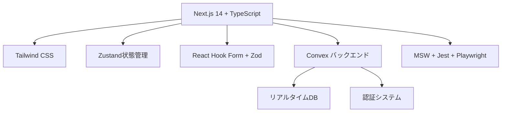

# Unson OS ランディングページ設計書

## 📋 プロジェクト概要

**プロジェクト名**: Unson OS ランディングページ  
**目的**: 100個（3年目標）のマイクロSaaS自動生成プラットフォームの紹介とユーザー獲得  
**ターゲット**: 開発者、起業家、DAO参加希望者、企業のDX担当者  
**戦略**: MVP検証フレームワークに基づく段階的リリース

## 🎯 ビジネス目標

### 主要KPI
- **LP登録率**: 10%以上
- **有料転換率**: 10%以上  
- **7日後継続率**: 50%以上
- **MRR成長率**: 20%/月以上

### ユーザージャーニー
1. **認知**: SEO、SNS、紹介経由でのLP流入
2. **理解**: プラットフォーム価値の理解
3. **検討**: プロダクト一覧、DAO概要の確認
4. **登録**: ウェイトリスト登録・お問い合わせ
5. **参加**: Discordコミュニティ参加・プロダクト利用

## 🏗️ システムアーキテクチャ

### 技術スタック


### フォルダ構成
```
src/
├── app/                    # App Router（Next.js 14）
│   ├── page.tsx           # ホームページ
│   ├── products/          # プロダクト関連
│   ├── community/         # DAOコミュニティ
│   ├── docs/             # ドキュメント
│   ├── about/            # 会社概要
│   ├── careers/          # 採用情報
│   ├── contact/          # お問い合わせ
│   └── api/              # APIエンドポイント
├── components/            # 再利用可能コンポーネント
│   ├── ui/               # 基本UIコンポーネント
│   ├── forms/            # フォームコンポーネント
│   ├── sections/         # セクションコンポーネント
│   └── interactive/      # インタラクティブ要素
├── hooks/                # カスタムフック
├── data/                 # モックデータ（将来的にConvex移行）
├── lib/                  # ユーティリティ
├── types/                # TypeScript型定義
└── mocks/                # MSWモックAPI
```

## 📱 ページ構成とUIデザイン

### 1. ホームページ (/)
```
ヒーローセクション
├── タイトル: "自動SaaS生成プラットフォーム"
├── サブタイトル: "100個（3年目標）のマイクロSaaSプロダクトを自動生成・管理"
├── CTA: "プラットフォームを探索" + "ドキュメントを見る"
└── ウェイトリストフォーム

特徴セクション（3つの価値提案）
├── 2週間での自動生成
├── DAOコミュニティ主導
└── 45-15-40収益分配モデル

統計セクション
├── プロダクト数: 100+
├── 開発時間: 2週間
├── ユーザー数: ∞
└── スケーラビリティ: ∞

CTAセクション
└── "革新的なSaaSエコシステムに参加"
```

### 2. プロダクトページ (/products)
```
ヒーローセクション
├── タイトル: "自動生成プロダクト 100個（3年目標）のマイクロSaaS"
└── CTA: "プロダクトを探索" + "カスタムプロダクト依頼"

統計セクション（動的更新）
├── アクティブプロダクト数（フィルター連動）
├── 平均開発時間: 2週間
├── 総ユーザー数（計算値）
└── 平均レーティング（計算値）

カテゴリフィルター
├── 全て / 生産性 / データ管理
├── マーケティング / セキュリティ / コンテンツ / 環境
└── リアルタイム統計更新

プロダクト一覧（3カラムグリッド）
├── プロダクトカード
│   ├── 名前・カテゴリ・レーティング
│   ├── 説明文・機能リスト
│   ├── 価格・ユーザー数・ステータス
│   └── "詳細を見る" + "試用開始"
└── プロセス説明（4ステップ）

CTA
└── "あなたのアイデアをプロダクトに"
```

### 3. プロダクト詳細ページ (/products/[id])
```
パンくずナビ
└── ホーム > プロダクト > [製品名]

プロダクト概要
├── カテゴリ・レーティング・ユーザー数
├── 製品名・説明・詳細説明
├── 価格・ステータス
└── CTA: "無料トライアル開始" + "お問い合わせ"

主な機能セクション
└── アイコン付き機能詳細リスト

料金プランセクション（3プラン）
├── ベーシック・プロフェッショナル・エンタープライズ
├── 人気プランのハイライト
└── 機能比較表

技術仕様セクション
├── API仕様・稼働率・セキュリティ
└── 対応統合サービス一覧

ユーザーレビューセクション
└── レーティング・コメント・ユーザー名・日付

関連プロダクトセクション
└── 同カテゴリの他製品
```

### 4. コミュニティページ (/community)
```
ヒーローセクション
├── タイトル: "Unson OS DAOコミュニティ"
├── 説明: "分散型自律組織による新しい働き方"
└── CTA: "コミュニティに参加" + "DAOについて学ぶ"

統計セクション
├── DAOメンバー数
├── 総収益分配額
├── アクティブプロジェクト数
└── 平均月収（メンバー）

収益分配モデル（45-15-40）
├── 技術開発: 45% + 詳細説明
├── 運営管理: 15% + 詳細説明
└── コミュニティ貢献: 40% + 詳細説明

参加プロセス
├── Discord参加
├── スキル・貢献タイプ登録  
├── プロジェクト参加
└── 収益分配開始

メンバータイプ
├── 開発者・デザイナー・マーケター
├── プロダクトマネージャー・コンテンツクリエイター
└── コミュニティマネージャー・投資家・アドバイザー

CTA
└── "今すぐDAOに参加して収益を共有しよう"
```

### 5. ドキュメントページ (/docs)
```
ヒーローセクション
├── タイトル: "Unson OS ドキュメント"
├── 説明: "包括的なドキュメント"
└── 検索フィールド（リアルタイム検索）

人気のドキュメント（4カラム）
├── クイックスタート（5分）
├── REST API リファレンス（15分）
├── DAOトークノミクス解説（8分）
└── プロダクト開発プロセス（12分）

ドキュメント一覧（6カテゴリ）
├── はじめに🚀 / プロダクト開発⚡ / API リファレンス📡
├── DAOガバナンス🗳️ / セキュリティ🔒 / サポート❓
└── 階層的ドキュメント構造

SDK & 開発ツール（4つのSDK）
├── JavaScript SDK / Python SDK
├── Unson CLI / VS Code拡張
└── ダウンロード・ドキュメントリンク

貢献セクション
└── "ドキュメント改善に貢献" GitHub編集 + フィードバック
```

### 6. 会社概要ページ (/about)
```
ヒーローセクション
├── タイトル: "Unson OSについて"
├── 企業理念・ビジョン
└── 統計（創設年・メンバー・言語・所在地）

ミッション・ビジョン
├── 自動SaaS生成による生産性革命
├── DAOによる新しい働き方の創造
└── グローバルなイノベーション促進

チーム紹介
├── 創設者・CTOプロフィール
├── 主要メンバー一覧
└── アドバイザー紹介

企業文化・価値観
├── イノベーション重視
├── オープンソース精神
├── 多様性と包括性
└── 継続的学習

技術への取り組み
├── 最先端技術の活用
├── オープンソース貢献
├── セキュリティ重視
└── 使用技術スタック

CTA
└── "一緒に未来を創造しませんか？" 採用 + お問い合わせ
```

### 7. 採用情報ページ (/careers)
```
ヒーローセクション
├── タイトル: "Unson OSキャリア"
├── "革新的なチームに参加"
└── CTA: "求人を見る" + "カルチャーを知る"

会社の魅力
├── 最先端技術での開発
├── フレキシブルな働き方
├── 成長機会の豊富さ
└── DAOガバナンス参加

募集中のポジション（4職種）
├── AIエンジニア（フルタイム）
├── フルスタックデベロッパー（フルタイム/契約）
├── プロダクトマネージャー（フルタイム）
└── UI/UXデザイナー（契約）

福利厚生
├── 競争力のある給与・成果ボーナス
├── 健康保険・有給休暇
├── 学習支援・機器支給
└── DAOトークン付与・ストックオプション

チームの価値観（4つの価値観）
├── イノベーション🚀 / 協働🤝
├── 透明性🔍 / 学習📚
└── 各価値観の詳細説明

選考プロセス（5ステップ）
├── 書類選考（3-5日）
├── 一次面接（1週間）
├── 技術面接（1週間）
├── 最終面接（3-5日）
└── 内定・入社（2週間）

応募フォーム
└── 名前・メール・ポジション・志望動機
```

### 8. お問い合わせページ (/contact)
```
ヒーローセクション
├── タイトル: "お問い合わせ"
├── "お気軽にご相談ください"
└── 複数の連絡方法紹介

お問い合わせ方法（4つの選択肢）
├── メールサポート📧（24時間以内返信）
├── ライブチャット💬（平日10-18時）  
├── 電話サポート📞（緊急時対応）
└── ビデオ通話📹（技術相談・デモ）

お問い合わせフォーム
├── 基本情報（名前・メール・会社・電話）
├── お問い合わせ種別（一般・技術・料金・開発・提携）
├── 内容（5000文字まで）
└── クエリパラメータ対応（?type=custom-product）

オフィス情報
├── 本社（東京）- 住所・アクセス
├── 営業時間・定休日
└── 緊急時サポート情報

CTA
└── "まずはお気軽にご相談ください"
```

### 9. サポートページ (/support)
```
ヒーローセクション
├── タイトル: "サポート・FAQ"
├── "迅速なサポートを提供"
└── 検索フィールド（FAQ検索）

サポートオプション（4つの選択肢）
├── メールサポート・ライブチャット
├── コミュニティフォーラム・ドキュメント
└── 各オプションの詳細説明

FAQ（4カテゴリ）
├── アカウント・料金💰
├── プロダクト利用🔧
├── 技術的問題⚙️
└── DAO・トークン🪙

お問い合わせフォーム
└── サポート専用フォーム

CTA
└── "さらにサポートが必要ですか？"
```

## 🔗 ナビゲーション設計

### メインナビゲーション
```
[ロゴ] | ホーム | プロダクト | コミュニティ | ドキュメント | について | [CTA:今すぐ参加]
```

### フッターナビゲーション
```
プロダクト          コミュニティ        リソース          会社情報
├── 製品一覧        ├── Discord        ├── ドキュメント   ├── 会社概要
├── 価格            ├── GitHub         ├── API            ├── 採用情報
├── トライアル      ├── DAO概要        ├── SDK            ├── プレス
└── カスタム開発    └── 収益分配       └── サポート       └── お問い合わせ
```

### クエリパラメータ活用
- `/contact?type=custom-product` - カスタム開発相談
- `/contact?type=partnership` - パートナーシップ相談
- `/contact?type=support` - サポート問い合わせ

## 📋 フォーム設計

### 1. ウェイトリストフォーム
```typescript
interface WaitlistData {
  email: string     // 必須、メール形式
  name: string      // 必須、100文字以内
  role?: string     // 任意、職種・役割
}
```

**バリデーション**:
- リアルタイムバリデーション（React Hook Form + Zod）
- メール重複チェック（将来実装）
- 送信後サンクスメッセージ表示

### 2. お問い合わせフォーム
```typescript
interface ContactData {
  name: string          // 必須、100文字以内
  email: string         // 必須、メール形式
  company?: string      // 任意、会社名
  phone?: string        // 任意、電話番号
  type: string          // 必須、問い合わせ種別
  message: string       // 必須、5000文字以内
}
```

**問い合わせ種別**:
- 一般的なお問い合わせ
- 技術的な質問
- 料金・プランについて
- カスタム開発の相談
- パートナーシップについて

### 3. 採用応募フォーム
```typescript
interface CareerData {
  name: string          // 必須、100文字以内
  email: string         // 必須、メール形式
  position: string      // 必須、希望ポジション
  experience: string    // 必須、経験・スキル
  coverLetter: string   // 必須、志望動機（5000文字以内）
  portfolio?: string    // 任意、ポートフォリオURL
}
```

## 🎨 デザインシステム

### カラーパレット
```css
/* プライマリカラー */
--blue-50: #eff6ff
--blue-100: #dbeafe  
--blue-500: #3b82f6
--blue-600: #2563eb
--blue-700: #1d4ed8

/* セカンダリカラー */
--purple-600: #9333ea
--green-600: #16a34a
--orange-600: #ea580c

/* ニュートラル */
--gray-50: #f9fafb
--gray-100: #f3f4f6
--gray-600: #4b5563
--gray-900: #111827
```

### タイポグラフィ
```css
/* 見出し */
.heading-primary: 3xl md:4xl lg:5xl font-bold
.heading-secondary: 2xl md:3xl font-bold

/* 本文 */
.text-large: lg md:xl
.text-base: base
.text-small: sm
```

### スペーシング
```css
.section-padding: py-16 md:py-24
.container-custom: max-w-7xl mx-auto px-4 sm:px-6 lg:px-8
```

### コンポーネント
```css
.card: bg-white rounded-lg shadow-sm border p-6
.btn-primary: bg-blue-600 hover:bg-blue-700 text-white
.btn-secondary: bg-white border border-gray-300 hover:bg-gray-50
```

## 📊 アナリティクス設計

### 追跡イベント
```typescript
interface AnalyticsEvent {
  // ページビュー
  page_view: { page: string, referrer?: string }
  
  // フォーム関連
  form_start: { form_type: string }
  form_submit: { form_type: string, success: boolean }
  form_error: { form_type: string, error: string }
  
  // ナビゲーション
  cta_click: { button_text: string, location: string }
  external_link_click: { url: string, text: string }
  
  // プロダクト関連
  product_view: { product_id: number, product_name: string }
  category_filter: { category: string }
  search_query: { query: string, results_count: number }
  
  // エンゲージメント
  scroll_depth: { depth: number, page: string }
  time_on_page: { duration: number, page: string }
}
```

## 🧪 テスト戦略

### テストピラミッド
```
E2E テスト (Playwright)           ← 少数、重要フロー
└── ユーザージャーニー全体

統合テスト (Testing Library)      ← 中程度
└── コンポーネント + API

ユニットテスト (Jest)             ← 多数、網羅的
└── 個別関数・フック・コンポーネント
```

### テストカバレッジ目標
- **ユニットテスト**: 90%以上
- **統合テスト**: 主要機能の80%以上
- **E2Eテスト**: クリティカルパスの100%

### 主要テストケース
1. **ウェイトリスト登録フロー**: 入力→バリデーション→送信→成功表示
2. **プロダクト検索・フィルター**: 検索→フィルター適用→結果表示
3. **プロダクト詳細表示**: 一覧→詳細→料金プラン→レビュー
4. **お問い合わせフロー**: 種別選択→入力→送信→確認
5. **レスポンシブ表示**: モバイル・タブレット・デスクトップ

## 🚀 パフォーマンス要件

### Core Web Vitals 目標
- **LCP (Largest Contentful Paint)**: < 2.5秒
- **FID (First Input Delay)**: < 100ms
- **CLS (Cumulative Layout Shift)**: < 0.1

### 最適化戦略
1. **Next.js最適化**: App Router、Image最適化、フォント最適化
2. **コード分割**: 動的インポート、ページ単位の分割
3. **キャッシュ戦略**: 静的生成、ISR（将来実装）
4. **画像最適化**: WebP、responsive images
5. **CSS最適化**: critical CSS、未使用CSS除去

## 🔒 セキュリティ設計

### セキュリティ対策
1. **CSRF保護**: Next.js内蔵保護
2. **XSS対策**: React自動エスケープ
3. **入力バリデーション**: Zod schema validation
4. **レート制限**: API呼び出し制限（将来実装）
5. **HTTPS強制**: production環境

### データ保護
1. **個人情報**: GDPR準拠、最小収集原則
2. **データ暗号化**: 送信時・保存時暗号化
3. **アクセスログ**: 監査ログ記録

## 📱 レスポンシブ設計

### ブレークポイント
```css
mobile: 320px - 768px
tablet: 768px - 1024px  
desktop: 1024px+
```

### レスポンシブ戦略
1. **モバイルファースト**: 小画面から大画面へ
2. **フレキシブルグリッド**: CSS Grid + Flexbox
3. **タッチフレンドリー**: 44px以上のタップターゲット
4. **読みやすさ**: 適切な行間・文字サイズ

## 🌐 SEO・アクセシビリティ

### SEO要件
```typescript
// 各ページのメタデータ
interface PageMetadata {
  title: string           // 60文字以内
  description: string     // 160文字以内
  keywords: string[]      // 関連キーワード
  ogImage?: string        // OGP画像
  canonicalUrl?: string   // 正規URL
}
```

### アクセシビリティ要件
- **WCAG 2.1 AA準拠**
- **キーボードナビゲーション**
- **スクリーンリーダー対応**
- **高コントラスト対応**
- **動画・アニメーション制御**

## 📈 成長戦略

### A/Bテスト候補
1. **ヒーローセクション**: CTAボタンの文言・色
2. **ウェイトリストフォーム**: 入力項目数・位置
3. **価格表示**: 表示形式・強調方法
4. **プロダクト一覧**: 表示形式・並び順

### 将来的な機能拡張
1. **国際化**: 多言語対応（英語・中国語）
2. **ダークモード**: ユーザー設定保存
3. **PWA化**: オフライン対応、プッシュ通知
4. **AI チャットボット**: 自動サポート
5. **ダッシュボード**: ユーザー専用管理画面

## 🏗️ 実装フェーズ

### Phase 1: 基盤構築（完了）
- [x] 基本ページ構造
- [x] デザインシステム
- [x] モックデータ
- [x] フォーム機能
- [x] レスポンシブ対応

### Phase 2: バックエンド統合（次のステップ）
- [ ] Convex環境構築
- [ ] データベース設計
- [ ] API実装
- [ ] 認証システム
- [ ] リアルタイム機能

### Phase 3: 高度な機能
- [ ] 検索エンジン（Algolia/Elasticsearch）
- [ ] 支払い処理（Stripe）
- [ ] メール配信（SendGrid）
- [ ] アナリティクス詳細
- [ ] A/Bテスト基盤

### Phase 4: スケーリング
- [ ] CDN最適化
- [ ] キャッシュ戦略
- [ ] 国際化
- [ ] PWA機能
- [ ] マイクロサービス化

---

この設計書は、Unson OSランディングページの包括的な技術仕様書として、開発・デザイン・マーケティング チーム全体で共有し、継続的に更新していくドキュメントです。