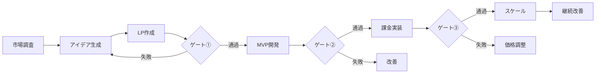

# 自動サービス生成パイプライン

## 概要

Unson OSの中核となる、アイデアから収益化までを自動化するパイプラインの詳細仕様です。AIエージェントが主導し、人間は重要な判断ポイントでのみ関与します。

## パイプライン全体像



## Phase 1: 市場調査・アイデア生成

### 自動市場調査

```python
# キーワード組み合わせによるアイデア生成
class IdeaGenerator:
    def generate_ideas(self):
        # トレンドキーワード抽出
        trend_keywords = [
            "AI", "自動化", "リモートワーク", 
            "サステナビリティ", "メンタルヘルス"
        ]
        
        # 技術キーワード
        tech_keywords = [
            "自動化", "データ分析", "最適化",
            "可視化", "統合"
        ]
        
        # 組み合わせ生成
        ideas = []
        for trend in trend_keywords:
            for tech in tech_keywords:
                ideas.append({
                    "concept": f"{trend} × {tech}",
                    "examples": self.generate_examples(trend, tech)
                })
        
        return self.evaluate_ideas(ideas)
```

### 評価基準

| 評価項目 | 重み | 閾値 |
|---------|------|------|
| 市場規模 | 30% | 10万人以上 |
| 競合数 | 25% | 10社以下 |
| 開発容易性 | 25% | 1週間以内 |
| 差別化可能性 | 20% | 明確な独自性 |

## Phase 2: LP（ランディングページ）作成

### 自動生成プロセス

1. **コピーライティング**
   ```javascript
   const generateCopy = async (idea) => {
     const copy = await claude.generate({
       headline: "問題提起型ヘッドライン",
       subheadline: "解決策の提示",
       benefits: ["利点1", "利点2", "利点3"],
       cta: "行動喚起文言"
     });
     return copy;
   };
   ```

2. **デザイン生成**
   - カラースキーム自動選択
   - レイアウトパターン適用
   - 画像・アイコン生成

3. **A/Bテスト設定**
   - 見出しバリエーション
   - CTAボタンの色・文言
   - 価格表示方法

### ゲート①通過基準

```yaml
metrics:
  visit_count:
    minimum: 1000
    period: 7_days
  
  conversion_rate:
    minimum: 10%
    calculation: registrations / visits
  
  quality_score:
    minimum: 7.0
    factors:
      - bounce_rate < 70%
      - time_on_page > 30s
      - scroll_depth > 50%
```

## Phase 3: MVP開発

### 技術テンプレート

```typescript
// 標準MVPテンプレート
interface MVPTemplate {
  frontend: {
    framework: "Next.js 14",
    ui: "shadcn/ui",
    styling: "Tailwind CSS"
  },
  backend: {
    runtime: "Convex",
    database: "Neon",
    auth: "Clerk"
  },
  features: {
    core: Feature[],
    nice_to_have: Feature[]
  }
}
```

### 自動実装フロー

1. **要件定義**
   - LPから機能要件を抽出
   - ユーザーストーリー生成
   - 受け入れ基準の設定

2. **テスト駆動開発**
   ```javascript
   // テストファースト実装
   describe('Core Feature', () => {
     it('should perform main action', async () => {
       const result = await performAction(input);
       expect(result).toBeDefined();
       expect(result.status).toBe('success');
     });
   });
   ```

3. **実装**
   - Claude Codeによる自動実装
   - コードレビューBot
   - 自動マージ

### ゲート②通過基準

```yaml
metrics:
  weekly_active_users:
    minimum: 200
  
  retention_rate:
    day_7: 30%
    calculation: active_day_7 / cohort_size
  
  feature_adoption:
    core_features: 80%
    measurement: used_feature / total_users
```

## Phase 4: 課金実装

### Stripe統合

```javascript
// 価格設定の自動化
const pricingStrategy = {
  tiers: [
    { name: "Free", price: 0, features: ["基本機能"] },
    { name: "Pro", price: 1500, features: ["全機能"] },
    { name: "Enterprise", price: 4800, features: ["全機能+サポート"] }
  ],
  
  optimization: {
    method: "bayesian",
    target: "revenue_per_user",
    test_duration: "2_weeks"
  }
};
```

### 価格最適化

1. **初期価格設定**
   - 競合分析による基準価格
   - 価値ベース価格の算出

2. **A/Bテスト**
   - 価格感度テスト
   - プラン構成の最適化
   - 割引戦略の検証

### ゲート③通過基準

```yaml
metrics:
  conversion_to_paid:
    minimum: 7%
    
  ltv_cac_ratio:
    minimum: 3.0
    
  payback_period:
    maximum: 6_months
```

## Phase 5: スケーリング

### 自動スケーリング戦略

1. **マーケティング自動化**
   ```javascript
   const marketingAutomation = {
     channels: ["Facebook", "Google", "Twitter"],
     budget_allocation: "dynamic",
     optimization_target: "CAC",
     
     rules: {
       pause_if: "ROAS < 1.5",
       scale_if: "ROAS > 3.0",
       retest_after: "48_hours"
     }
   };
   ```

2. **機能拡張**
   - ユーザーリクエストの自動分析
   - 優先順位の自動設定
   - 実装とリリース

3. **国際展開**
   - 多言語対応の自動化
   - 地域別価格設定
   - 規制対応

## 人間の関与ポイント

### 判断が必要なタイミング

1. **Go/No-Go判定**
   - 各ゲートでの最終承認
   - 重大な方向転換
   - 投資判断

2. **品質管理**
   - デザイン・ブランドの確認
   - 法的・倫理的なレビュー
   - ユーザー体験の最終調整

3. **例外処理**
   - 自動化で対応できない課題
   - 重要な顧客対応
   - 戦略的パートナーシップ

### 承認プロセス

```yaml
approval_process:
  gate_1:
    approvers: ["Curator"]
    criteria: "LP品質とメッセージング"
    sla: "4時間以内"
    
  gate_2:
    approvers: ["Curator", "Craftsman"]
    criteria: "MVP品質とUX"
    sla: "8時間以内"
    
  gate_3:
    approvers: ["Curator", "CSO"]
    criteria: "収益性と持続可能性"
    sla: "24時間以内"
```

## モニタリングとアラート

### リアルタイムダッシュボード

```javascript
const dashboardMetrics = {
  pipeline: {
    active_ideas: count,
    lps_in_test: count,
    mvps_in_dev: count,
    live_services: count
  },
  
  performance: {
    avg_time_to_revenue: hours,
    success_rate: percentage,
    total_mrr: amount,
    growth_rate: percentage
  },
  
  alerts: {
    stuck_projects: list,
    failing_services: list,
    cost_overruns: list
  }
};
```

### 自動介入ルール

| 状況 | 自動アクション |
|-----|--------------|
| 48時間停滞 | エスカレーション通知 |
| コスト超過20% | サービス一時停止 |
| エラー率5%超 | 自動ロールバック |
| 転換率50%低下 | A/Bテスト再開 |

## 継続的改善

### 学習サイクル

1. **データ収集**
   - 全プロジェクトの成功/失敗要因
   - ユーザー行動パターン
   - 市場反応

2. **パターン分析**
   - 成功サービスの共通点
   - 失敗の原因分析
   - 改善機会の特定

3. **システム更新**
   - アルゴリズムの調整
   - テンプレートの改良
   - 新機能の追加

## まとめ

この自動サービス生成パイプラインにより、アイデアから収益化までの時間を従来の1/10以下に短縮します。人間は創造性と判断力を発揮し、AIは実行と最適化を担当。この協働により、月20個以上の新サービスを継続的に市場投入することが可能になります。