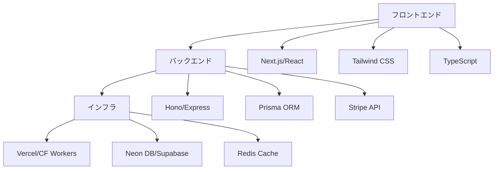

# Unson OS AIエンジニア向けテクニカルガイド

---

## 📋 目次

1. [エグゼクティブサマリー](#1-エグゼクティブサマリー)
2. [技術アーキテクチャ](#2-技術アーキテクチャ) 
3. [開発プロセスフロー](#3-開発プロセスフロー)
4. [実装ガイドライン](#4-実装ガイドライン)
5. [収益化とDAO設計](#5-収益化とdao設計)
6. [実装アクションプラン](#6-実装アクションプラン)

---

## 1. エグゼクティブサマリー

### 🎯 ミッション
**100-200個のマイクロSaaSを自動生成・運用するプラットフォーム**

### 🔑 コアコンセプト
```
Company-as-a-Product（会社自体をプロダクト化）
├── 24-48時間の自動プロダクトライフサイクル
├── 営業ゼロドクトリン（テックタッチ100%）
└── DAO型の利益共有（45-15-40モデル）
```

### 📊 成功指標
- **開発速度**: 課題特定→課金開始 8時間以内
- **検証サイクル**: 3日間でGo/No-Go判定
- **収益目標**: 各SaaS MRR 30万円以上

---

## 2. 技術アーキテクチャ

### 🏗️ テクノロジースタック



### 🤖 自動化コンポーネント

```yaml
コード生成:
  - Claude Code API
  - プロンプトエンジニアリング
  - テンプレート管理

デプロイメント:
  - GitHub Actions
  - Vercel自動デプロイ
  - Cloudflare Workers

モニタリング:
  - PostHog（行動分析）
  - Sentry（エラー監視）
  - Stripe（収益追跡）
```

### 🔧 開発環境セットアップ

```bash
# 基本環境
npm create vite@latest my-saas -- --template react-ts
npm install @hono/node-server prisma @stripe/stripe-js

# AI統合
npm install openai anthropic-ai/sdk

# 分析ツール
npm install posthog-js @sentry/react
```

---

## 3. 開発プロセスフロー

### 📈 4段階ゲート方式

```
Stage 1: 課題検知（Day 1）
├── ユーザーの思い込み調査
├── キーワードA×B分析
└── 市場規模推定 → 合格基準：TAM 1億円以上

Stage 2: LP検証（Day 2-3）
├── ノーコードLP作成（2-3時間）
├── 広告配信・データ収集
└── 登録率測定 → 合格基準：CVR 10%以上

Stage 3: MVP開発（Day 4-7）
├── Claude Codeで基本実装
├── Stripe決済統合
└── デプロイ → 合格基準：技術的動作確認

Stage 4: 課金開始（Day 8-14）
├── 有料転換率測定
├── チャーン率追跡
└── LTV計算 → 合格基準：LTV/CAC > 3
```

### 🚀 想定する開発フロー（コンセプト）

```javascript
// 1. アイデア生成（構想）
const generateIdeas = async (problem) => {
  // Claude APIを使用したアイデア生成の検証予定
  const response = await claude.complete({
    prompt: `${problem}を解決するSaaSアイデアを20個`,
    template: 'SCAMPER法'
  });
  return filterFeasible(response.ideas);
};

// 2. LP作成支援（検討中）
const createLandingPage = async (idea) => {
  // テンプレートとコンテンツ生成の自動化を検証
  const template = await getTemplate('saas-lp');
  const content = await generateCopy(idea);
  return deployToVercel(template, content);
};

// 3. MVP開発支援（将来構想）
const buildMVP = async (validatedIdea) => {
  // AIを活用した開発支援の可能性を探る
  const code = await generateCodeTemplate({
    spec: validatedIdea,
    stack: 'next-hono-stripe'
  });
  return validateAndDeploy(code);
};
```

---

## 4. 実装ガイドライン

### 🧪 TDD（テスト駆動開発）

**t_wada方式の厳守**
```javascript
// Red: 失敗するテストを書く
test('ユーザーは月額プランに登録できる', async () => {
  const result = await subscribe(userId, 'monthly');
  expect(result.status).toBe('active');
});

// Green: ベタ書きOK（一時的に）
async function subscribe(userId, plan) {
  return { status: 'active' }; // ハードコード許容
}

// Refactor: 必ずベタ書きを除去
async function subscribe(userId, plan) {
  const subscription = await stripe.subscriptions.create({
    customer: userId,
    items: [{ price: getPriceId(plan) }]
  });
  return { status: subscription.status };
}
```

### 🏭 SaaS必須機能チェックリスト

```typescript
interface SaaSRequirements {
  // 認証・認可
  auth: {
    signup: boolean;
    login: boolean;
    passwordReset: boolean;
    multiTenant: boolean;
  };
  
  // 課金・決済
  billing: {
    stripeIntegration: boolean;
    subscriptionPlans: boolean;
    usageTracking: boolean;
    invoicing: boolean;
  };
  
  // 運用・監視
  operations: {
    errorTracking: boolean;
    userAnalytics: boolean;
    performanceMonitoring: boolean;
    automatedBackups: boolean;
  };
}
```

### 🎨 UIコンポーネント標準

```jsx
// 共通コンポーネントライブラリ
const UnsonUIKit = {
  // 認証フォーム
  AuthForm: ({ mode }) => {...},
  
  // 料金表
  PricingTable: ({ plans }) => {...},
  
  // ダッシュボード
  Dashboard: ({ metrics }) => {...},
  
  // 使用量メーター
  UsageMeter: ({ current, limit }) => {...}
};
```

---

## 5. 収益化とDAO設計

### 💰 資金調達計画

#### フェーズ別資金調達戦略

**Phase 1（1年目）: ブートストラップ開始**
```yaml
初期資金: 50-100万円（創業者自己資金）
内訳:
  - MVP開発費: 30万円（2-3個のSaaS）
  - インフラ費用: 10万円/年（Vercel, Neon DB）
  - AI API費用: 5万円/年（Claude Code API）
  - マーケティング: 10万円（LP広告、A/Bテスト）
  - 運転資金: 20万円
目標: 1-2個の収益化で黒字転換
```

**Phase 2（2年目）: 内部資金循環**
```yaml
資金源: 初期SaaSからの収益再投資
年間収益目標: 300-500万円
再投資率: 70%（新規SaaS開発）
技術投資: Claude Code API拡張、自動化ツール開発
```

**Phase 3（3年目）: 拡大投資**
```yaml
資金源: 潤沢な内部資金 + 外部調達検討
年間収益目標: 1,000万円以上
投資領域: AI開発、完全自動化システム
外部調達: 必要に応じてシリーズA検討
```

#### 自己資金循環モデルの技術的メリット
```python
class BootstrapModel:
    def __init__(self):
        self.initial_capital = 100_0000  # 100万円
        self.reinvestment_rate = 0.7    # 70%再投資
        
    def calculate_growth(self, months):
        capital = self.initial_capital
        for month in range(months):
            revenue = self.generate_revenue(capital)
            capital += revenue * self.reinvestment_rate
        return capital
    
    # 複利効果で急速な成長が可能
```

### 💰 トークノミクスモデル（構想）

```
収益分配（45-15-40）
├── 運営・再投資: 45%
│   ├── インフラコスト
│   ├── AI API費用
│   └── 新規SaaS開発
├── 創業者: 15%
└── DAOコミュニティ: 40%
    ├── 開発貢献者
    ├── アイデア・検証貢献者
    └── コミュニティ運営
```

### 🪙 トークン設計

```solidity
// UNSONトークン（ガバナンス）
contract UnsonToken {
  totalSupply: 100,000,000
  distribution: {
    team: 15%,
    dao: 30%,
    community: 40%,
    ecosystem: 15%
  }
}

// PROFITトークン（収益分配）
contract ProfitToken {
  // 月次で動的発行
  mintMonthly(revenue) {
    return revenue * 0.4; // DAO分
  }
}
```

### 📊 貢献度スコアリング

```javascript
const calculateContribution = (member) => {
  const scores = {
    codeCommit: commits * 3,
    issueResolved: issues * 2,
    ideaAdopted: ideas * 5,
    bugReported: bugs * 1
  };
  return Object.values(scores).reduce((a, b) => a + b);
};
```

---

## 6. 実装アクションプラン

### 🎯 フェーズ1: 基盤構築（2週間）

```bash
Week 1:
□ Claude Code API統合
□ 基本テンプレート作成
□ CI/CDパイプライン構築
□ Stripe決済基盤実装

Week 2:
□ LP自動生成システム
□ 分析ダッシュボード
□ DAOスマートコントラクト
□ 初回アイデア検証
```

### 🚀 フェーズ2: 自動化拡張（1ヶ月）

```bash
Week 3-4:
□ アイデア生成AI強化
□ A/Bテスト自動化
□ KPI自動追跡
□ 5個のMVPローンチ

Week 5-6:
□ 収益分配自動化
□ 貢献度トラッキング
□ スケーリング対応
□ 20個のMVPローンチ
```

### 📈 フェーズ3: スケール（3ヶ月）

```bash
Month 2:
□ 50個のSaaS運用
□ 月間収益1,000万円
□ DAOメンバー100人

Month 3:
□ 100個のSaaS運用
□ 月間収益3,000万円
□ 国際展開準備
```

---

## 🛠️ クイックスタートコマンド

```bash
# プロジェクト初期化
git clone https://github.com/unson-os/template
cd template && npm install

# 環境変数設定
cp .env.example .env
# CLAUDE_API_KEY=xxx
# STRIPE_SECRET_KEY=xxx
# DATABASE_URL=xxx

# 開発サーバー起動
npm run dev

# アイデア検証開始
npm run validate:idea "AIで〇〇を自動化"

# MVP生成
npm run generate:mvp --idea="validated-idea.json"

# デプロイ
npm run deploy:production
```

---

## 📚 参考リソース

- [Unson OS GitHub](https://github.com/unson-os)
- [Claude Code API Docs](https://docs.anthropic.com/claude-code)
- [Stripe SaaS Guide](https://stripe.com/docs/billing/subscriptions)
- [DAO設計パターン](https://moloch.daohaus.fun/)

---

## 🤝 コントリビューション

```
参加方法:
1. Discord参加 → https://discord.gg/unson-os
2. GitHubでIssue確認
3. PRを作成（+3ポイント獲得）
4. 月次で収益分配を受領
```

---

# Let's Build the Future of SaaS Together! 🚀