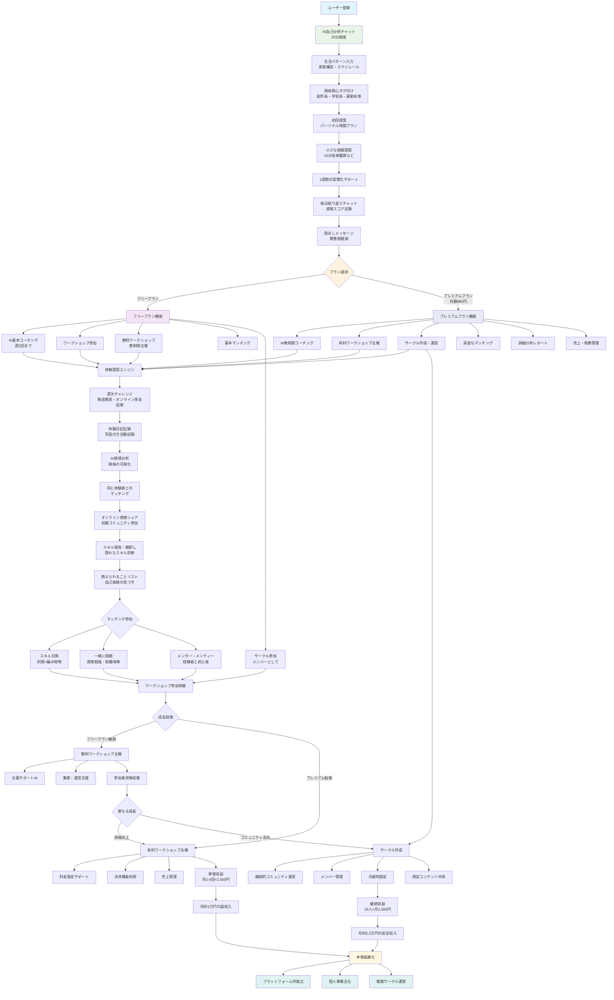

# 調査資料ベースライン（保存版）

このファイルは、サービス開発前のニーズ調査に用いた初期資料（仮説・ユーザーフロー・機能構想）を固定保存したものです。以後のLP修正は本資料を参照しつつ、調査用コピーへ最適化します。

## ユーザーフロー（Mermaid）

## サービス概要

### コンセプト

「20年ぶりの自分時間を、最高の人生設計に変える」

### ターゲットユーザー

- 年齢: 40-55歳女性
- 状況: 子育てが一段落（子供が高校生〜大学生）
- 悩み: 自分らしい時間の使い方がわからない、趣味がない、友達がいない
- 願望: 自分の時間を充実させたい、新しいことに挑戦したい

### キャッチコピー

「お疲れ様でした、お母さん。今度はあなたの番です。」

---

以下、提供された調査用ドキュメント（ユーザーフロー設計、主要機能、技術仕様、収益モデル、KPI、差別化ポイント）をそのまま保存しています。今後のLP改稿では、調査LPの目的（事前関心者の収集とニーズ把握）に合わせて、プラン表記や収益例等は公開面から削除・圧縮し、マイクロサーベイと明確な研究目的提示へ置き換えます。
